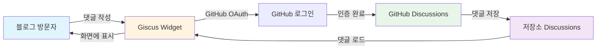
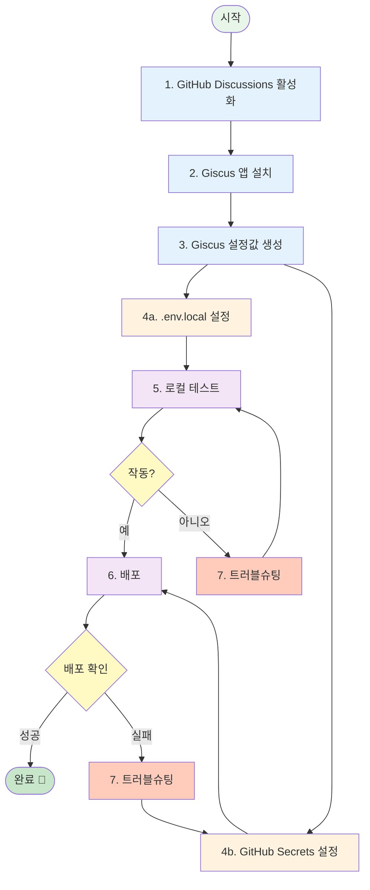
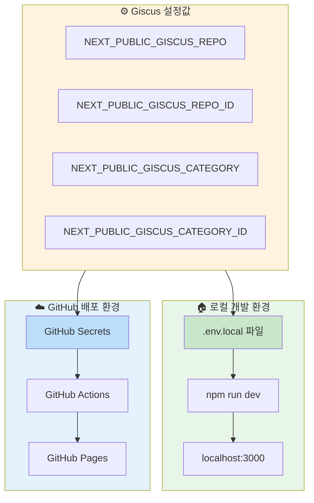

# Giscus 댓글 시스템 설정 가이드

이 문서는 **이 프로젝트(nextjs-notion-blog)에 Giscus 댓글 시스템을 활성화하는 방법**을 설명합니다.
GitHub을 처음 사용하시는 분도 따라하실 수 있도록 작성되었습니다.

> **📖 이 가이드의 범위:**
> - ✅ 이 프로젝트에 Giscus를 설정하는 필수 단계
> - ✅ 환경 변수 설정 및 배포 방법
> - ✅ 주요 문제 해결 방법
> - ❌ 일반적인 Giscus 사용법 및 고급 기능 (→ [Giscus 공식 문서](https://giscus.app/ko) 참고)
> - ❌ GitHub Discussions 세부 관리 (→ [GitHub 공식 문서](https://docs.github.com/en/discussions) 참고)

## 📋 Giscus란?

**Giscus**는 GitHub Discussions를 이용한 무료 댓글 시스템입니다.

### 주요 특징
- ✅ **완전 무료** - 별도 비용 없이 사용 가능
- ✅ **광고 없음** - 깔끔한 댓글 UI
- ✅ **GitHub 계정 연동** - 스팸 방지
- ✅ **마크다운 지원** - 코드 블록, 이미지 첨부 가능
- ✅ **다크 모드 자동 전환** - 블로그 테마에 맞춰 자동 변경
- ✅ **반응(Reactions) 지원** - 👍 ❤️ 등의 이모지 반응

### 필요한 것
- GitHub 계정 (무료)
- 블로그가 배포된 GitHub 저장소 (public)
- 약 10분의 시간

### 댓글 시스템 작동 원리



**데이터 흐름:**
1. 사용자가 블로그에서 댓글 작성
2. Giscus가 GitHub OAuth로 사용자 인증
3. GitHub Discussions에 댓글 저장
4. 저장된 댓글이 블로그에 자동 표시

## ⏱️ 예상 소요 시간

- GitHub Discussions 활성화: 2분
- Giscus 앱 설치: 3분
- 설정값 생성: 3분
- 환경 변수 설정: 2분

**전체 약 10분 소요**

---

## 📌 목차

0. [전체 설정 플로우](#-전체-설정-플로우) ⭐

1. [GitHub Discussions 활성화](#1-github-discussions-활성화)
   - [1.1 저장소 Settings로 이동](#11-저장소-settings로-이동)
   - [1.2 Discussions 기능 활성화](#12-discussions-기능-활성화)
   - [1.3 확인하기](#13-확인하기)

2. [Giscus 앱 설치](#2-giscus-앱-설치)
   - [2.1 Giscus 앱 페이지 접속](#21-giscus-앱-페이지-접속)
   - [2.2 설치 대상 선택](#22-설치-대상-선택)
   - [2.3 권한 확인](#23-권한-확인)

3. [Giscus 설정값 생성](#3-giscus-설정값-생성)
   - [3.1 Giscus 설정 페이지 접속](#31-giscus-설정-페이지-접속)
   - [3.2 저장소 정보 입력](#32-저장소-정보-입력)
   - [3.3 Discussion 카테고리 선택](#33-discussion-카테고리-선택)
   - [3.4 기타 설정 (선택사항)](#34-기타-설정-선택사항)
   - [3.5 설정값 복사](#35-설정값-복사)

4. [환경 변수 설정](#4-환경-변수-설정) ⚠️
   - [환경별 설정 구조](#환경별-설정-구조)
   - [4.1 로컬 환경 설정](#41-로컬-환경-설정)
   - [4.2 GitHub Actions 설정 (배포용)](#42-github-actions-설정-배포용)
   - [4.3 프로젝트 코드 통합 (이미 완료됨)](#43-프로젝트-코드-통합-이미-완료됨)

5. [동작 확인](#5-동작-확인)
   - [5.1 개발 서버 실행](#51-개발-서버-실행)
   - [5.2 포스트 페이지 접속](#52-포스트-페이지-접속)
   - [5.3 댓글 섹션 확인](#53-댓글-섹션-확인)
   - [5.4 댓글 작성 테스트](#54-댓글-작성-테스트)
   - [5.5 GitHub Discussions 확인](#55-github-discussions-확인)

6. [배포 및 최종 확인](#6-배포-및-최종-확인)
   - [6.1 변경사항 커밋 및 푸시](#61-변경사항-커밋-및-푸시)
   - [6.2 GitHub Actions 워크플로우 확인](#62-github-actions-워크플로우-확인)
   - [6.3 배포된 사이트 확인](#63-배포된-사이트-확인)

7. [트러블슈팅](#7-트러블슈팅)
   - [7.1 댓글 섹션이 표시되지 않음](#71-댓글-섹션이-표시되지-않음)
   - [7.2 "Error: Discussion not found" 표시](#72-error-discussion-not-found-표시)
   - [7.3 배포된 사이트에서만 안 보임 ⚠️ 가장 흔한 문제!](#73-배포된-사이트에서만-안-보임-️-가장-흔한-문제)
   - [7.4 댓글이 다른 포스트에 섞여서 표시됨](#74-댓글이-다른-포스트에-섞여서-표시됨)
   - [7.5 "Public repository not found"](#75-public-repository-not-found)

8. [추가 설정 (선택사항)](#8-추가-설정-선택사항)
   - [8.1 댓글 알림 받기](#81-댓글-알림-받기)
   - [8.2 스팸 관리](#82-스팸-관리)
   - [8.3 Discussion 카테고리 관리](#83-discussion-카테고리-관리)

9. [자주 묻는 질문](#9-자주-묻는-질문)
   - [Q1. Giscus는 무료인가요?](#q1-giscus는-무료인가요)
   - [Q2. 댓글 작성자가 GitHub 계정이 필요한가요?](#q2-댓글-작성자가-github-계정이-필요한가요)
   - [Q3. Private 저장소에서 사용할 수 있나요?](#q3-private-저장소에서-사용할-수-있나요)
   - [Q4. 댓글 데이터는 어디에 저장되나요?](#q4-댓글-데이터는-어디에-저장되나요)
   - [Q5. 댓글을 다른 시스템으로 이전할 수 있나요?](#q5-댓글을-다른-시스템으로-이전할-수-있나요)
   - [Q6. 댓글을 수정/삭제할 수 있나요?](#q6-댓글을-수정삭제할-수-있나요)
   - [Q7. 반응(Reactions)을 비활성화할 수 있나요?](#q7-반응reactions을-비활성화할-수-있나요)
   - [Q8. 댓글이 많아지면 속도가 느려지나요?](#q8-댓글이-많아지면-속도가-느려지나요)

10. [참고 자료](#10-참고-자료)
    - [10.1 공식 문서](#101-공식-문서)
    - [10.2 추가 기능 및 커스터마이징](#102-추가-기능-및-커스터마이징)

11. [요약 체크리스트](#요약-체크리스트)

---

## 🔄 전체 설정 플로우

다음 다이어그램은 Giscus를 설정하는 전체 과정을 보여줍니다:



**핵심 포인트:**
- ⚠️ **Step 4는 반드시 두 곳 모두 설정해야 합니다**
  - `.env.local` - 로컬 개발 환경용
  - GitHub Secrets - 배포 환경용
- ⚠️ **가장 흔한 실수**: GitHub Secrets를 설정하지 않아 배포 환경에서 댓글이 안 보임

---

## 1. GitHub Discussions 활성화

Giscus는 GitHub Discussions를 댓글 저장소로 사용합니다. 먼저 저장소에서 Discussions를 활성화해야 합니다.

### 1.1 저장소 Settings로 이동

1. **GitHub.com** 접속 및 로그인
2. 블로그 저장소로 이동
   - 예: `https://github.com/your-username/nextjs-notion-blog`
3. 상단 메뉴에서 **Settings** 탭 클릭

> **찾을 수 없다면?**
> - Settings 탭은 저장소 소유자만 볼 수 있습니다
> - Fork한 저장소가 아닌 본인 소유 저장소인지 확인하세요

### 1.2 Discussions 기능 활성화

1. Settings 페이지 좌측 메뉴에서 **General** 선택 (이미 선택되어 있을 수 있음)
2. 아래로 스크롤하여 **Features** 섹션 찾기
3. **Discussions** 체크박스 체크
   ```
   ☑️ Discussions
   ```
4. 페이지 상단 또는 하단의 변경사항이 자동 저장됨

### 1.3 확인하기

1. 저장소 상단 메뉴에 **Discussions** 탭이 생성되었는지 확인
2. Discussions 탭을 클릭하면 "Welcome to Discussions!" 화면이 표시됨

---

## 2. Giscus 앱 설치

GitHub에 Giscus 앱을 설치하여 댓글을 저장할 권한을 부여합니다.

### 2.1 Giscus 앱 페이지 접속

1. 브라우저 새 탭에서 접속: https://github.com/apps/giscus
2. **Install** 버튼 클릭 (초록색 버튼)

### 2.2 설치 대상 선택

1. **Install on** 화면에서 계정 선택
   - 개인 계정: `your-username`
   - 조직 계정이 있다면 조직도 선택 가능

2. **Repository access** 섹션에서 선택

   **권장: Only select repositories (선택한 저장소만)**
   ```
   ⚪ All repositories (모든 저장소) - 권장하지 않음
   ⚫ Only select repositories (선택한 저장소만) - 권장
   ```

3. **Select repositories** 드롭다운에서 블로그 저장소 선택
   - 예: `nextjs-notion-blog`

4. 하단의 **Install** 버튼 클릭

### 2.3 권한 확인

설치가 완료되면 자동으로 Giscus 설정 페이지로 이동합니다.

---

## 3. Giscus 설정값 생성

이제 Giscus 웹사이트에서 블로그에 필요한 설정값을 생성합니다.

### 3.1 Giscus 설정 페이지 접속

1. 브라우저에서 접속: https://giscus.app/ko
2. 한국어로 표시되는지 확인 (우측 상단 언어 선택)

### 3.2 저장소 정보 입력

**Step 1: 저장소 입력**

1. **저장소** 입력란 찾기
2. 형식에 맞춰 입력: `your-username/repository-name`

   **예시:**
   ```
   your-username/your-repo-name
   octocat/nextjs-notion-blog
   ```

3. 입력 후 잠시 기다리면 아래 메시지 확인
   - ✅ 성공: "Success! This repository meets all of the above criteria."
   - ❌ 실패: 오류 메시지 표시

**오류 발생 시 확인사항:**
- [ ] 저장소가 **public**인가요? (private 저장소는 사용 불가)
- [ ] Discussions가 활성화되어 있나요? (Section 1 다시 확인)
- [ ] Giscus 앱이 설치되어 있나요? (Section 2 다시 확인)
- [ ] 저장소 이름이 정확한가요? (대소문자 구분)

### 3.3 Discussion 카테고리 선택

**Step 2: Page ↔️ Discussions 매핑**

1. **Discussion 카테고리 선택** 드롭다운 클릭
2. 추천 카테고리 선택:
   - **Announcements** (공지사항) - 권장
   - **General** (일반)
   - 또는 원하는 카테고리 선택

> **카테고리가 없다면?**
> 1. 저장소의 Discussions 탭으로 이동
> 2. 우측 ⚙️ 아이콘 클릭
> 3. "New category" 클릭하여 생성

**권장 설정:**
- ✅ Announcements 카테고리 사용
- 이유: 블로그 관리자만 새 Discussion을 만들 수 있어 스팸 방지

### 3.4 기타 설정 (선택사항)

**언어 설정:**
- 페이지 우측 상단에서 **한국어 (ko)** 선택
- 댓글 UI가 한국어로 표시됩니다

**Discussion 제목 포함:**
```
☑️ Discussion 제목에 페이지 경로명 포함
```

**반응 활성화:**
```
☑️ 메인 포스트 위에 반응 남기기 활성화
```
- 👍 ❤️ 등의 반응을 댓글 영역 상단에 표시

**테마:**
- 이 프로젝트는 자동으로 블로그의 라이트/다크 모드를 감지하여 Giscus 테마를 전환합니다
- `ThemeProvider` 컴포넌트가 `data-theme` 속성을 설정하고, Giscus가 이를 감지하여 자동으로 테마를 변경합니다
- 기본 테마 사용 시 별도 설정 불필요 (환경 변수 생략 가능)

### 3.5 설정값 복사

페이지 하단 **giscus 사용** 섹션에 생성된 코드가 표시됩니다.

**필요한 값 4가지:**

스크립트 태그에서 다음 값들을 찾아 복사합니다:

```html
<script src="https://giscus.app/client.js"
        data-repo="your-username/your-repo"           ← 1️⃣ REPO
        data-repo-id="R_kgDOGxxxxxxx"                 ← 2️⃣ REPO_ID
        data-category="Announcements"                  ← 3️⃣ CATEGORY
        data-category-id="DIC_kwDOGxxxxxxx"           ← 4️⃣ CATEGORY_ID
        ...
</script>
```

**복사할 값:**

| 이름 | 속성 이름 | 예시 |
|------|-----------|------|
| 1️⃣ 저장소 | `data-repo` | `octocat/nextjs-notion-blog` |
| 2️⃣ 저장소 ID | `data-repo-id` | `R_kgDOGxxxxxxx` |
| 3️⃣ 카테고리 | `data-category` | `Announcements` |
| 4️⃣ 카테고리 ID | `data-category-id` | `DIC_kwDOGxxxxxxx` |

> **메모장에 임시 저장:**
> ```
> REPO: your-username/your-repo
> REPO_ID: R_kgDOGxxxxxxx
> CATEGORY: Announcements
> CATEGORY_ID: DIC_kwDOGxxxxxxx
> ```

---

## 4. 환경 변수 설정

복사한 설정값을 프로젝트의 환경 변수 파일에 추가합니다.

### 환경별 설정 구조



**⚠️ 중요: 두 곳 모두 설정해야 합니다!**

| 환경 | 설정 위치 | 용도 | 필수 여부 |
|------|-----------|------|-----------|
| 🏠 **로컬** | `.env.local` | 개발 서버 (`npm run dev`) | ✅ 필수 |
| ☁️ **배포** | GitHub Secrets | 배포된 사이트 (GitHub Pages) | ✅ 필수 |

**가장 흔한 실수:**
- ❌ `.env.local`만 설정 → 로컬에서만 작동, 배포 후 댓글 안 보임
- ✅ 두 곳 모두 설정 → 로컬과 배포 환경 모두 정상 작동

### 4.1 로컬 환경 설정

1. **프로젝트 폴더 열기**
   - VS Code 또는 파일 탐색기에서 프로젝트 루트 폴더 열기

2. **`.env.local` 파일 열기**
   - 파일이 없다면 `.env.example`을 복사하여 `.env.local` 생성

3. **Giscus 설정 추가**

   파일 하단에 다음 4줄 추가:

   ```bash
   # Giscus 댓글 시스템 설정
   NEXT_PUBLIC_GISCUS_REPO=your-username/your-repo
   NEXT_PUBLIC_GISCUS_REPO_ID=R_kgDOGxxxxxxx
   NEXT_PUBLIC_GISCUS_CATEGORY=Announcements
   NEXT_PUBLIC_GISCUS_CATEGORY_ID=DIC_kwDOGxxxxxxx
   ```

   > **🔒 보안 참고:**
   > - `NEXT_PUBLIC_` 접두사는 클라이언트(브라우저)에서 접근 가능한 환경 변수입니다
   > - 이 값들은 빌드된 JavaScript 파일에 포함되어 공개됩니다
   > - Giscus 설정값은 공개되어도 안전합니다 (Repository ID와 Category ID는 public 저장소에서만 작동)
   > - 민감한 정보는 절대 `NEXT_PUBLIC_` 접두사를 사용하지 마세요

4. **실제 값으로 교체**

   Section 3.5에서 복사한 값으로 교체:

   ```bash
   # ❌ 예시 - 이대로 사용하면 안됨
   NEXT_PUBLIC_GISCUS_REPO=your-username/your-repo

   # ✅ 올바른 예시
   NEXT_PUBLIC_GISCUS_REPO=octocat/nextjs-notion-blog
   NEXT_PUBLIC_GISCUS_REPO_ID=R_kgDOH9x7Q8w
   NEXT_PUBLIC_GISCUS_CATEGORY=Announcements
   NEXT_PUBLIC_GISCUS_CATEGORY_ID=DIC_kwDOH9x7Q8s4CRt_A
   ```

5. **(선택사항) 테마 설정**

   라이트 모드와 다크 모드에서 각각 다른 테마를 사용하고 싶다면 추가로 설정할 수 있습니다:

   ```bash
   # Giscus 테마 설정 (선택사항)
   # 설정하지 않으면 기본값 (light/dark)이 사용됩니다
   NEXT_PUBLIC_GISCUS_THEME_LIGHT=light
   NEXT_PUBLIC_GISCUS_THEME_DARK=dark
   ```

   **사용 가능한 테마:**
   - 라이트 테마: `light`, `light_high_contrast`, `light_protanopia`, `light_tritanopia`, `noborder_light`
   - 다크 테마: `dark`, `dark_dimmed`, `dark_high_contrast`, `dark_protanopia`, `dark_tritanopia`, `transparent_dark`, `noborder_dark`
   - 커스텀 CSS URL: `https://yourdomain.com/giscus-custom.css`

6. **파일 저장** (Ctrl+S 또는 Cmd+S)

### 4.2 GitHub Actions 설정 (배포용)

**⚠️ 중요: 이 단계는 필수입니다!**

블로그를 GitHub Pages로 배포하는 경우, **반드시** GitHub Secrets에도 환경 변수를 추가해야 합니다.
- 로컬(`.env.local`)에만 설정하고 GitHub Secrets에 추가하지 않으면 **배포된 사이트에서 댓글이 표시되지 않습니다.**
- GitHub Actions 빌드 시에는 `.env.local` 파일이 없고, GitHub Secrets의 값을 사용합니다.

1. **GitHub 저장소 접속**
   - `https://github.com/your-username/your-repo`

2. **Settings → Secrets and variables → Actions 이동**
   - Settings 탭 클릭
   - 좌측 메뉴: Secrets and variables → Actions

3. **New repository secret 클릭**

4. **기본 Secret 4개 추가**

   각 항목마다 다음 과정 반복:

   **Secret 1: GISCUS_REPO**
   - Name: `NEXT_PUBLIC_GISCUS_REPO`
   - Secret: `your-username/your-repo` (실제 값)
   - **Add secret** 클릭

   **Secret 2: GISCUS_REPO_ID**
   - Name: `NEXT_PUBLIC_GISCUS_REPO_ID`
   - Secret: `R_kgDOGxxxxxxx` (실제 값)
   - **Add secret** 클릭

   **Secret 3: GISCUS_CATEGORY**
   - Name: `NEXT_PUBLIC_GISCUS_CATEGORY`
   - Secret: `Announcements` (실제 값)
   - **Add secret** 클릭

   **Secret 4: GISCUS_CATEGORY_ID**
   - Name: `NEXT_PUBLIC_GISCUS_CATEGORY_ID`
   - Secret: `DIC_kwDOGxxxxxxx` (실제 값)
   - **Add secret** 클릭

5. **(선택사항) 테마 Secret 추가**

   라이트/다크 모드별로 다른 테마를 사용하고 싶다면 추가:

   **Secret 5: GISCUS_THEME_LIGHT**
   - Name: `NEXT_PUBLIC_GISCUS_THEME_LIGHT`
   - Secret: `light` (또는 원하는 라이트 테마)
   - **Add secret** 클릭

   **Secret 6: GISCUS_THEME_DARK**
   - Name: `NEXT_PUBLIC_GISCUS_THEME_DARK`
   - Secret: `dark_dimmed` (또는 원하는 다크 테마)
   - **Add secret** 클릭

6. **확인**
   - Actions secrets 목록에 필수 4개 (+ 선택 2개) 항목이 추가되었는지 확인

### 4.3 프로젝트 코드 통합 (이미 완료됨)

**이 프로젝트에는 Giscus 댓글 시스템이 이미 코드에 통합되어 있습니다.**
환경 변수만 설정하면 자동으로 작동합니다.

**통합된 위치:**
- `src/components/Comments.tsx` - Giscus 댓글 컴포넌트
- `src/app/posts/[slug]/page.tsx` - 포스트 페이지에 자동으로 댓글 섹션 표시

**동작 방식:**
```typescript
// Comments.tsx에서 환경 변수를 읽어서 Giscus를 초기화합니다
const repo = process.env.NEXT_PUBLIC_GISCUS_REPO;
const repoId = process.env.NEXT_PUBLIC_GISCUS_REPO_ID;
const category = process.env.NEXT_PUBLIC_GISCUS_CATEGORY;
const categoryId = process.env.NEXT_PUBLIC_GISCUS_CATEGORY_ID;

// 환경 변수가 모두 설정되어 있으면 댓글 섹션 표시
// 하나라도 없으면 댓글 섹션이 표시되지 않음
```

**📌 따라서 별도의 코드 수정 없이 환경 변수 설정만으로 Giscus를 활성화할 수 있습니다.**

> **참고:** 다른 페이지에도 댓글을 추가하고 싶다면 `<Comments />` 컴포넌트를 import하여 사용하면 됩니다.

---

## 5. 동작 확인

설정이 완료되었으면 로컬에서 테스트합니다.

### 5.1 개발 서버 실행

```bash
# 터미널에서 실행
npm run dev
```

### 5.2 포스트 페이지 접속

1. 브라우저에서 접속: `http://localhost:3000`
2. 아무 포스트나 클릭하여 상세 페이지로 이동
3. 페이지 하단으로 스크롤

### 5.3 댓글 섹션 확인

**성공 시 표시:**
```
Comments
━━━━━━━━━━━━━━━━━━━━━━━━━━━━━━
[Sign in with GitHub] 버튼 표시
```

**실패 시 표시:**
- 댓글 섹션이 아예 없음
- 에러 메시지 표시

### 5.4 댓글 작성 테스트

1. **Sign in with GitHub** 버튼 클릭
2. GitHub 로그인 및 권한 승인
3. 테스트 댓글 작성: "테스트 댓글입니다"
4. **Comment** 버튼 클릭

### 5.5 GitHub Discussions 확인

1. GitHub 저장소의 **Discussions** 탭으로 이동
2. 새로운 Discussion이 생성되었는지 확인
   - 제목: 포스트 제목 또는 경로
   - 카테고리: 선택한 카테고리 (Announcements 등)
   - 내용: 작성한 댓글

---

## 6. 배포 및 최종 확인

### 6.1 변경사항 커밋 및 푸시

```bash
# Git 상태 확인
git status

# .env.local은 커밋하지 않음 (.gitignore에 이미 포함됨)
# 다른 변경사항이 있다면 커밋
git add .
git commit -m "Add Giscus comments configuration"
git push origin main
```

### 6.2 GitHub Actions 워크플로우 확인

1. GitHub 저장소 → **Actions** 탭
2. 최신 워크플로우 실행 확인
3. 성공(✅) 확인

### 6.3 배포된 사이트 확인

1. 배포된 블로그 URL 접속
   - 예: `https://your-username.github.io/your-repo`
2. 포스트 페이지 접속
3. 댓글 섹션 정상 표시 확인
4. 테스트 댓글 작성

---

## 7. 트러블슈팅

### 7.1 댓글 섹션이 표시되지 않음

**원인:** 환경 변수가 설정되지 않았거나 잘못됨

**해결 방법:**
1. `.env.local` 파일 확인
   - 4개 변수가 모두 설정되었는지 확인
   - 값이 정확한지 확인 (따옴표 없이)
   - 오타가 없는지 확인

2. 개발 서버 재시작
   ```bash
   # Ctrl+C로 서버 중지
   npm run dev
   ```

3. 브라우저 캐시 삭제 후 새로고침
   - Chrome: Ctrl+Shift+R (Windows) / Cmd+Shift+R (Mac)

### 7.2 "Error: Discussion not found" 표시

**원인:** 카테고리 설정이 잘못되었거나 Discussions가 비활성화됨

**해결 방법:**
1. GitHub 저장소 → Discussions 탭 확인
   - Discussions가 활성화되어 있는지 확인
   - 선택한 카테고리가 존재하는지 확인

2. Giscus 설정 페이지 (https://giscus.app/ko) 재확인
   - 저장소 이름이 정확한지 확인
   - 카테고리 ID가 정확한지 확인

### 7.3 배포된 사이트에서만 안 보임 ⚠️ 가장 흔한 문제!

**증상:** 로컬에서는 댓글이 잘 보이는데, GitHub Pages에 배포하면 댓글 섹션이 사라짐

**원인:** GitHub Secrets가 설정되지 않음

**해결 방법:**

**1단계: GitHub Secrets 확인**
1. GitHub 저장소 → Settings → Secrets and variables → Actions
2. 다음 4개의 Secret이 **반드시** 있어야 함:
   - `NEXT_PUBLIC_GISCUS_REPO`
   - `NEXT_PUBLIC_GISCUS_REPO_ID`
   - `NEXT_PUBLIC_GISCUS_CATEGORY`
   - `NEXT_PUBLIC_GISCUS_CATEGORY_ID`

**2단계: 없거나 잘못되었다면**
- Section 4.2를 다시 수행하여 모든 Secret 추가
- 각 Secret의 Name과 Value가 정확한지 확인

**3단계: 재배포**
```bash
# 방법 1: 빈 커밋으로 재배포 트리거
git commit --allow-empty -m "Trigger rebuild for Giscus"
git push origin main

# 방법 2: GitHub Actions에서 수동 실행
# GitHub → Actions 탭 → Deploy to GitHub Pages → Run workflow
```

**4단계: 배포 완료 확인**
- Actions 탭에서 워크플로우가 성공(✅)했는지 확인
- 2-3분 후 배포된 사이트에서 댓글 섹션 확인

**💡 핵심 포인트:**
- `.env.local`은 로컬 개발용
- GitHub Secrets는 배포용 (필수!)
- 둘 다 설정해야 로컬과 배포 환경 모두에서 작동

### 7.4 댓글이 다른 포스트에 섞여서 표시됨

**원인:** Discussion 매핑 설정 문제

**현재 설정:** `pathname` 매핑 사용 (기본값)
- 각 포스트의 URL 경로로 Discussion 구분
- 예: `/posts/my-first-post`

**해결 방법:**
- 정상 동작입니다
- 각 포스트마다 자동으로 별도 Discussion 생성됨

### 7.5 "Public repository not found"

**원인:** 저장소가 Private이거나 이름이 잘못됨

**해결 방법:**
1. 저장소가 **Public**인지 확인
   - Settings → General → Danger Zone
   - "Change repository visibility" → Public

2. 저장소 이름 확인
   - URL: `github.com/username/repo-name`
   - 환경 변수: `username/repo-name` (정확히 일치)

---

## 8. 추가 설정 (선택사항)

이 섹션의 기능들은 Giscus 설정이 아닌 GitHub의 기본 기능입니다.
자세한 사용법은 [GitHub Discussions 공식 문서](https://docs.github.com/en/discussions)를 참고하세요.

### 8.1 댓글 알림 받기

새 댓글이 달릴 때 이메일 알림을 받을 수 있습니다.

**간단 설정:**
- GitHub → Settings → Notifications → "Automatically watch repositories" 체크

**상세 가이드:** [GitHub 알림 설정 문서](https://docs.github.com/en/account-and-profile/managing-subscriptions-and-notifications-on-github/setting-up-notifications)

### 8.2 스팸 관리

스팸 댓글 작성자를 차단하거나 댓글을 삭제할 수 있습니다.

**간단 방법:**
- 저장소 → Discussions → 댓글 ⋯ 메뉴 → "Block user" 또는 "Delete"

**상세 가이드:** [GitHub Discussions 관리 문서](https://docs.github.com/en/discussions/managing-discussions-for-your-community)

### 8.3 Discussion 카테고리 관리

카테고리 추가, 수정, 삭제가 가능합니다.

**간단 방법:**
- 저장소 → Discussions → ⚙️ 아이콘 → Categories 관리

**상세 가이드:** [Discussion 카테고리 관리 문서](https://docs.github.com/en/discussions/managing-discussions-for-your-community/managing-categories-for-discussions)

---

## 9. 자주 묻는 질문

### Q1. Giscus는 무료인가요?

**A.** 네, 완전 무료입니다. GitHub Discussions를 사용하므로 별도 비용이 발생하지 않습니다.

### Q2. 댓글 작성자가 GitHub 계정이 필요한가요?

**A.** 네, GitHub 계정으로 로그인해야 댓글을 작성할 수 있습니다. 이는 스팸 방지에 효과적입니다.

### Q3. Private 저장소에서 사용할 수 있나요?

**A.** 아니요, Public 저장소만 지원됩니다.

### Q4. 댓글 데이터는 어디에 저장되나요?

**A.** GitHub Discussions에 저장됩니다. 저장소의 Discussions 탭에서 모든 댓글을 확인할 수 있습니다.

### Q5. 댓글을 다른 시스템으로 이전할 수 있나요?

**A.** GitHub Discussions는 표준 포맷이므로 API를 통해 데이터를 내보낼 수 있습니다.

### Q6. 댓글을 수정/삭제할 수 있나요?

**A.**
- **작성자:** 본인 댓글 수정/삭제 가능
- **저장소 관리자:** 모든 댓글 수정/삭제 가능

### Q7. 반응(Reactions)을 비활성화할 수 있나요?

**A.** Giscus 설정 페이지 (https://giscus.app/ko)에서 "반응 활성화" 체크박스를 해제하면 됩니다. 그러면 `Comments.tsx`의 `reactionsEnabled` prop을 수정해야 합니다.

### Q8. 댓글이 많아지면 속도가 느려지나요?

**A.** GitHub API를 사용하므로 댓글이 많아도 성능에 큰 영향은 없습니다. 다만 댓글 로딩은 GitHub 서버 속도에 의존합니다.

---

## 10. 참고 자료

### 10.1 공식 문서

- [Giscus 공식 웹사이트](https://giscus.app/ko) - 설정 생성 및 상세 옵션
- [Giscus GitHub 저장소](https://github.com/giscus/giscus) - 소스 코드 및 이슈 트래킹
- [GitHub Discussions 문서](https://docs.github.com/en/discussions) - GitHub Discussions 사용법
- [Giscus 컴포넌트 문서](https://github.com/giscus/giscus-component) - React 컴포넌트 API

### 10.2 추가 기능 및 커스터마이징

이 가이드에서 다루지 않은 고급 기능들은 Giscus 공식 문서를 참고하세요:

**테마 커스터마이징:**
- [커스텀 CSS 테마 만들기](https://github.com/giscus/giscus/blob/main/ADVANCED-USAGE.md#data-theme)
- 다양한 내장 테마 옵션 (light_high_contrast, dark_dimmed 등)

**매핑 전략:**
- [Discussion 매핑 방식 비교](https://github.com/giscus/giscus/blob/main/ADVANCED-USAGE.md#discussion-mapping) (pathname, url, title, og:title 등)
- 각 방식의 장단점 및 사용 사례

**성능 최적화:**
- [Lazy loading 설정](https://github.com/giscus/giscus/blob/main/ADVANCED-USAGE.md#lazy-loading)
- iframe 로딩 전략

**기타 고급 기능:**
- [커스텀 언어 지원](https://github.com/giscus/giscus/blob/main/CONTRIBUTING.md#adding-localizations)
- [웹훅 통합](https://github.com/giscus/giscus/blob/main/ADVANCED-USAGE.md#webhooks)
- [API 사용법](https://github.com/giscus/giscus/blob/main/ADVANCED-USAGE.md#giscus-api)

---

## 요약 체크리스트

설정을 완료했다면 다음 항목들을 확인하세요:

- [ ] GitHub Discussions 활성화 완료
- [ ] Giscus 앱 설치 완료
- [ ] Giscus 설정값 4개 복사 완료
  - [ ] NEXT_PUBLIC_GISCUS_REPO
  - [ ] NEXT_PUBLIC_GISCUS_REPO_ID
  - [ ] NEXT_PUBLIC_GISCUS_CATEGORY
  - [ ] NEXT_PUBLIC_GISCUS_CATEGORY_ID
- [ ] `.env.local` 파일에 환경 변수 추가 완료
- [ ] (선택) 테마 환경 변수 추가 완료
- [ ] GitHub Secrets에 환경 변수 추가 완료 (배포용)
- [ ] (선택) GitHub Secrets에 테마 환경 변수 추가 완료
- [ ] 로컬에서 댓글 섹션 표시 확인
- [ ] 테스트 댓글 작성 성공
- [ ] GitHub Discussions에 댓글 저장 확인
- [ ] 배포된 사이트에서 댓글 정상 동작 확인

모든 항목이 체크되었다면 Giscus 설정이 완료되었습니다! 🎉
