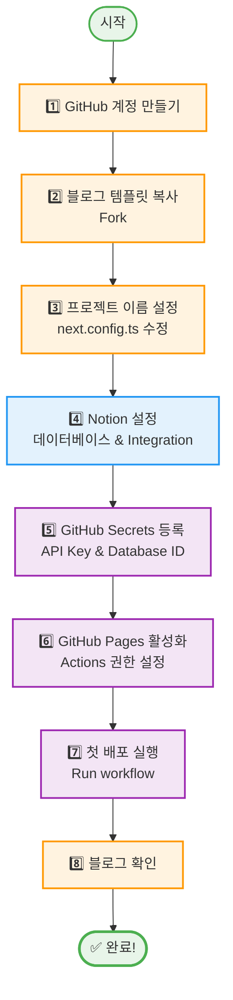
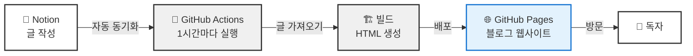
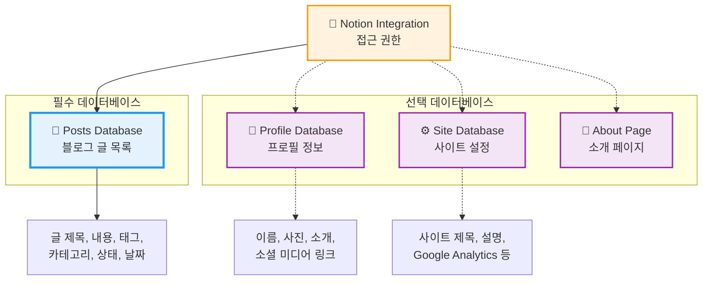
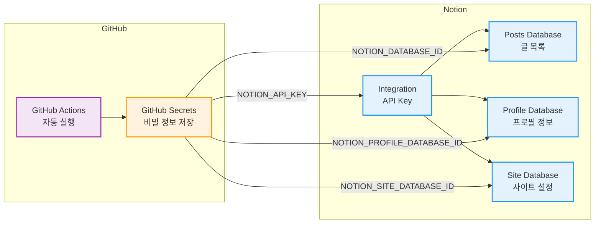
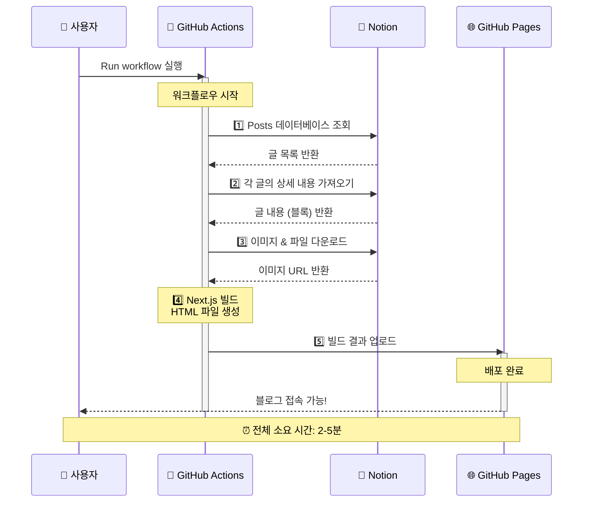
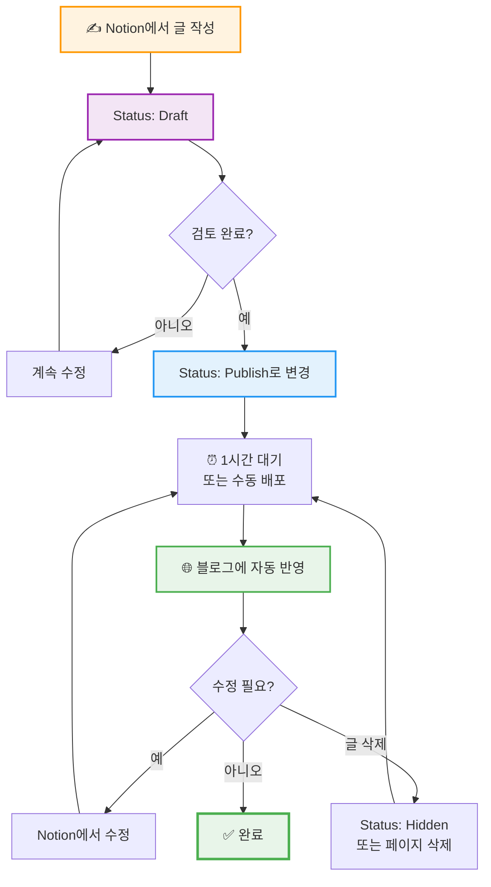
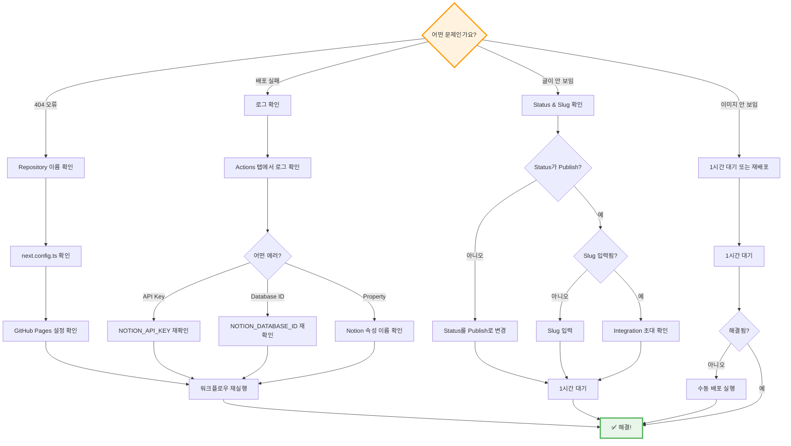

# 비개발자를 위한 완전 가이드

> 💡 **코딩 지식이 전혀 없어도 괜찮습니다!**
> 이 가이드는 프로그래밍을 한 번도 해보지 않은 분들도 따라할 수 있도록 **클릭 한 번 한 번**을 상세하게 설명합니다.

**⏱️ 소요 시간**: 약 30분
**📦 필요한 것**: Notion 계정, GitHub 계정 (무료)
**💻 설치 프로그램**: 없음 (모든 작업을 웹 브라우저에서 진행)

---

## ✨ 이 가이드의 특징

| 특징 | 설명 |
|------|------|
| 🖱️ **클릭 단위 설명** | "어디를 클릭하나요?"부터 "무엇이 보여야 하나요?"까지 |
| 🔤 **용어 쉬운 설명** | 어려운 기술 용어를 일상적인 말로 풀어서 설명 |
| 📊 **시각적 다이어그램** | 전체 흐름과 구조를 그림으로 이해 |
| ✅ **확인사항 체크** | 각 단계마다 "제대로 하고 있는지" 확인 가능 |
| ⚠️ **주의사항 강조** | 실수하기 쉬운 부분을 미리 알려드림 |
| 💡 **팁 제공** | 더 쉽게 할 수 있는 방법 안내 |

---

## 📌 목차

1. [전체 설정 프로세스 🗺️](#-전체-설정-프로세스)
2. [시작하기 전에](#시작하기-전에)
   - [이 가이드는 누구를 위한 것인가요?](#이-가이드는-누구를-위한-것인가요)
   - [이 가이드로 무엇을 얻을 수 있나요?](#이-가이드로-무엇을-얻을-수-있나요)
   - [필요한 사전 준비물](#필요한-사전-준비물)
   - [🔤 용어 설명 (알아두면 좋아요!)](#-용어-설명-알아두면-좋아요)
   - [전체 시스템 구조](#전체-시스템-구조)
3. [1단계: GitHub 계정 만들기](#1단계-github-계정-만들기)
   - [1.1 GitHub 웹사이트 접속하기](#11-github-웹사이트-접속하기)
   - [1.2 회원가입 시작하기](#12-회원가입-시작하기)
   - [1.3 이메일 주소 입력하기](#13-이메일-주소-입력하기)
   - [1.4 비밀번호 만들기](#14-비밀번호-만들기)
   - [1.5 사용자 이름 정하기](#15-사용자-이름-정하기)
   - [1.6 이메일 수신 동의 (선택)](#16-이메일-수신-동의-선택)
   - [1.7 로봇 아님 확인하기](#17-로봇-아님-확인하기)
   - [1.8 이메일 인증하기](#18-이메일-인증하기)
   - [1.9 추가 정보 입력 (선택)](#19-추가-정보-입력-선택)
   - [1.10 무료 플랜 선택하기](#110-무료-플랜-선택하기)
4. [2단계: 블로그 템플릿 복사하기 (Fork)](#2단계-블로그-템플릿-복사하기-fork)
   - [2.1 블로그 템플릿 페이지 열기](#21-블로그-템플릿-페이지-열기)
   - [2.2 Fork 버튼 찾기](#22-fork-버튼-찾기)
   - [2.3 블로그 이름 정하기](#23-블로그-이름-정하기)
   - [2.4 설명 입력하기 (선택사항)](#24-설명-입력하기-선택사항)
   - [2.5 설정 확인하기](#25-설정-확인하기)
   - [2.6 Fork 생성하기](#26-fork-생성하기)
5. [3단계: 프로젝트 이름 설정하기](#3단계-프로젝트-이름-설정하기)
   - [3.1 내 프로젝트 페이지 확인하기](#31-내-프로젝트-페이지-확인하기)
   - [3.2 파일 목록에서 next.config.ts 찾기](#32-파일-목록에서-nextconfigts-찾기)
   - [3.3 파일 수정 모드로 들어가기](#33-파일-수정-모드로-들어가기)
   - [3.4 수정할 줄 찾기](#34-수정할-줄-찾기)
   - [3.5 블로그 이름 수정하기](#35-블로그-이름-수정하기)
   - [3.6 변경사항 저장하기 (Commit)](#36-변경사항-저장하기-commit)
   - [3.7 변경사항 확정하기](#37-변경사항-확정하기)
6. [4단계: Notion 설정하기](#4단계-notion-설정하기)
   - [📊 Notion 데이터베이스 구조](#-notion-데이터베이스-구조)
   - [📚 Notion 설정 완전 가이드](#-notion-설정-완전-가이드)
7. [5단계: GitHub에 Notion 정보 등록하기](#5단계-github에-notion-정보-등록하기)
   - [🔐 GitHub과 Notion 연결 구조](#-github과-notion-연결-구조)
   - [5.1 내 프로젝트로 돌아가기](#51-내-프로젝트로-돌아가기)
   - [5.2 Settings (설정) 페이지 열기](#52-settings-설정-페이지-열기)
   - [5.3 Secrets 메뉴 찾기](#53-secrets-메뉴-찾기)
   - [5.4 첫 번째 Secret 추가하기: NOTION_API_KEY](#54-첫-번째-secret-추가하기-notion_api_key)
   - [5.5 두 번째 Secret 추가하기: NOTION_DATABASE_ID](#55-두-번째-secret-추가하기-notion_database_id)
   - [5.6 선택 Secret 추가하기 (필요한 경우만)](#56-선택-secret-추가하기-필요한-경우만)
   - [5.7 블로그 주소 설정하기 (권장)](#57-블로그-주소-설정하기-권장)
8. [6단계: GitHub Pages 활성화하기](#6단계-github-pages-활성화하기)
   - [6.1 Settings 페이지 열기](#61-settings-페이지-열기)
   - [6.2 Pages 메뉴 찾기](#62-pages-메뉴-찾기)
   - [6.3 Source 설정하기](#63-source-설정하기)
   - [6.4 Actions 권한 설정하기](#64-actions-권한-설정하기)
   - [6.5 Workflow 권한 변경하기](#65-workflow-권한-변경하기)
9. [7단계: 첫 배포 실행하기](#7단계-첫-배포-실행하기)
   - [🚀 자동 배포 프로세스](#-자동-배포-프로세스)
   - [7.1 Actions 탭 열기](#71-actions-탭-열기)
   - [7.2 Workflows 활성화하기 (필요한 경우)](#72-workflows-활성화하기-필요한-경우)
   - [7.3 배포 워크플로우 선택하기](#73-배포-워크플로우-선택하기)
   - [7.4 워크플로우 실행하기](#74-워크플로우-실행하기)
   - [7.5 진행 상황 확인하기](#75-진행-상황-확인하기)
10. [8단계: 블로그 확인하기](#8단계-블로그-확인하기)
    - [8.1 블로그 주소 만들기](#81-블로그-주소-만들기)
    - [8.2 블로그에 접속하기](#82-블로그에-접속하기)
    - [8.3 블로그 확인하기](#83-블로그-확인하기)
    - [8.4 블로그 즐겨찾기 추가하기 (추천)](#84-블로그-즐겨찾기-추가하기-추천)
11. [일상적인 블로그 운영](#일상적인-블로그-운영)
    - [📝 블로그 운영 플로우](#-블로그-운영-플로우)
    - [새 글 작성하기](#새-글-작성하기)
    - [글 수정하기](#글-수정하기)
    - [글 삭제하기](#글-삭제하기)
    - [프로필 수정하기](#프로필-수정하기)
    - [즉시 배포하기 (선택사항)](#즉시-배포하기-선택사항)
12. [문제 해결](#문제-해결)
    - [🔍 문제 진단 플로우차트](#-문제-진단-플로우차트)
    - [블로그에 접속이 안 돼요 (404 오류)](#블로그에-접속이-안-돼요-404-오류)
    - [배포가 실패했어요 (빨간색 X)](#배포가-실패했어요-빨간색-x)
    - [글이 블로그에 표시되지 않아요](#글이-블로그에-표시되지-않아요)
    - [이미지가 표시되지 않아요](#이미지가-표시되지-않아요)
13. [🎉 완료!](#-완료)
    - [다음 단계](#다음-단계)
    - [추가 자료](#추가-자료)
    - [도움이 필요하신가요?](#도움이-필요하신가요)

---

## 🗺️ 전체 설정 프로세스

아래 플로우를 따라가면 약 30분 안에 블로그를 완성할 수 있습니다:



**단계별 색상 가이드:**
- 🟢 **초록색**: 시작과 완료
- 🟠 **주황색**: GitHub 관련 작업 (1, 2, 3, 8단계)
- 🔵 **파란색**: Notion 관련 작업 (4단계)
- 🟣 **보라색**: GitHub 설정 작업 (5, 6, 7단계)

---

## 시작하기 전에

### 전체 시스템 구조

블로그가 어떻게 작동하는지 한눈에 확인해보세요:



**간단 요약:**
1. 📝 Notion에서 글 작성
2. 🔄 1시간마다 자동으로 확인
3. 🏗️ 새 글이 있으면 블로그 생성
4. 🌐 인터넷에 자동 공개
5. 👥 독자가 블로그 방문

### 이 가이드는 누구를 위한 것인가요?

- ✅ 프로그래밍을 해본 적이 없는 분
- ✅ Notion으로 글을 쓰고 싶은 분
- ✅ 무료로 블로그를 운영하고 싶은 분
- ✅ 복잡한 설정 없이 간단하게 시작하고 싶은 분

### 이 가이드로 무엇을 얻을 수 있나요?

- ✅ 무료 블로그 웹사이트 (예: `https://your-name.github.io/blog`)
- ✅ Notion에서 글만 쓰면 자동으로 블로그에 반영
- ✅ 1시간마다 자동 업데이트
- ✅ 커버 이미지, 태그, 카테고리 등 모든 기능

### 필요한 사전 준비물

1. **Notion 계정** (무료) - [notion.so](https://www.notion.so)
2. **GitHub 계정** (무료) - 아래에서 만들 예정
3. **컴퓨터** (Windows, Mac 모두 가능)
4. **인터넷 브라우저** (Chrome, Safari, Edge 등)

**⚠️ 중요**: 이 가이드는 **프로그램 설치가 필요 없습니다**. 모든 작업을 웹 브라우저에서 진행합니다.

### 🔤 용어 설명 (알아두면 좋아요!)

이 가이드에서 자주 나오는 용어를 쉽게 설명합니다:

| 용어 | 쉬운 설명 | 비유 |
|------|----------|------|
| **GitHub** | 코드를 저장하고 웹사이트를 무료로 공개할 수 있는 서비스 | 📦 구글 드라이브처럼 파일을 저장하는 곳 |
| **Repository (저장소)** | GitHub에서 프로젝트를 저장하는 폴더 | 📁 프로젝트 폴더 |
| **Fork (포크)** | 다른 사람의 프로젝트를 내 계정으로 복사하기 | 📋 복사+붙여넣기 |
| **Notion** | 메모, 문서, 데이터베이스를 만들 수 있는 서비스 | 📝 워드+엑셀을 합친 것 |
| **Database (데이터베이스)** | Notion에서 표 형태로 정보를 정리하는 기능 | 📊 엑셀 시트 |
| **Integration (통합)** | 외부 프로그램이 Notion에 접근할 수 있게 해주는 열쇠 | 🔑 출입 카드 |
| **API Key** | 프로그램이 Notion을 읽을 수 있는 비밀번호 | 🔐 비밀번호 |
| **GitHub Actions** | 자동으로 작업을 실행해주는 GitHub 기능 | ⏰ 자동화 로봇 |
| **Deploy (배포)** | 블로그를 인터넷에 공개하는 작업 | 🚀 온라인에 올리기 |
| **Slug** | 글의 URL 주소 (영문 소문자, 하이픈만 사용) | 🏷️ 글의 별명 |
| **Status** | 글의 상태 (발행됨, 작성 중, 숨김 등) | 🚦 신호등 |

---

## 1단계: GitHub 계정 만들기

**📦 GitHub이란?**
코드를 저장하고 웹사이트를 무료로 공개할 수 있는 서비스입니다. 구글 드라이브처럼 파일을 저장하는 곳이라고 생각하면 됩니다.

### 1.1 GitHub 웹사이트 접속하기

**🖱️ 따라하기:**

1. **웹 브라우저를 엽니다** (Chrome, Safari, Edge 등)
2. **주소창에 입력**: `github.com`
3. **Enter 키를 누릅니다**

→ GitHub 메인 페이지가 나타납니다.

### 1.2 회원가입 시작하기

**🖱️ 따라하기:**

1. **화면 오른쪽 위를 봅니다**
2. **"Sign up" 버튼**을 찾습니다 (검은색 또는 초록색 버튼)
3. **"Sign up" 버튼을 클릭**합니다

→ 회원가입 페이지로 이동합니다.

### 1.3 이메일 주소 입력하기

**🖱️ 따라하기:**

1. **"Enter your email" 입력창**이 보입니다
2. **본인의 이메일 주소를 입력**합니다
   - 예: `hong-gildong@gmail.com`
3. **"Continue" 버튼을 클릭**합니다

💡 **팁**: 자주 사용하는 이메일 주소를 입력하세요. 나중에 알림을 받을 수 있습니다.

### 1.4 비밀번호 만들기

**🖱️  따라하기:**

1. **"Create a password" 입력창**이 보입니다
2. **비밀번호를 입력**합니다
   - ✅ 최소 8자 이상
   - ✅ 숫자 포함 (예: `MyBlog2024!`)
3. **"Continue" 버튼을 클릭**합니다

⚠️ **주의**: 비밀번호를 메모장에 꼭 적어두세요!

### 1.5 사용자 이름 정하기

**🖱️ 따라하기:**

1. **"Enter a username" 입력창**이 보입니다
2. **사용자 이름을 입력**합니다
   - ✅ 영문, 숫자, 하이픈(-) 사용 가능
   - ✅ 소문자 추천
   - ❌ 한글, 공백, 특수문자 불가
   - 예시:
     - ✅ `hong-gildong`
     - ✅ `myblog2024`
     - ✅ `tech-writer`
     - ❌ `홍길동` (한글 불가)
     - ❌ `my blog` (공백 불가)
3. **"Continue" 버튼을 클릭**합니다

🎯 **매우 중요**: 이 사용자 이름이 블로그 주소에 들어갑니다!
- 사용자 이름이 `hong-gildong`이면
- 블로그 주소는 `https://hong-gildong.github.io/블로그이름/`

### 1.6 이메일 수신 동의 (선택)

**🖱️ 따라하기:**

1. **"Would you like to receive product updates and announcements via email?"** 질문이 나옵니다
2. **원하는 것을 선택**합니다:
   - **"y"** 입력 → 이메일 받기 (추천하지 않음)
   - **"n"** 입력 → 이메일 받지 않기 (추천)
3. **"Continue" 버튼을 클릭**합니다

### 1.7 로봇 아님 확인하기

**🖱️ 따라하기:**

1. **"Verify your account" 화면**이 나타납니다
2. **"Verify" 버튼을 클릭**합니다
3. **퍼즐 게임**이 나옵니다
   - 화살표를 돌려서 그림을 맞추면 됩니다
   - 여러 번 시도해도 괜찮습니다
4. **퍼즐을 완료**하면 자동으로 다음으로 넘어갑니다

### 1.8 이메일 인증하기

**🖱️ 따라하기:**

1. **"Enter code" 화면**이 나타납니다
2. **이메일을 확인**합니다
   - GitHub에서 온 이메일을 찾습니다
   - 제목: "Your GitHub launch code"
3. **이메일에 있는 8자리 코드**를 복사합니다
   - 예: `12345678`
4. **코드를 입력창에 붙여넣기**합니다
5. 자동으로 인증됩니다

💡 **팁**: 이메일이 안 오면 스팸 메일함을 확인하세요.

### 1.9 추가 정보 입력 (선택)

**🖱️ 따라하기:**

1. **몇 가지 질문**이 나올 수 있습니다:
   - "How many people work on your team?" → **"Just me" 선택**
   - "What do you want to use GitHub for?" → **"Other" 선택**
2. **"Continue" 또는 "Skip" 버튼을 클릭**합니다

### 1.10 무료 플랜 선택하기

**🖱️ 따라하기:**

1. **플랜 선택 화면**이 나타날 수 있습니다
2. **"Continue for free" 버튼을 클릭**합니다
   - 또는 **"Free" 플랜 선택 → "Continue" 클릭**

✅ **완료!** GitHub 계정이 만들어졌습니다!

→ GitHub 대시보드 화면이 보이면 성공입니다.

---

## 2단계: 블로그 템플릿 복사하기 (Fork)

**📋 Fork (포크)란?**
다른 사람의 프로젝트를 내 계정으로 복사하는 것입니다. 워드 문서를 복사+붙여넣기하는 것과 같습니다.

### 2.1 블로그 템플릿 페이지 열기

**🖱️ 따라하기:**

1. **새 탭을 엽니다** (Ctrl+T 또는 Cmd+T)
2. **주소창에 복사+붙여넣기**:
   ```
   https://github.com/freelife1191/nextjs-notion-blog
   ```
3. **Enter 키를 누릅니다**

→ 블로그 템플릿 프로젝트 페이지가 열립니다.

**✅ 확인사항**: 화면에 이런 것들이 보여야 합니다:
- 왼쪽 위: `freelife1191 / nextjs-notion-blog`
- 파일 목록: `src`, `docs`, `README.md` 등
- 오른쪽 위: **Fork** 버튼 (중요!)

### 2.2 Fork 버튼 찾기

**🖱️ 따라하기:**

1. **화면 오른쪽 위를 봅니다**
2. **별(⭐) 모양 옆에 "Fork" 버튼**을 찾습니다
3. **Fork 버튼을 클릭**합니다

💡 **팁**: Fork 버튼은 보통 별 모양과 숫자 사이에 있습니다.

→ Fork 설정 페이지로 이동합니다.

### 2.3 블로그 이름 정하기

**🖱️ 따라하기:**

1. **"Repository name" 입력창**을 찾습니다 (이미 `nextjs-notion-blog`라고 채워져 있음)
2. **기존 이름을 지우고 새 이름을 입력**합니다
   - ✅ 영문 소문자 추천
   - ✅ 숫자 사용 가능
   - ✅ 하이픈(-) 사용 가능
   - ❌ 한글 불가
   - ❌ 공백 불가
   - ❌ 특수문자 불가
   - 좋은 예시:
     - ✅ `my-blog` (간단하고 좋음)
     - ✅ `tech-blog`
     - ✅ `personal-blog`
     - ✅ `myblog2024`
   - 나쁜 예시:
     - ❌ `나의블로그` (한글)
     - ❌ `my blog` (공백)
     - ❌ `my_blog!` (특수문자)

🎯 **매우 중요**: 이 이름이 블로그 주소에 들어갑니다!

**예시:**
- GitHub 사용자 이름: `hong-gildong`
- Repository 이름: `my-blog`
- 최종 블로그 주소: `https://hong-gildong.github.io/my-blog/`

⚠️ **주의**: 이 이름을 메모장에 꼭 적어두세요! 다음 단계에서 사용합니다.

### 2.4 설명 입력하기 (선택사항)

**🖱️ 따라하기:**

1. **"Description" 입력창**을 봅니다 (선택사항이므로 비워도 됨)
2. 원하면 **블로그 설명을 입력**합니다
   - 예: "My personal blog"
   - 예: "Tech writing blog"
3. **비워둬도 전혀 문제없습니다**

### 2.5 설정 확인하기

**🖱️ 따라하기:**

1. **아래로 스크롤**합니다
2. **"Copy the main branch only" 체크박스**를 찾습니다
3. **✅ 체크되어 있는지 확인**합니다
   - 체크되어 있지 않으면 체크하세요

→ 이 설정은 필요한 파일만 복사하기 위한 것입니다.

### 2.6 Fork 생성하기

**🖱️ 따라하기:**

1. **페이지 아래쪽을 봅니다**
2. **초록색 "Create fork" 버튼**을 찾습니다
3. **"Create fork" 버튼을 클릭**합니다

→ 화면에 로딩 표시가 나타납니다. **10~20초 기다려주세요.**

✅ **완료!** 블로그 템플릿이 내 계정으로 복사되었습니다!

**✅ 확인사항**:
- 왼쪽 위에 `내사용자이름 / my-blog` 형태로 보여야 합니다
- `freelife1191`이 아닌 **본인의 사용자 이름**이 보여야 합니다

---

## 3단계: 프로젝트 이름 설정하기

**⚙️ 이 단계가 왜 필요한가요?**
블로그가 올바른 주소로 열리도록 설정 파일을 수정해야 합니다. 파일 하나만 수정하면 됩니다!

### 3.1 내 프로젝트 페이지 확인하기

**🖱️ 따라하기:**

1. **현재 화면을 확인**합니다
2. **왼쪽 위에 본인의 사용자 이름이 있는지 확인**합니다
   - 예: `hong-gildong / my-blog`
3. 만약 다른 페이지에 있다면:
   - 주소창에 입력: `github.com/내사용자이름/내블로그이름`
   - 예: `github.com/hong-gildong/my-blog`

### 3.2 파일 목록에서 next.config.ts 찾기

**🖱️ 따라하기:**

1. **화면을 아래로 스크롤**합니다
2. **파일 목록**을 봅니다
   - `src`, `.github`, `docs` 등의 폴더가 보입니다
3. **`next.config.ts` 파일**을 찾습니다
   - 보통 파일 목록 중간쯤에 있습니다
   - 📄 파일 아이콘과 함께 표시됩니다
4. **`next.config.ts`를 클릭**합니다

→ 파일 내용이 화면에 나타납니다.

**✅ 확인사항**: 화면에 코드가 보여야 합니다. 첫 줄은 `import type { NextConfig } from "next";`로 시작합니다.

### 3.3 파일 수정 모드로 들어가기

**🖱️ 따라하기:**

1. **화면 오른쪽 위를 봅니다**
2. **연필 모양 아이콘 ✏️ (Edit this file)**을 찾습니다
   - 보통 "Raw", "Blame" 버튼 옆에 있습니다
3. **연필 아이콘을 클릭**합니다

→ 파일이 수정 가능한 상태로 바뀝니다.

**✅ 확인사항**: 코드가 입력 가능한 텍스트 박스로 바뀌어야 합니다.

### 3.4 수정할 줄 찾기

**🖱️ 따라하기:**

1. **코드를 주의깊게 봅니다**
2. **3번째 줄을 찾습니다**:
   ```typescript
   const repoBase = "/nextjs-notion-blog";
   ```
3. **이 줄을 클릭**하여 커서를 놓습니다

💡 **팁**: Ctrl+F (또는 Cmd+F)를 눌러서 `repoBase`를 검색하면 쉽게 찾을 수 있습니다.

### 3.5 블로그 이름 수정하기

**🖱️ 따라하기:**

1. **`"/nextjs-notion-blog"` 부분을 선택**합니다
   - 마우스로 드래그하여 선택
   - 또는 더블클릭하여 단어 선택
2. **Delete 키를 눌러 삭제**합니다
3. **2단계에서 메모한 본인의 블로그 이름을 입력**합니다
   - ⚠️ **주의**: 슬래시(/)와 큰따옴표(")는 그대로 두고 이름만 바꿉니다!

**📝 수정 예시:**

**Before (수정 전):**
```typescript
const repoBase = "/nextjs-notion-blog";
```

**After (수정 후):**
```typescript
const repoBase = "/my-blog";
```

**다른 예시들:**
- 블로그 이름이 `personal-blog`인 경우:
  ```typescript
  const repoBase = "/personal-blog";
  ```
- 블로그 이름이 `tech-blog`인 경우:
  ```typescript
  const repoBase = "/tech-blog";
  ```
- 블로그 이름이 `myblog2024`인 경우:
  ```typescript
  const repoBase = "/myblog2024";
  ```

⚠️ **매우 중요**:
- ✅ 슬래시(/) **반드시 포함**
- ✅ 큰따옴표(") **반드시 포함**
- ✅ 2단계에서 정한 이름과 **정확히 일치**
- ✅ 대소문자도 **정확히 일치**

### 3.6 변경사항 저장하기 (Commit)

**🖱️ 따라하기:**

1. **화면 오른쪽 위를 봅니다**
2. **초록색 "Commit changes..." 버튼**을 찾습니다
3. **"Commit changes..." 버튼을 클릭**합니다

→ 팝업 창이 나타납니다.

### 3.7 변경사항 확정하기

**🖱️ 따라하기:**

1. **팝업 창**을 봅니다
   - "Commit message"라는 제목이 보입니다
   - 이미 메시지가 입력되어 있습니다
2. **메시지는 그대로 두고**
3. **아래쪽의 초록색 "Commit changes" 버튼을 클릭**합니다
   - (팝업 창 안쪽의 버튼입니다)

→ 팝업이 닫히고 파일이 저장됩니다.

✅ **완료!** 블로그 주소 설정이 완료되었습니다!

**✅ 확인사항**: 파일 내용 화면으로 돌아오고, 수정한 내용이 반영되어 보여야 합니다.

---

## 4단계: Notion 설정하기

Notion에서 블로그 콘텐츠를 관리할 데이터베이스를 만들고, 외부 접근 권한을 설정합니다.

### 📊 Notion 데이터베이스 구조



**필수 vs 선택:**
- ✅ **필수**: Posts Database - 블로그 글을 관리하는 핵심 데이터베이스
- ⭕ **선택**: Profile, Site, About - 추가 정보 및 사이트 커스터마이징

### 📚 Notion 설정 완전 가이드

Notion 설정은 단계가 많아 별도 문서로 준비했습니다:

**👉 [Notion 설정 가이드 (NOTION_SETUP_GUIDE.md)](./NOTION_SETUP_GUIDE.md)**

위 가이드를 따라 진행하면서 다음 정보를 **메모장에 복사**해두세요:

1. ✅ **Notion Integration Secret** (예: `secret_abc123...`)
2. ✅ **Posts Database ID** (예: `a1b2c3d4e5f6...`)
3. ⭕ **Profile Database ID** (선택사항 - 프로필 정보)
4. ⭕ **Site Database ID** (선택사항 - 사이트 설정)
5. ⭕ **About Page ID** (선택사항)

**⚠️ 중요**: 위 정보는 다음 단계에서 사용되니 안전하게 보관하세요!

---

## 5단계: GitHub에 Notion 정보 등록하기

**⚠️ 이 단계는 필수입니다!** 이 설정이 없으면 블로그가 작동하지 않습니다.

### 🔐 GitHub과 Notion 연결 구조



**이 단계에서 하는 일:**
- GitHub Actions가 Notion에 접근할 수 있도록 "열쇠"를 등록하는 과정입니다
- GitHub Secrets는 비밀번호처럼 안전하게 보관되는 공간입니다
- Integration API Key는 Notion 데이터베이스를 읽을 수 있는 권한입니다

GitHub Actions가 자동으로 Notion에서 글을 가져오려면 접근 권한이 필요합니다.
4단계에서 복사한 정보를 GitHub Secrets에 등록해야 합니다.

**📋 준비물**: 4단계 Notion 가이드에서 메모한 정보
- ✅ Notion Integration Secret (예: `secret_abc123...`)
- ✅ Posts Database ID (예: `a1b2c3d4e5f6...`)
- ⭕ Profile Database ID (선택)
- ⭕ Site Database ID (선택)
- ⭕ About Page ID (선택)

### 5.1 내 프로젝트로 돌아가기

**🖱️ 따라하기:**

1. **GitHub 창으로 돌아갑니다**
2. **내 프로젝트 페이지로 이동**:
   - 주소창에 입력: `github.com/내사용자이름/내블로그이름`
   - 예: `github.com/hong-gildong/my-blog`

**✅ 확인사항**: 왼쪽 위에 본인의 사용자 이름이 보여야 합니다.

### 5.2 Settings (설정) 페이지 열기

**🖱️ 따라하기:**

1. **화면 위쪽의 탭 메뉴를 봅니다**
   - `Code`, `Issues`, `Pull requests` 등이 보입니다
2. **오른쪽 끝의 "Settings" 탭**을 찾습니다
   - ⚙️ 톱니바퀴 아이콘과 함께 있습니다
3. **"Settings"를 클릭**합니다

→ 프로젝트 설정 페이지로 이동합니다.

💡 **팁**: Settings가 안 보이면 "..." 버튼을 클릭하면 나타날 수 있습니다.

### 5.3 Secrets 메뉴 찾기

**🖱️ 따라하기:**

1. **화면 왼쪽 사이드바를 봅니다**
2. **아래로 스크롤**합니다
3. **"Secrets and variables" 메뉴**를 찾습니다
   - 🔒 자물쇠 아이콘과 함께 있을 수 있습니다
4. **"Secrets and variables"를 클릭**합니다
   - 하위 메뉴가 펼쳐집니다
5. **"Actions"를 클릭**합니다

→ Secrets 관리 페이지로 이동합니다.

**✅ 확인사항**:
- 화면 위에 "Actions secrets and variables" 제목이 보입니다
- "Secrets" 탭이 선택되어 있습니다
- "Repository secrets" 섹션이 보입니다

### 5.4 첫 번째 Secret 추가하기: NOTION_API_KEY

이제 Notion Integration Secret을 등록합니다. 이것은 GitHub이 Notion을 읽을 수 있는 "비밀번호"입니다.

**🖱️ 따라하기:**

1. **"Repository secrets" 섹션을 봅니다**
2. **초록색 "New repository secret" 버튼**을 찾습니다
   - 오른쪽 위에 있습니다
3. **"New repository secret" 버튼을 클릭**합니다

→ Secret 추가 화면이 나타납니다.

**5.4.1 이름 입력하기**

**🖱️ 따라하기:**

1. **"Name" 입력창**을 봅니다
2. **정확히 입력**: `NOTION_API_KEY`
   - ⚠️ **매우 중요**: 대문자로, 띄어쓰기 없이, 정확히 입력해야 합니다!
   - ✅ 올바른 예: `NOTION_API_KEY`
   - ❌ 틀린 예: `notion_api_key`, `Notion API Key`, `NOTION API KEY`

**5.4.2 비밀 값 입력하기**

**🖱️ 따라하기:**

1. **"Secret" 입력창**을 봅니다
2. **4단계에서 메모한 Integration Secret을 복사+붙여넣기**합니다
   - `secret_`로 시작하는 긴 문자열입니다
   - 예: `secret_abc123XYZ456def...`
3. **앞뒤 공백이 없는지 확인**합니다

💡 **팁**: 메모장에서 복사할 때 공백이 포함되지 않도록 주의하세요.

**5.4.3 Secret 저장하기**

**🖱️ 따라하기:**

1. **아래쪽의 초록색 "Add secret" 버튼**을 찾습니다
2. **"Add secret" 버튼을 클릭**합니다

→ Secret이 저장되고 목록에 나타납니다.

**✅ 확인사항**: `NOTION_API_KEY`가 목록에 보여야 합니다.

---

### 5.5 두 번째 Secret 추가하기: NOTION_DATABASE_ID

이제 Posts Database ID를 등록합니다. 이것은 블로그 글이 있는 데이터베이스의 "주소"입니다.

**🖱️ 따라하기:**

1. **다시 초록색 "New repository secret" 버튼을 클릭**합니다

**5.5.1 이름 입력하기**

**🖱️ 따라하기:**

1. **"Name" 입력창**에 정확히 입력: `NOTION_DATABASE_ID`
   - ⚠️ **매우 중요**: 대문자로, 띄어쓰기 없이, 정확히 입력!
   - ✅ 올바른 예: `NOTION_DATABASE_ID`
   - ❌ 틀린 예: `notion_database_id`, `NOTION DATABASE ID`

**5.5.2 비밀 값 입력하기**

**🖱️ 따라하기:**

1. **"Secret" 입력창**에 **Posts Database ID를 복사+붙여넣기**합니다
   - 32자리 문자열입니다 (하이픈 없음)
   - 예: `a1b2c3d4e5f6g7h8i9j0k1l2m3n4o5p6`
2. **앞뒤 공백이 없는지 확인**합니다

**5.5.3 Secret 저장하기**

**🖱️ 따라하기:**

1. **"Add secret" 버튼을 클릭**합니다

**✅ 확인사항**: 목록에 2개의 Secret이 보여야 합니다:
- `NOTION_API_KEY`
- `NOTION_DATABASE_ID`

🎉 **필수 설정 완료!** 이 두 개만 있어도 블로그가 작동합니다!

### 5.6 선택 Secret 추가하기 (필요한 경우만)

Profile, Site, About 데이터베이스를 만들었다면 같은 방법으로 추가합니다.

**🖱️ 추가 방법:**

각 Secret마다 같은 과정을 반복합니다:
1. **"New repository secret" 버튼 클릭**
2. **Name 입력** (아래 표 참고)
3. **Secret 붙여넣기** (4단계에서 메모한 값)
4. **"Add secret" 버튼 클릭**

**📋 선택 Secret 목록:**

| 만든 것 | Name (정확히 입력) | Secret 값 |
|--------|------------------|-----------|
| Profile Database | `NOTION_PROFILE_DATABASE_ID` | Profile Database ID |
| Site Database | `NOTION_SITE_DATABASE_ID` | Site Database ID |
| About Page | `NOTION_ABOUT_PAGE_ID` | About Page ID |

**💡 참고**: 이 Secret들은 선택사항입니다. 나중에 언제든지 추가할 수 있습니다.

### 5.7 블로그 주소 설정하기 (권장)

SEO 최적화를 위해 블로그 전체 주소를 등록합니다.

**🖱️ 따라하기:**

1. **"New repository secret" 버튼 클릭**
2. **Name 입력**: `NEXT_PUBLIC_SITE_URL`
3. **Secret 입력**: 본인의 블로그 주소
   - 형식: `https://사용자이름.github.io/블로그이름`
   - 예: `https://hong-gildong.github.io/my-blog`
4. **"Add secret" 버튼 클릭**

💡 **팁**: 이 설정은 선택사항이지만 검색 엔진 최적화에 도움이 됩니다.

---

## 6단계: GitHub Pages 활성화하기

**🌐 GitHub Pages란?**
GitHub에서 제공하는 무료 웹 호스팅 서비스입니다. 블로그를 인터넷에 공개하려면 이 기능을 켜야 합니다.

### 6.1 Settings 페이지 열기

**🖱️ 따라하기:**

1. **저장소 페이지를 엽니다**
   - 주소: `github.com/내사용자이름/내블로그이름`
2. **Settings 탭을 클릭**합니다
   - 화면 위쪽 탭 메뉴에서 찾으세요

→ Settings 페이지로 이동합니다.

### 6.2 Pages 메뉴 찾기

**🖱️ 따라하기:**

1. **왼쪽 사이드바를 봅니다**
2. **아래로 스크롤**합니다
3. **"Pages" 메뉴**를 찾습니다
   - "Code and automation" 섹션 아래에 있습니다
4. **"Pages"를 클릭**합니다

→ Pages 설정 화면이 나타납니다.

### 6.3 Source 설정하기

**🖱️ 따라하기:**

1. **"Build and deployment" 섹션을 봅니다**
2. **"Source" 드롭다운**을 찾습니다
3. **드롭다운을 클릭**하여 열기
4. **"GitHub Actions"를 선택**합니다

⚠️ **매우 중요**:
- ✅ 반드시 **"GitHub Actions"** 선택
- ❌ **"Deploy from a branch"** 선택하지 마세요!

→ 설정이 자동으로 저장됩니다.

### 6.4 Actions 권한 설정하기

**🖱️ 따라하기:**

1. **왼쪽 사이드바에서 "Actions"를 클릭**합니다
   - 하위 메뉴가 펼쳐집니다
2. **"General"을 클릭**합니다

→ Actions 설정 페이지로 이동합니다.

### 6.5 Workflow 권한 변경하기

**🖱️ 따라하기:**

1. **페이지를 아래로 스크롤**합니다
2. **"Workflow permissions" 섹션**을 찾습니다
3. **"Read and write permissions" 라디오 버튼을 선택**합니다
   - ⭕ 동그라미를 클릭하면 선택됩니다
4. **아래의 체크박스를 선택**합니다:
   - ✅ "Allow GitHub Actions to create and approve pull requests"
5. **초록색 "Save" 버튼을 클릭**합니다

✅ **완료!** 블로그 호스팅 설정이 완료되었습니다!

---

## 7단계: 첫 배포 실행하기

이제 Notion 콘텐츠를 불러와서 블로그를 생성합니다!

### 🚀 자동 배포 프로세스



**배포 과정 설명:**
1. 🟡 **노란색 원** - 워크플로우 실행 중
2. ✅ **초록색 체크** - 배포 성공
3. ❌ **빨간색 X** - 배포 실패 (아래 "문제 해결" 참고)

### 7.1 Actions 탭 열기

**🖱️ 따라하기:**

1. **저장소 페이지로 이동**합니다
   - 주소: `github.com/내사용자이름/내블로그이름`
2. **화면 위쪽 탭 메뉴를 봅니다**
3. **"Actions" 탭을 클릭**합니다

→ Actions 페이지로 이동합니다.

### 7.2 Workflows 활성화하기 (필요한 경우)

노란색 배너가 보일 수 있습니다:

**🖱️ 따라하기:**

1. **노란색 배너를 봅니다**:
   ```
   Workflows aren't being run on this forked repository
   ```
2. **초록색 "I understand my workflows, go ahead and enable them" 버튼을 클릭**합니다

💡 **참고**: 배너가 안 보이면 이미 활성화된 것이므로 다음 단계로 넘어가세요.

### 7.3 배포 워크플로우 선택하기

**🖱️ 따라하기:**

1. **왼쪽 사이드바를 봅니다**
2. **"All workflows" 아래 목록을 봅니다**
3. **"Deploy to GitHub Pages"를 찾습니다**
4. **"Deploy to GitHub Pages"를 클릭**합니다

→ 워크플로우 상세 페이지로 이동합니다.

### 7.4 워크플로우 실행하기

**🖱️ 따라하기:**

1. **화면 오른쪽 위를 봅니다**
2. **"Run workflow" 버튼**을 찾습니다
   - 파란색 또는 회색 버튼입니다
3. **"Run workflow" 버튼을 클릭**합니다
   - 작은 드롭다운 메뉴가 나타납니다
4. **드롭다운 안의 초록색 "Run workflow" 버튼을 다시 클릭**합니다

→ 워크플로우가 시작됩니다!

**✅ 확인사항**: "Workflow run was successfully requested" 메시지가 나타납니다.

### 7.5 진행 상황 확인하기

**🖱️ 따라하기:**

1. **페이지를 새로고침**합니다 (F5 또는 Cmd+R)
2. **워크플로우 목록**을 봅니다
3. **가장 위에 새 항목**이 보입니다:
   - 제목: "Deploy to GitHub Pages"
   - 아래에 본인의 사용자 이름

**📊 상태 표시:**

| 아이콘 | 의미 | 설명 |
|--------|------|------|
| 🟡 **노란색 원** | 진행 중 | 2~5분 기다려주세요 |
| ✅ **초록색 체크** | 성공! | 배포 완료! 다음 단계로 |
| ❌ **빨간색 X** | 실패 | "문제 해결" 섹션 참고 |

💡 **팁**: 페이지를 계속 새로고침하면서 상태를 확인하세요.

⏰ **소요 시간**: 보통 2~5분이 걸립니다. 커피 한 잔 하고 오세요! ☕

---

## 8단계: 블로그 확인하기

🎉 **축하합니다!** 이제 블로그가 만들어졌습니다!

### 8.1 블로그 주소 만들기

**📝 주소 형식:**
```
https://사용자이름.github.io/블로그이름/
```

**🖊️ 본인의 주소 적어보기:**

1. **메모장을 엽니다**
2. **아래 정보를 채웁니다**:
   - 내 GitHub 사용자 이름: `____________`
   - 내 블로그 이름 (2단계에서 정한): `____________`
3. **주소를 조합**합니다:
   ```
   https://____________.github.io/____________/
   ```

**예시:**
- 사용자 이름: `hong-gildong`
- 블로그 이름: `my-blog`
- 완성된 주소: `https://hong-gildong.github.io/my-blog/`

### 8.2 블로그에 접속하기

**🖱️ 따라하기:**

1. **새 탭을 엽니다** (Ctrl+T 또는 Cmd+T)
2. **위에서 만든 주소를 복사+붙여넣기**합니다
3. **Enter 키를 누릅니다**

⏰ **첫 접속은 1~2분 정도 걸릴 수 있습니다.** 잠시 기다려주세요!

### 8.3 블로그 확인하기

**✅ 성공 확인:**

블로그가 정상적으로 보이면:
- ✅ 메인 페이지가 표시됩니다
- ✅ Notion에서 작성한 글 목록이 보입니다
- ✅ 글 제목을 클릭하면 상세 페이지로 이동합니다

**❌ 만약 오류가 보인다면:**

| 오류 메시지 | 원인 | 해결 방법 |
|------------|------|----------|
| **404 - Page not found** | 주소가 틀렸거나 배포가 안 됨 | "문제 해결" 섹션 참고 |
| **아무것도 안 보임** | 아직 배포 중 | 2~5분 더 기다리기 |
| **빈 페이지** | Notion 글이 없거나 Status가 Draft | Notion 확인 |

⚠️ **주의**: 처음 배포 후 블로그가 보이기까지 최대 5분 정도 걸릴 수 있습니다.

### 8.4 블로그 즐겨찾기 추가하기 (추천)

**🖱️ 따라하기:**

1. **블로그 페이지에서**
2. **Ctrl+D (또는 Cmd+D)**를 누릅니다
3. **"확인" 또는 "저장" 버튼을 클릭**합니다

→ 이제 언제든지 빠르게 접속할 수 있습니다!

✅ **완료!** 이제 블로그를 자유롭게 즐기세요! 🎊

---

## 일상적인 블로그 운영

설정이 완료되었습니다! 이제부터는 **Notion에서만** 작업하면 됩니다.

### 📝 블로그 운영 플로우



**핵심 포인트:**
1. 모든 작업은 **Notion에서만** 진행
2. Status를 `Publish`로 변경하면 자동 공개
3. 1시간마다 자동 반영 (또는 즉시 수동 배포 가능)
4. 수정/삭제도 Notion에서 처리

### 새 글 작성하기

**🖱️ 따라하기:**

**1단계: Posts 데이터베이스 열기**
1. **Notion을 엽니다**
2. **4단계에서 만든 "Posts" 데이터베이스를 찾습니다**
3. **데이터베이스를 클릭하여 엽니다**

→ 표 형태의 데이터베이스가 보입니다.

**2단계: 새 행 추가하기**
1. **데이터베이스 아래쪽의 "+ New" 버튼을 클릭**합니다
   - 또는 데이터베이스 안에서 빈 행을 찾아 클릭

→ 새 행이 추가됩니다.

**3단계: 필수 정보 입력하기**

각 열(컬럼)에 정보를 입력합니다:

| 열 이름 | 입력 예시 | 설명 |
|---------|----------|------|
| **Title** | `Next.js 시작하기` | 글 제목 (한글 가능) |
| **Slug** | `nextjs-getting-started` | URL 주소 (영문 소문자, 하이픈만) |
| **Status** | `Draft` | 작성 중 상태 선택 |
| **Date** | `2024-01-15` | 발행 날짜 |
| **Label** | `개발` | 카테고리 (선택) |
| **Tags** | `Next.js`, `React` | 태그 (선택) |

⚠️ **Slug 작성 규칙**:
- ✅ 영문 소문자만: `my-first-post`
- ✅ 하이픈으로 단어 구분: `how-to-blog`
- ❌ 한글 불가: `나의-첫-글`
- ❌ 공백 불가: `my first post`
- ❌ 대문자 불가: `My-First-Post`

**4단계: 글 본문 작성하기**
1. **Title 열의 제목을 클릭**합니다
   - 또는 행 전체를 클릭
2. **페이지가 열립니다**
3. **글 내용을 자유롭게 작성**합니다:
   - `/` 입력 → 블록 메뉴 열기
   - 헤딩, 목록, 코드, 이미지, 동영상 등 모두 사용 가능
   - Notion의 모든 기능 사용 가능!

**5단계: 발행하기**
1. **글 작성이 완료되면**
2. **Status 속성을 찾습니다**
3. **"Draft"를 클릭**하여 드롭다운 열기
4. **"Publish"를 선택**합니다

✅ **완료!** 1시간 이내에 블로그에 자동으로 표시됩니다!

💡 **팁**: 즉시 반영하고 싶다면 GitHub Actions에서 수동 배포를 실행하세요 (5단계 참고).

### 글 수정하기

1. Notion에서 해당 글 열기
2. 내용 수정
3. 저장 (자동 저장됨)
4. 1시간 이내 자동 반영

### 글 삭제하기

**완전 삭제**:
- Notion에서 페이지 삭제

**임시 숨김** (나중에 다시 공개 가능):
- Status를 `Hidden` 또는 `Draft`로 변경

### 프로필 수정하기

Profile Database를 만들었다면:

1. **Profile** 데이터베이스 열기
2. 첫 번째 행 클릭
3. 정보 수정:
   - 이름, 프로필 사진
   - 자기소개, 직함
   - 소셜 미디어 링크
4. 1시간 이내 자동 반영

Site Database를 만들었다면:

1. **Site** 데이터베이스 열기
2. 첫 번째 행 클릭
3. 사이트 설정 수정:
   - 사이트 제목, 설명
   - Google Analytics ID
   - Google AdSense Publisher ID
4. 1시간 이내 자동 반영

### 즉시 배포하기 (선택사항)

1시간을 기다리지 않고 바로 반영하고 싶다면:

1. GitHub 저장소 → **Actions** 탭
2. **Deploy to GitHub Pages** 선택
3. **Run workflow** → **Run workflow** 클릭

---

## 문제 해결

### 🔍 문제 진단 플로우차트



---

### 블로그에 접속이 안 돼요 (404 오류)

**원인**:
- `next.config.ts` 파일의 Repository 이름이 틀렸을 수 있습니다
- GitHub Pages Source 설정이 잘못되었을 수 있습니다

**해결**:
1. 저장소에서 `next.config.ts` 파일 열기
2. 3번째 줄 확인:
   ```typescript
   const repoBase = "/my-blog";  // 본인의 repo 이름과 정확히 일치해야 함
   ```
3. Repository 이름과 다르면 수정
4. Settings → Pages에서 Source가 "GitHub Actions"인지 확인
5. 다시 Actions 탭에서 워크플로우 실행

### 배포가 실패했어요 (빨간색 X)

**원인 1: Notion API Key 오류**

1. Actions 탭에서 실패한 워크플로우 클릭
2. 로그에서 에러 메시지 확인
3. "NOTION_API_KEY" 관련 오류라면:
   - Settings → Secrets에서 `NOTION_API_KEY` 재확인
   - Integration Secret이 올바른지 확인
   - Notion에서 Integration이 데이터베이스에 초대되었는지 확인

**원인 2: Database ID 오류**

1. "Failed to fetch" 오류라면:
   - `NOTION_DATABASE_ID`가 올바른지 확인
   - Integration이 데이터베이스에 초대되었는지 확인

**원인 3: 속성 이름 오류**

1. "Property not found" 오류라면:
   - Notion 데이터베이스의 속성 이름 확인
   - `Title`, `Slug`, `Status`, `Date` 등이 정확한지 확인
   - 대소문자 구분 (`Title` ≠ `title`)

### 글이 블로그에 표시되지 않아요

**체크리스트**:
1. ✅ Status가 `Publish`인가요?
2. ✅ Slug가 입력되었나요?
3. ✅ Integration이 페이지에 초대되었나요?
   - 페이지 우측 상단 **Share** 버튼 → Integration 이름 확인
4. ✅ 1시간 기다렸나요? 또는 수동 배포했나요?
5. ✅ 브라우저 캐시를 삭제했나요?
   - `Ctrl + Shift + R` (Windows)
   - `Cmd + Shift + R` (Mac)

### 이미지가 표시되지 않아요

**해결**:
1. Notion 이미지 URL은 1시간 후 만료됩니다
2. 1시간 기다리거나 수동 배포하면 자동으로 최신 URL로 갱신됩니다
3. 외부 이미지는 Notion에 직접 업로드하는 것을 권장합니다

---

## 🎉 완료!

축하합니다! 이제 Notion으로 글만 쓰면 자동으로 블로그에 반영되는 시스템이 완성되었습니다.

### 다음 단계

- ✅ Notion에서 글 작성하기
- ✅ 커버 이미지 추가하기
- ✅ 태그와 카테고리 활용하기
- ✅ Google Analytics 연동하기 (선택)
- ✅ 커스텀 도메인 연결하기 (선택)

### 추가 자료

- [Notion 설정 가이드](./NOTION_SETUP_GUIDE.md) - Notion 데이터베이스 상세 설정
- [README.md](../README.md) - 전체 프로젝트 문서
- [GitHub Issues](https://github.com/freelife1191/nextjs-notion-blog/issues) - 문제 제보

### 도움이 필요하신가요?

- 🐛 버그 발견: [GitHub Issues](https://github.com/freelife1191/nextjs-notion-blog/issues)
- 💡 기능 제안: [GitHub Discussions](https://github.com/freelife1191/nextjs-notion-blog/discussions)
- 📖 문서 개선: Pull Request 환영합니다!

---

**Happy Blogging! 🚀**
