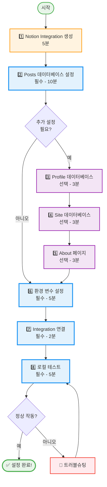
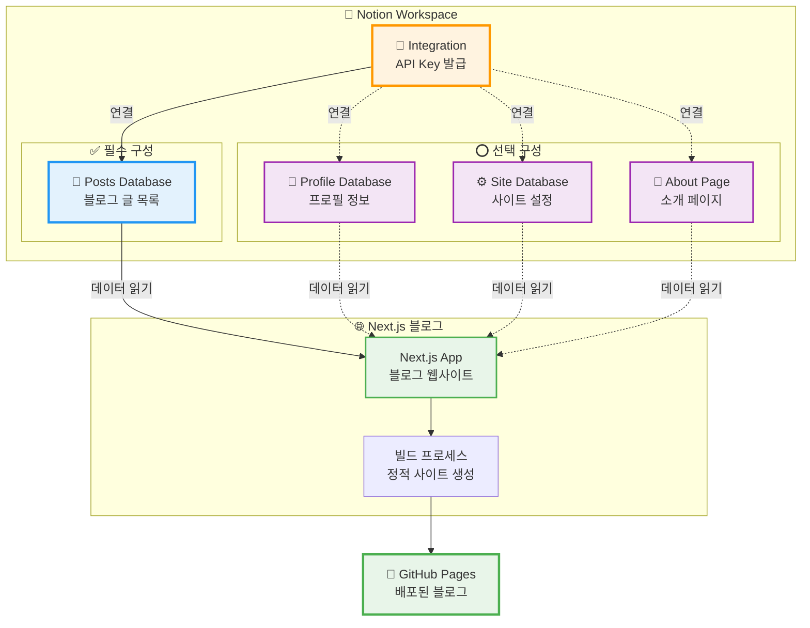
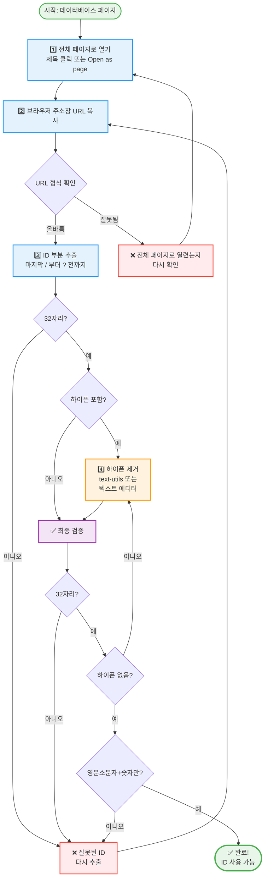
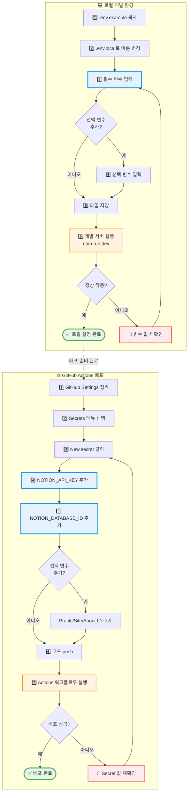

# Notion 블로그 설정 가이드

이 문서는 Notion을 이용한 블로그 운영을 위한 전체 설정 방법을 **처음부터 끝까지** 설명합니다.
Notion을 처음 사용하시는 분도 따라하실 수 있도록 작성되었습니다.

## 📋 설정 전 준비사항

시작하기 전에 다음 항목들을 준비해주세요:

- ✅ Notion 계정 (무료 계정 가능)
- ✅ 블로그에 사용할 프로필 이미지
- ✅ 포스팅할 콘텐츠 (최소 1개 이상)
- ✅ 약 30분의 시간

## ⏱️ 예상 소요 시간

- Integration 생성: 5분
- 데이터베이스 설정: 10분
- 사이트 설정: 5분
- About 페이지 (선택): 5분
- 환경 변수 설정: 5분

**전체 약 30분 소요**

## 🗺️ 전체 설정 프로세스



**색상 가이드:**
- 🟢 **초록색**: 시작과 완료
- 🟠 **주황색**: Integration 생성 (1단계)
- 🔵 **파란색**: 필수 설정 (2, 6, 7, 8단계)
- 🟣 **보라색**: 선택 설정 (3, 4, 5단계)
- 🔴 **빨간색**: 문제 해결

---

## 📌 목차

- [Notion 블로그 설정 가이드](#notion-블로그-설정-가이드)
  - [📋 설정 전 준비사항](#-설정-전-준비사항)
  - [⏱️ 예상 소요 시간](#️-예상-소요-시간)
  - [🗺️ 전체 설정 프로세스](#️-전체-설정-프로세스)
  - [📌 목차](#-목차)
  - [💡 주요 개념 이해하기](#-주요-개념-이해하기)
    - [Notion Integration이란?](#notion-integration이란)
    - [데이터베이스 vs 페이지](#데이터베이스-vs-페이지)
    - [페이지 ID란?](#페이지-id란)
    - [📊 Notion 블로그 구조 다이어그램](#-notion-블로그-구조-다이어그램)
  - [1. Notion Integration 생성](#1-notion-integration-생성)
    - [1.1 Integration 만들기](#11-integration-만들기)
    - [1.2 권한 설정](#12-권한-설정)
    - [1.3 Integration 보안 베스트 프랙티스](#13-integration-보안-베스트-프랙티스)
      - [1. API Key 노출 방지](#1-api-key-노출-방지)
      - [2. Integration 권한 최소화](#2-integration-권한-최소화)
      - [3. 정기적인 API Key 갱신](#3-정기적인-api-key-갱신)
      - [4. 페이지별 Integration 연결 관리](#4-페이지별-integration-연결-관리)
      - [5. API 사용량 모니터링](#5-api-사용량-모니터링)
      - [6. 의심스러운 활동 감지](#6-의심스러운-활동-감지)
  - [2. 포스팅 데이터베이스 설정](#2-포스팅-데이터베이스-설정)
    - [2.1 데이터베이스 생성](#21-데이터베이스-생성)
    - [2.2 필수 속성 추가](#22-필수-속성-추가)
    - [2.3 Status 속성 설정](#23-status-속성-설정)
    - [2.4 Label 속성 설정 (선택사항)](#24-label-속성-설정-선택사항)
    - [2.5 포스트 작성 예시](#25-포스트-작성-예시)
    - [2.6 데이터베이스 ID 가져오기](#26-데이터베이스-id-가져오기)
      - [🔍 Database ID 추출 플로우](#-database-id-추출-플로우)
      - [단계 1: URL 복사하기](#단계-1-url-복사하기)
      - [단계 2: ID 추출하기](#단계-2-id-추출하기)
      - [단계 3: 하이픈 제거하기 (있는 경우)](#단계-3-하이픈-제거하기-있는-경우)
      - [✅ 확인하기](#-확인하기)
    - [2.7 Integration 연결](#27-integration-연결)
      - [상세 단계](#상세-단계)
    - [2.8 이미지 최적화 가이드](#28-이미지-최적화-가이드)
      - [이미지 종류별 권장 사양](#이미지-종류별-권장-사양)
      - [이미지 최적화 도구](#이미지-최적화-도구)
      - [Notion에서 이미지 추가하는 방법](#notion에서-이미지-추가하는-방법)
      - [이미지 최적화 체크리스트](#이미지-최적화-체크리스트)
      - [실전 예시: 이미지 최적화 워크플로우](#실전-예시-이미지-최적화-워크플로우)
      - [성능 영향](#성능-영향)
    - [2.9 소셜 미디어 공유 최적화](#29-소셜-미디어-공유-최적화)
      - [Open Graph (OG) 이미지란?](#open-graph-og-이미지란)
      - [자동 설정되는 메타데이터](#자동-설정되는-메타데이터)
      - [CoverImage 설정 방법 (필수!)](#coverimage-설정-방법-필수)
      - [소셜 미디어별 이미지 최적화](#소셜-미디어별-이미지-최적화)
      - [공유 미리보기 테스트 방법](#공유-미리보기-테스트-방법)
      - [Description 작성 팁](#description-작성-팁)
      - [실전 체크리스트](#실전-체크리스트)
      - [트러블슈팅: 이미지가 표시되지 않는 경우](#트러블슈팅-이미지가-표시되지-않는-경우)
  - [3. 프로필 설정 데이터베이스 구성](#3-프로필-설정-데이터베이스-구성)
    - [3.1 프로필 설정 데이터베이스 생성](#31-프로필-설정-데이터베이스-생성)
    - [3.2 필수 속성 추가](#32-필수-속성-추가)
      - [기본 정보](#기본-정보)
      - [홈페이지 설정](#홈페이지-설정)
      - [소셜 링크 (모두 선택사항)](#소셜-링크-모두-선택사항)
    - [3.3 프로필 설정 예시](#33-프로필-설정-예시)
    - [3.4 데이터베이스 ID 가져오기](#34-데이터베이스-id-가져오기)
    - [3.5 Integration 연결](#35-integration-연결)
  - [4. 사이트 설정 데이터베이스 구성](#4-사이트-설정-데이터베이스-구성)
    - [4.1 사이트 설정 데이터베이스 생성](#41-사이트-설정-데이터베이스-생성)
    - [4.2 필수 속성 추가](#42-필수-속성-추가)
      - [사이트 메타데이터](#사이트-메타데이터)
      - [Google Analytics 및 AdSense (모두 선택사항)](#google-analytics-및-adsense-모두-선택사항)
    - [4.3 사이트 설정 예시](#43-사이트-설정-예시)
    - [4.4 데이터베이스 ID 가져오기](#44-데이터베이스-id-가져오기)
    - [4.5 Integration 연결](#45-integration-연결)
  - [5. About 페이지 구성](#5-about-페이지-구성)
    - [5.1 About 페이지 생성](#51-about-페이지-생성)
    - [5.2 페이지 내용 작성](#52-페이지-내용-작성)
    - [5.3 페이지 ID 가져오기](#53-페이지-id-가져오기)
    - [5.4 Integration 연결](#54-integration-연결)
    - [5.5 동작 확인](#55-동작-확인)
  - [6. 환경 변수 설정](#6-환경-변수-설정)
    - [🔐 환경 변수 설정 플로우](#-환경-변수-설정-플로우)
    - [6.1 `.env.local` 파일 생성하기](#61-envlocal-파일-생성하기)
      - [단계 1: 파일 위치 확인](#단계-1-파일-위치-확인)
      - [단계 2: .env.example 파일 복사하기](#단계-2-envexample-파일-복사하기)
      - [단계 3: 환경 변수 값 확인](#단계-3-환경-변수-값-확인)
      - [단계 4: 실제 값으로 교체하기](#단계-4-실제-값으로-교체하기)
      - [✅ 확인하기](#-확인하기-1)
    - [6.2 환경 변수 설명](#62-환경-변수-설명)
    - [6.3 GitHub Actions 설정 (배포용 - 필수!)](#63-github-actions-설정-배포용---필수)
  - [7. 로컬 테스트](#7-로컬-테스트)
    - [7.1 개발 서버 실행하기](#71-개발-서버-실행하기)
      - [단계 1: 터미널 열기](#단계-1-터미널-열기)
      - [단계 2: 프로젝트 디렉토리로 이동](#단계-2-프로젝트-디렉토리로-이동)
      - [단계 3: 의존성 설치 (처음 한 번만)](#단계-3-의존성-설치-처음-한-번만)
      - [단계 4: 개발 서버 실행](#단계-4-개발-서버-실행)
    - [7.2 블로그 확인하기](#72-블로그-확인하기)
    - [7.3 자주 하는 실수](#73-자주-하는-실수)
      - [오류 1: "Cannot find module..."](#오류-1-cannot-find-module)
      - [오류 2: "Missing required env var: NOTION\_API\_KEY"](#오류-2-missing-required-env-var-notion_api_key)
      - [오류 3: "Notion API returned 401"](#오류-3-notion-api-returned-401)
      - [오류 4: 포스트가 표시되지 않음](#오류-4-포스트가-표시되지-않음)
    - [7.4 개발 서버 중지하기](#74-개발-서버-중지하기)
  - [8. 트러블슈팅](#8-트러블슈팅)
    - [8.1 포스트가 표시되지 않는 경우](#81-포스트가-표시되지-않는-경우)
    - [8.2 프로필/사이트 설정이 반영되지 않는 경우](#82-프로필사이트-설정이-반영되지-않는-경우)
    - [8.3 About 페이지가 표시되지 않는 경우](#83-about-페이지가-표시되지-않는-경우)
    - [8.4 이미지가 표시되지 않는 경우](#84-이미지가-표시되지-않는-경우)
    - [8.5 API 호출 실패](#85-api-호출-실패)
    - [8.6 빌드 오류](#86-빌드-오류)
    - [8.7 Notion 데이터 백업](#87-notion-데이터-백업)
      - [왜 백업이 필요한가?](#왜-백업이-필요한가)
      - [Notion 내장 백업 기능](#notion-내장-백업-기능)
      - [자동 백업 설정](#자동-백업-설정)
      - [백업 데이터 저장 위치](#백업-데이터-저장-위치)
      - [백업에서 복원하기](#백업에서-복원하기)
      - [백업 체크리스트](#백업-체크리스트)
      - [데이터 손실 방지 팁](#데이터-손실-방지-팁)
      - [비상 상황 대응](#비상-상황-대응)
  - [부록: 속성 이름 참조표](#부록-속성-이름-참조표)
    - [포스팅 데이터베이스](#포스팅-데이터베이스)
  - [9. 다음 단계](#9-다음-단계)
    - [9.1 포스트 작성하기](#91-포스트-작성하기)
    - [9.2 GitHub Pages 배포](#92-github-pages-배포)
      - [단계 1: GitHub Repository Secrets 설정](#단계-1-github-repository-secrets-설정)
      - [단계 2: GitHub Pages 활성화](#단계-2-github-pages-활성화)
      - [단계 3: 코드 푸시 및 배포](#단계-3-코드-푸시-및-배포)
      - [단계 4: 배포 확인](#단계-4-배포-확인)
    - [9.3 운영 팁](#93-운영-팁)
      - [포스트 관리](#포스트-관리)
      - [콘텐츠 업데이트](#콘텐츠-업데이트)
      - [SEO 최적화](#seo-최적화)
      - [성능 최적화](#성능-최적화)
    - [9.4 문제 해결](#94-문제-해결)
  - [참고 자료](#참고-자료)

---

## 💡 주요 개념 이해하기

시작하기 전에 알아두면 좋은 개념들입니다:

### Notion Integration이란?
- Notion의 데이터를 외부 앱(우리의 블로그)에서 읽을 수 있게 해주는 **연결 다리**입니다
- API Key를 발급받아 블로그가 Notion의 내용을 가져올 수 있습니다
- **무료**로 사용 가능하며, 개인 워크스페이스에서만 동작합니다

### 데이터베이스 vs 페이지
- **데이터베이스**: 여러 개의 포스트를 표 형태로 관리 (엑셀과 비슷)
- **페이지**: 하나의 문서 (워드 문서와 비슷)
- 우리는 포스트 목록용 데이터베이스와 About 페이지를 만듭니다

### 페이지 ID란?
- Notion의 모든 페이지/데이터베이스는 고유한 ID를 가집니다
- URL에서 추출할 수 있으며, 32자리 영문+숫자 조합입니다
- 예: `123abc456def789ghi012jkl345mno67`

### 📊 Notion 블로그 구조 다이어그램



**연결 구조 설명:**
- 🔑 **Integration**: 모든 데이터베이스/페이지에 접근 권한 부여
- ━━ **실선**: 필수 연결 (Posts Database는 반드시 필요)
- ┄┄ **점선**: 선택 연결 (Profile, Site, About은 선택사항)
- ✅ **필수**: Posts Database - 블로그 글 없이는 블로그 운영 불가
- ⭕ **선택**: Profile, Site, About - 추가 기능 및 커스터마이징

---

## 1. Notion Integration 생성

### 1.1 Integration 만들기

1. [Notion Integrations 페이지](https://www.notion.so/my-integrations)에 접속
2. **"+ New integration"** 클릭
3. 다음 정보 입력:
   - **Name**: 블로그 이름 (예: "My Blog Integration")
   - **Logo**: 선택사항
   - **Associated workspace**: 블로그를 운영할 워크스페이스 선택
4. **Submit** 클릭
5. **Internal Integration Token** 복사 (나중에 `.env.local`에 사용)

### 1.2 권한 설정

기본적으로 다음 권한이 필요합니다:
- ✅ Read content
- ✅ Read user information (선택사항)
- ✅ No user information

### 1.3 Integration 보안 베스트 프랙티스

**⚠️ 중요: API Key는 비밀번호와 같습니다!**

Integration API Key를 안전하게 관리하기 위한 필수 수칙:

#### 1. API Key 노출 방지

**절대 하지 말아야 할 것:**
- ❌ GitHub에 `.env.local` 파일 커밋 (자동으로 무시됨)
- ❌ 스크린샷이나 화면 공유 시 API Key 노출
- ❌ 블로그 포스트나 문서에 실제 Key 포함
- ❌ 공개 슬랙/디스코드 채널에 Key 공유

**올바른 방법:**
- ✅ `.env.local` 파일만 로컬에 보관
- ✅ GitHub Secrets에 안전하게 저장
- ✅ 팀원과 공유 시 암호화된 메신저 사용

#### 2. Integration 권한 최소화

**권장 설정:**
- ✅ **Read content만 활성화** (쓰기 권한 불필요)
- ✅ 필요한 페이지/데이터베이스에만 연결
- ✅ 사용하지 않는 워크스페이스에는 Integration 생성 안 함

**권한 확인 방법:**
1. [Notion Integrations 페이지](https://www.notion.so/my-integrations) 접속
2. Integration 클릭 → **Capabilities** 섹션 확인
3. **Content Capabilities**에서 "Read content"만 체크되어 있는지 확인

#### 3. 정기적인 API Key 갱신

**권장 주기:**
- 📅 **6개월마다** API Key 재발급 (보안 강화)
- 📅 **즉시 갱신** 필요 상황:
  - API Key가 실수로 노출된 경우
  - 팀원이 퇴사하거나 접근 권한 변경이 필요한 경우
  - 의심스러운 API 호출이 감지된 경우

**API Key 갱신 방법:**
1. [Notion Integrations 페이지](https://www.notion.so/my-integrations) 접속
2. Integration 선택 → **Secrets** 탭
3. **"Refresh secret"** 클릭
4. 새로운 API Key 복사
5. `.env.local` 파일의 `NOTION_API_KEY` 값 업데이트
6. GitHub Secrets의 `NOTION_API_KEY` 값 업데이트
7. 개발 서버 재시작

#### 4. 페이지별 Integration 연결 관리

**권장 사항:**
- ✅ **필요한 페이지에만** Integration 연결
- ✅ 개인 페이지, 민감한 정보가 있는 페이지는 연결 안 함
- ✅ 블로그용 페이지와 개인 메모를 분리하여 관리

**연결 해제 방법:**
1. 페이지 우측 상단 **⋯** 메뉴 → **"Connections"**
2. Integration 이름 옆의 **"Remove"** 클릭

#### 5. API 사용량 모니터링

Notion API는 **Rate Limit**이 있습니다:
- **초당 3회** 요청 제한
- **분당 최대 요청 수** 제한 존재

**Rate Limit 초과 시:**
- 429 에러 발생 (Too Many Requests)
- 일시적으로 API 호출 차단

**이 블로그 프로젝트는 자동으로 Rate Limit를 처리합니다:**
- ✅ 캐싱을 통해 불필요한 API 호출 최소화
- ✅ 빌드 타임에만 API 호출 (런타임에는 정적 HTML 제공)
- ✅ 429 에러 시 자동 재시도 (Exponential Backoff)

#### 6. 의심스러운 활동 감지

**다음과 같은 상황이 발생하면 즉시 API Key를 갱신하세요:**
- 🚨 예상치 못한 Notion 페이지 수정 발생
- 🚨 API Rate Limit 초과 알림 (평소와 다른 트래픽)
- 🚨 GitHub Actions 로그에서 비정상적인 API 호출 패턴 발견

**확인 방법:**
- GitHub Actions → 워크플로우 실행 로그 확인
- Notion 페이지 히스토리 확인 (우측 상단 ⋯ → "Page history")

---

## 2. 포스팅 데이터베이스 설정

### 2.1 데이터베이스 생성

1. Notion에서 **새 페이지** 생성
2. 페이지 제목 설정 (예: "블로그 포스트")
3. 페이지 내에서 `/database` 입력하여 **Database - Full page** 선택
4. 또는 기존 데이터베이스를 사용해도 됩니다

### 2.2 필수 속성 추가

데이터베이스에 다음 속성들을 **정확한 이름으로** 추가해야 합니다:

| 속성 이름 | 타입 | 필수 | 설명 |
|----------|------|------|------|
| **Title** | Title | ✅ | 포스트 제목 (기본 생성됨) |
| **Slug** | Text | ✅ | URL 경로 (예: "my-first-post") |
| **Status** | Select | ✅ | 발행 상태 ("Publish" 또는 "Draft") |
| **Date** | Date | ✅ | 발행 날짜 |
| **Label** | Select | ⬜ | 카테고리 라벨 (포스트 상단에 빨간색으로 강조 표시) |
| **Tags** | Multi-select | ⬜ | 태그 목록 |
| **Description** | Text | ⬜ | 포스트 요약/설명 |
| **CoverImage** | Files | ⬜ | 커버 이미지 |
| **Language** | Select | ⬜ | 언어 (예: "ko", "en") |
| **Author** | Person 또는 Text | ⬜ | 작성자 (Notion 사용자 선택 또는 직접 입력) |

### 2.3 Status 속성 설정

**Status** 선택(Select) 속성에 다음 옵션을 추가합니다:

| 상태 | 설명 | 블로그 표시 여부 |
|------|------|----------------|
| **Publish** | 발행된 포스트 | ✅ 표시됨 |
| **Draft** | 작성 중인 포스트 | ❌ 숨김 |
| **Hidden** | 임시로 숨긴 포스트 | ❌ 숨김 |
| **Wait** | 발행 대기 중인 포스트 | ❌ 숨김 |

**동작 방식:**
- **Publish 상태만** 블로그에 표시됩니다
- Status를 "Publish"에서 다른 값으로 변경하면 즉시 포스팅 목록에서 제거됩니다
- 다시 "Publish"로 변경하면 다음 빌드 시(최대 1시간 내) 목록에 다시 표시됩니다
- Draft, Hidden, Wait 상태의 포스트는 완전히 비공개로 처리됩니다

**사용 예시:**
- **Draft**: 아직 작성 중이거나 검토가 필요한 글
- **Hidden**: 발행했지만 일시적으로 숨기고 싶은 글 (계절성 콘텐츠 등)
- **Wait**: 작성 완료했지만 특정 시점에 공개 예정인 글

### 2.4 Label 속성 설정 (선택사항)

**Label** 선택(Select) 속성은 포스트의 카테고리를 표시합니다. 포스트 상단에 날짜와 함께 빨간색으로 강조되어 표시됩니다.

**추천 라벨 옵션:**
- **INNOVATION & TOOLS** - 혁신적인 도구나 기술 소개
- **DEVELOPMENT** - 개발 관련 주제
- **DESIGN** - 디자인 관련 주제
- **PRODUCTIVITY** - 생산성 향상 팁
- **TUTORIAL** - 튜토리얼 및 가이드

**특징:**
- 포스트 상단에 "OCTOBER 2025 • INNOVATION & TOOLS" 형식으로 표시
- 대문자, 빨간색으로 강조되어 시각적으로 눈에 띔
- Label을 설정하지 않으면 날짜만 표시됨

### 2.5 포스트 작성 예시

데이터베이스에 다음과 같이 포스트를 작성할 수 있습니다:

| Title | Slug | Status | Label | Tags | Date | Description | CoverImage | Author |
|-------|------|--------|-------|------|------|-------------|------------|--------|
| Next.js로 블로그 만들기 | nextjs-blog-tutorial | Publish | DEVELOPMENT | Next.js, React, Tutorial | 2024-01-15 | Next.js와 Notion을 활용한 개인 블로그 제작 가이드 | [이미지 파일] | Your Name |
| TypeScript 베스트 프랙티스 | typescript-best-practices | Publish | DEVELOPMENT | TypeScript, JavaScript | 2024-01-20 | 실무에서 바로 쓸 수 있는 TypeScript 활용법 | [이미지 파일] | Your Name |
| 디자인 시스템 구축하기 | design-system-guide | Draft | DESIGN | Design, UI/UX | 2024-01-25 | 확장 가능한 디자인 시스템을 만드는 방법 | - | Your Name |
| 생산성 향상 도구 추천 | productivity-tools-2024 | Publish | PRODUCTIVITY | Tools, Tips | 2024-02-01 | 2024년 개발자를 위한 생산성 도구 모음 | [이미지 파일] | Your Name |

**참고:**
- **Title**: 포스트 제목 (자동으로 데이터베이스에 표시됨)
- **Slug**: URL 경로 (영문 소문자, 하이픈 사용)
- **Status**: "Publish" 상태만 블로그에 표시됨
- **Label**: 포스트 상단에 빨간색으로 강조 표시되는 카테고리
- **Tags**: 여러 개 선택 가능 (Multi-select)
- **Date**: 포스트 발행 날짜
- **Description**: 검색 엔진과 미리보기에 표시될 요약문
- **CoverImage**: 썸네일 이미지 (선택사항)
- **Author**: 작성자 (Person 타입 권장, Text 타입도 지원)
  - Person 타입: Notion 워크스페이스의 실제 사용자 선택
  - Text 타입: 직접 이름 입력
  - 설정하지 않으면 Site Settings의 기본 작성자 사용

### 2.6 데이터베이스 ID 가져오기

**중요:** 이 ID는 환경 변수 설정에서 사용됩니다.

#### 🔍 Database ID 추출 플로우



**검증 체크리스트:**
- ✅ 정확히 32자리 (더 길거나 짧으면 안 됨)
- ✅ 하이픈(`-`) 없음
- ✅ 영문 소문자와 숫자만 포함
- ❌ 대문자 포함 시 소문자로 변환 필요
- ❌ 데이터베이스 제목 포함되면 안 됨

---

#### 단계 1: URL 복사하기

1. 데이터베이스 페이지를 **전체 페이지로** 열기
   - 데이터베이스 제목을 클릭하거나
   - 우측 상단 ⋮⋮ 메뉴 → "Open as page" 클릭

2. 브라우저 주소창의 URL 복사
   ```
   https://www.notion.so/workspace명/12345678abcd12345678abcd12345678?v=...
   ```

#### 단계 2: ID 추출하기

URL에서 **32자리 영문+숫자** 부분이 ID입니다:

**예시 URL:**
```
https://www.notion.so/My-Workspace/Blog-Posts-a1b2c3d4e5f6789012345678abcdef12?v=xxx
```

**여기서 ID는:**
```
a1b2c3d4e5f6789012345678abcdef12
```

**찾는 방법:**
- URL에서 마지막 `/` 다음부터 `?` 전까지의 문자열
- 정확히 32자리 (하이픈 없이)
- 영문 소문자 + 숫자 조합

#### 단계 3: 하이픈 제거하기 (있는 경우)

만약 ID에 하이픈(`-`)이 포함되어 있다면 **모두 제거**해야 합니다.

**방법 1: 온라인 도구 사용 (가장 쉬움)**
1. [https://www.text-utils.com/remove-characters](https://www.text-utils.com/remove-characters) 접속
2. ID를 붙여넣고 하이픈(`-`)을 제거

**방법 2: 텍스트 에디터 사용**
1. 메모장이나 VS Code 열기
2. ID 붙여넣기
3. 찾기/바꾸기 (Ctrl+H 또는 Cmd+H)
4. 찾을 내용: `-`, 바꿀 내용: (공백)
5. 모두 바꾸기

**예시:**
- 원본: `a1b2c3d4-e5f6-7890-1234-5678abcdef12`
- 변환: `a1b2c3d4e5f6789012345678abcdef12` ✅

#### ✅ 확인하기

- [ ] ID가 정확히 32자리인가요?
- [ ] 하이픈(`-`)이 하나도 없나요?
- [ ] 영문 소문자와 숫자만 포함되어 있나요?

**잘못된 예시:**
- ❌ `a1b2c3d4-e5f6-7890-1234-5678abcdef12` (하이픈 포함)
- ❌ `a1b2c3d4e5f6789012345678` (32자리 미만)
- ❌ `Blog-Posts-a1b2c3d4...` (제목 포함)

### 2.7 Integration 연결

**중요:** Integration을 연결해야 블로그에서 데이터베이스를 읽을 수 있습니다.

#### 상세 단계

1. **데이터베이스 페이지 열기**
   - 포스팅 데이터베이스 페이지로 이동

2. **연결 메뉴 찾기**
   - 방법 1: 페이지 우측 상단의 **⋯** (점 3개) 메뉴 클릭
   - 방법 2: 페이지 우측 상단의 **Share** 버튼 클릭

3. **Integration 연결**
   - "Add connections" 또는 "연결 추가" 클릭
   - 검색창에서 앞서 만든 Integration 이름 검색
   - Integration 선택하여 권한 부여

4. **연결 확인**
   - Integration 이름이 연결 목록에 표시되면 성공

**주의사항:**
- ⚠️ Integration이 목록에 없다면, 1.1 단계로 돌아가 Integration을 먼저 생성해주세요
- ⚠️ 워크스페이스가 여러 개인 경우, Integration을 만든 워크스페이스와 동일한지 확인하세요

### 2.8 이미지 최적화 가이드

블로그의 성능과 사용자 경험을 위해 이미지를 최적화하는 것이 중요합니다.

#### 이미지 종류별 권장 사양

**1. CoverImage (포스트 커버 이미지)**

| 항목 | 권장 사양 | 설명 |
|------|----------|------|
| **크기** | 1200 x 630px | Open Graph 표준 크기 |
| **비율** | 1.91:1 (거의 2:1) | 소셜 미디어 공유 최적화 |
| **파일 형식** | JPG 또는 WebP | PNG는 파일 크기가 큼 |
| **파일 크기** | 200KB 이하 | 빠른 로딩 속도 보장 |
| **최대 크기** | 500KB | 초과 시 성능 저하 |

**2. ProfileImage (프로필 이미지)**

| 항목 | 권장 사양 | 설명 |
|------|----------|------|
| **크기** | 200 x 200px | 정사각형 |
| **비율** | 1:1 | 원형으로 표시됨 |
| **파일 형식** | JPG 또는 PNG | 투명 배경 필요시 PNG |
| **파일 크기** | 50KB 이하 | 매 페이지마다 로드됨 |

**3. 본문 이미지 (포스트 내부)**

| 항목 | 권장 사양 | 설명 |
|------|----------|------|
| **최대 너비** | 1200px | 더 크면 자동 축소됨 |
| **파일 형식** | JPG 또는 WebP | 스크린샷은 PNG |
| **파일 크기** | 300KB 이하 | 여러 이미지 사용 시 주의 |

#### 이미지 최적화 도구

**온라인 도구 (무료, 설치 불필요):**

1. **[TinyPNG](https://tinypng.com/)** (가장 추천)
   - PNG/JPG 압축 (최대 80% 크기 감소)
   - 화질 손실 거의 없음
   - 드래그 앤 드롭으로 간편하게 사용
   - 한 번에 최대 20개 파일 처리

2. **[Squoosh](https://squoosh.app/)**
   - Google에서 만든 이미지 압축 도구
   - WebP 변환 지원
   - 압축 전/후 비교 가능
   - 다양한 압축 옵션

3. **[ImageOptim Online](https://imageoptim.com/online)**
   - 메타데이터 제거
   - 무손실 압축
   - 여러 파일 한꺼번에 처리

**Mac 사용자:**
- **ImageOptim** 앱 설치 (무료)
- 드래그 앤 드롭으로 자동 최적화
- 다운로드: [https://imageoptim.com/mac](https://imageoptim.com/mac)

**Windows 사용자:**
- **FileOptimizer** (무료)
- 다운로드: [https://sourceforge.net/projects/nikkhokkho/](https://sourceforge.net/projects/nikkhokkho/)

#### Notion에서 이미지 추가하는 방법

**방법 1: 직접 업로드 (권장)**

1. Notion 페이지에서 `/image` 입력
2. "Upload" 선택
3. 최적화된 이미지 파일 선택
4. 업로드 완료

**장점:**
- ✅ 이미지가 Notion CDN에 저장됨
- ✅ 안정적인 접근
- ✅ 추가 설정 불필요

**주의사항:**
- ⚠️ Notion 이미지 URL은 **1시간 후 만료**됩니다
- ⚠️ 이 프로젝트는 빌드 시점에 이미지를 다운로드하므로 문제없음
- ⚠️ 1시간마다 자동 재빌드되어 이미지 URL 갱신됨

**방법 2: 외부 URL 사용**

1. 이미지를 다른 호스팅 서비스에 업로드 (예: Imgur, Cloudinary)
2. Notion 페이지에서 `/image` 입력
3. "Link" 선택
4. 이미지 URL 붙여넣기

**추천 무료 이미지 호스팅:**
- [Imgur](https://imgur.com/) - 무료, 간편함
- [Cloudinary](https://cloudinary.com/) - 무료 계정, 고급 기능
- GitHub Repository - 안정적이지만 용량 제한 있음

#### 이미지 최적화 체크리스트

포스트 작성 시 다음을 확인하세요:

- [ ] **CoverImage**: 1200x630px, 200KB 이하
- [ ] **ProfileImage**: 200x200px, 50KB 이하
- [ ] **본문 이미지**: 최대 너비 1200px, 300KB 이하
- [ ] 이미지 압축 도구로 최적화 완료
- [ ] 불필요한 메타데이터 제거
- [ ] 파일 형식: JPG/WebP (사진), PNG (스크린샷/로고)

#### 실전 예시: 이미지 최적화 워크플로우

**단계별 가이드:**

1. **원본 이미지 준비**
   - 스크린샷을 찍거나 사진을 준비

2. **크기 조정**
   - 온라인 도구: [ResizeImage.net](https://resizeimage.net/)
   - 또는 Mac Preview: 도구 → 크기 조정
   - 목표: 1200px 너비 이하

3. **압축**
   - [TinyPNG](https://tinypng.com/)에 업로드
   - 압축된 파일 다운로드

4. **Notion에 업로드**
   - 포스트 페이지에서 `/image` 입력
   - 최적화된 이미지 선택

5. **확인**
   - 이미지가 제대로 표시되는지 확인
   - 로컬에서 `npm run dev` 실행하여 테스트

#### 성능 영향

**최적화 전:**
- 원본 이미지 5MB × 10장 = **50MB**
- 로딩 시간: **15-30초**
- 모바일 데이터 소진 우려

**최적화 후:**
- 최적화된 이미지 200KB × 10장 = **2MB**
- 로딩 시간: **2-3초**
- 쾌적한 사용자 경험

**결과:**
- 🚀 **95% 용량 감소**
- 🚀 **10배 빠른 로딩**
- 🚀 **SEO 점수 향상**

### 2.9 소셜 미디어 공유 최적화

블로그 포스트를 소셜 미디어에 공유할 때 어떻게 보이는지 설정하는 방법입니다.

#### Open Graph (OG) 이미지란?

**Open Graph**는 Facebook, Twitter, LinkedIn, 카카오톡 등에서 링크를 공유할 때 표시되는 미리보기 정보입니다.

**예시: 링크 공유 시 표시 내용**
```
┌─────────────────────────────────────┐
│  [CoverImage 이미지]                 │
├─────────────────────────────────────┤
│  Your Name — Blog                    │  ← SiteTitle
│  Next.js로 블로그 만들기              │  ← Post Title
│  Next.js와 Notion을 활용한...        │  ← Description
│  yourdomain.com                      │
└─────────────────────────────────────┘
```

#### 자동 설정되는 메타데이터

이 블로그는 자동으로 다음 정보를 소셜 미디어 공유에 포함합니다:

**포스트 페이지:**
- **og:title**: 포스트 제목 (`Title` 속성)
- **og:description**: 포스트 설명 (`Description` 속성)
- **og:image**: 커버 이미지 (`CoverImage` 속성 또는 페이지 커버)
- **og:type**: article (포스트 타입)
- **og:url**: 포스트 URL

**홈페이지:**
- **og:title**: 사이트 제목 (`SiteTitle`)
- **og:description**: 사이트 설명 (`SiteDescription`)
- **og:image**: 프로필 이미지 (`ProfileImage`)
- **og:type**: website (웹사이트 타입)

#### CoverImage 설정 방법 (필수!)

소셜 미디어 공유 시 멋진 미리보기를 표시하려면 **CoverImage**를 설정해야 합니다.

**방법 1: 페이지 커버 이미지 사용 (권장)**

1. Notion 포스트 페이지 열기
2. 페이지 상단에 마우스 올리기
3. **"Add cover"** 버튼 클릭
4. 이미지 업로드 또는 URL 입력
5. 이미지 위치 조정 (드래그)

**장점:**
- ✅ 포스트 상단에 자동으로 이미지 표시
- ✅ 블로그와 소셜 미디어에서 동일한 이미지 사용
- ✅ 시각적으로 일관된 디자인

**방법 2: CoverImage 속성 사용**

1. 포스팅 데이터베이스에서 포스트 선택
2. `CoverImage` 속성에 이미지 업로드
3. 이미지 파일 선택 또는 URL 입력

**차이점:**
- 페이지 커버는 **포스트 상단**에 표시됨
- CoverImage 속성은 **메타데이터로만** 사용됨
- 둘 다 설정된 경우 **페이지 커버 우선**

#### 소셜 미디어별 이미지 최적화

| 플랫폼 | 권장 크기 | 비율 | 설명 |
|--------|----------|------|------|
| **Facebook** | 1200 x 630px | 1.91:1 | 가장 일반적인 크기 |
| **Twitter** | 1200 x 628px | 1.91:1 | Large Card 형식 |
| **LinkedIn** | 1200 x 627px | 1.91:1 | 프로필 피드에 표시 |
| **카카오톡** | 800 x 400px | 2:1 | 모바일 최적화 |
| **Instagram** | 1080 x 1080px | 1:1 | 정사각형 (스토리 제외) |

**💡 권장 사항:**
- **1200 x 630px** 크기 하나로 모든 플랫폼에서 잘 작동합니다
- 중요한 텍스트/로고는 중앙에 배치 (좌우 10% 영역은 잘릴 수 있음)
- 텍스트 크기는 충분히 크게 (읽기 쉬워야 함)

#### 공유 미리보기 테스트 방법

**1. Facebook Sharing Debugger**
- URL: [https://developers.facebook.com/tools/debug/](https://developers.facebook.com/tools/debug/)
- 블로그 URL 입력 → **"Debug"** 클릭
- 미리보기 확인 및 캐시 새로고침

**2. Twitter Card Validator**
- URL: [https://cards-dev.twitter.com/validator](https://cards-dev.twitter.com/validator)
- 블로그 URL 입력 → **"Preview card"** 클릭
- 트위터 카드 미리보기 확인

**3. LinkedIn Post Inspector**
- URL: [https://www.linkedin.com/post-inspector/](https://www.linkedin.com/post-inspector/)
- 블로그 URL 입력 → **"Inspect"** 클릭
- LinkedIn 피드 미리보기 확인

**4. 카카오톡 공유 테스트**
- 실제로 카카오톡에서 링크 공유해보기
- 또는 카카오톡 개발자 도구 사용

#### Description 작성 팁

소셜 미디어에 표시될 설명문을 효과적으로 작성하는 방법:

**좋은 예시:**
```
Next.js와 Notion을 활용하여 무료로 개인 블로그를 만드는 방법을 단계별로 설명합니다.
코딩 초보자도 30분 안에 완성할 수 있습니다.
```

**나쁜 예시:**
```
블로그 만들기
```

**작성 가이드라인:**
- ✅ **1-2문장** 길이 (150-160자 권장)
- ✅ 포스트 내용을 명확하게 요약
- ✅ 독자에게 제공하는 **가치** 강조
- ✅ 액션을 유도하는 표현 (예: "방법을 알아보세요")
- ❌ 너무 짧거나 모호한 설명
- ❌ 키워드만 나열 ("Next.js, Notion, 블로그")
- ❌ 200자 초과 (잘려서 표시됨)

#### 실전 체크리스트

포스트를 공유하기 전에 확인하세요:

- [ ] **CoverImage** 설정 (1200 x 630px)
- [ ] **Description** 작성 (150-160자)
- [ ] 이미지 파일 크기 200KB 이하
- [ ] 로컬 테스트 (`npm run dev`)에서 정상 표시 확인
- [ ] 배포 후 Facebook Debugger로 미리보기 확인
- [ ] 실제 소셜 미디어에서 공유 테스트

#### 트러블슈팅: 이미지가 표시되지 않는 경우

**문제 1: 소셜 미디어에서 이미지가 안 보임**

**원인:**
- Notion 이미지 URL이 만료됨 (1시간 제한)
- 캐시된 구 버전 메타데이터

**해결:**
1. 블로그가 최근에 재빌드되었는지 확인 (최대 1시간 대기)
2. Facebook Sharing Debugger에서 **"Scrape Again"** 클릭
3. Twitter Card Validator에서 재검사

**문제 2: 이전 이미지가 계속 표시됨**

**원인:**
- 소셜 미디어 플랫폼의 캐시

**해결:**
1. Facebook: Sharing Debugger → "Fetch new information"
2. Twitter: 24시간 후 자동 갱신 (강제 갱신 불가)
3. LinkedIn: Post Inspector → "Inspect" 재실행

**문제 3: 이미지가 잘려서 표시됨**

**원인:**
- 이미지 비율이 1.91:1이 아님
- 중요한 내용이 가장자리에 있음

**해결:**
1. 이미지를 1200 x 630px로 재조정
2. 중요한 텍스트/로고를 중앙에 배치
3. [Canva](https://www.canva.com/)로 OG 이미지 디자인

---

## 3. 프로필 설정 데이터베이스 구성

### 3.1 프로필 설정 데이터베이스 생성

1. Notion 워크스페이스에서 **새 페이지** 생성
2. 페이지 제목 설정 (예: "프로필 설정" 또는 "Profile Settings")
3. 페이지 내에서 `/database` 입력하여 **Database - Full page** 선택

### 3.2 필수 속성 추가

프로필 설정 데이터베이스에 다음 속성들을 **정확한 이름으로** 추가합니다:

#### 기본 정보

| 속성 이름 | 타입 | 필수 | 설명 | 예시 |
|----------|------|------|------|------|
| **Name** | Title | ✅ | 사이트 소유자 이름 | Your Name |
| **ProfileImage** | Files | ⬜ | 프로필 이미지 | [이미지 파일] |
| **JobTitle** | Text | ⬜ | 직업/직함 | Developer & Designer |
| **Bio** | Text | ⬜ | 자기소개 (**마크다운 지원**) | 개발자이자 디자이너로서... |

**💡 Bio 마크다운 지원**:
- ✅ **굵은 글씨**: `**텍스트**`
- ✅ *기울임*: `*텍스트*`
- ✅ 링크: `[텍스트](URL)`
- ✅ 코드: `` `코드` ``
- ✅ 리스트: `- 항목`
- 예시: `저는 **개발자**이자 *디자이너*입니다. [GitHub](https://github.com/username)에서 제 작업을 확인하세요.`

#### 홈페이지 설정

| 속성 이름 | 타입 | 필수 | 설명 | 예시 |
|----------|------|------|------|------|
| **HomeTitle** | Text | ⬜ | 홈페이지 헤더 제목 | Articles |
| **HomeDescription** | Text | ⬜ | 홈페이지 설명 (**마크다운 지원**) | 개발, 디자인, 일상에 대한 생각을 공유합니다. |

**💡 HomeDescription 마크다운 지원**:
- ✅ 홈페이지 상단에 마크다운으로 렌더링됨
- ✅ **링크**, *강조*, `코드`, 리스트 등 모든 마크다운 문법 지원
- ✅ GitHub Flavored Markdown (GFM) 완벽 지원
- 예시: `**Next.js**와 Notion으로 만든 블로그입니다. [GitHub](https://github.com/username)에서 소스 코드를 확인하세요.`

#### 소셜 링크 (모두 선택사항)

| 속성 이름 | 타입 | 설명 |
|----------|------|------|
| **KakaoChannel** | URL | 카카오톡 채널 링크 |
| **Kakao** | URL | 카카오톡 오픈채팅 링크 |
| **Instagram** | URL | 인스타그램 프로필 |
| **Blog** | URL | 블로그 링크 |
| **Email** | Email | 이메일 주소 |
| **Notion** | URL | Notion 페이지 링크 |
| **GitHub** | URL | GitHub 프로필 |
| **Twitter** | URL | Twitter 프로필 |
| **YouTube** | URL | YouTube 채널 |
| **LinkedIn** | URL | LinkedIn 프로필 |
| **Threads** | URL | Threads 프로필 |
| **Facebook** | URL | Facebook 프로필 |
| **TikTok** | URL | TikTok 프로필 |
| **Telegram** | URL | Telegram 프로필 |
| **LINE** | URL | LINE 프로필 |

### 3.3 프로필 설정 예시

데이터베이스에 다음과 같이 프로필 정보를 입력할 수 있습니다:

| Name | ProfileImage | JobTitle | Bio | HomeTitle | HomeDescription |
|------|--------------|----------|-----|-----------|-----------------|
| Your Name | [프로필 사진] | Developer & Designer | 개발자이자 디자이너로서 사용자 경험을 중시하는 프로덕트를 만듭니다. | Articles | 개발, 디자인, 일상에 대한 생각을 공유합니다. |

**소셜 링크 예시:**

| KakaoChannel | Kakao | Instagram | Blog | Email | Notion |
|--------------|-------|-----------|------|-------|--------|
| https://pf.kakao.com/your_channel_id | https://open.kakao.com/your_openchat_id | https://instagram.com/your_username | https://blog.example.com | hello@example.com | https://notion.so/your_page |

| GitHub | Twitter | YouTube | LinkedIn | Threads |
|--------|---------|---------|----------|---------|
| https://github.com/your_username | https://twitter.com/your_username | https://youtube.com/@your_channel | https://linkedin.com/in/your_username | https://threads.net/@your_username |

| Facebook | TikTok | Telegram | LINE |
|----------|--------|----------|------|
| https://facebook.com/your_username | https://tiktok.com/@your_username | https://t.me/your_username | https://line.me/ti/p/your_line_id |

**참고:**
- 모든 소셜 링크는 선택사항입니다
- 사용하지 않는 플랫폼은 비워두면 됩니다
- 프로필 이미지는 Notion에 직접 업로드하거나 외부 URL 사용 가능

### 3.4 데이터베이스 ID 가져오기

1. 프로필 설정 데이터베이스를 전체 페이지로 열기
2. URL에서 데이터베이스 ID 추출 (32자리, 하이픈 제거)
3. 환경 변수 `NOTION_PROFILE_DATABASE_ID`에 사용

### 3.5 Integration 연결

1. 프로필 설정 데이터베이스에서 우측 상단 **•••** 메뉴 클릭
2. **"연결"** 또는 **"Add connections"** 선택
3. 생성한 Integration 선택하여 권한 부여

---

## 4. 사이트 설정 데이터베이스 구성

### 4.1 사이트 설정 데이터베이스 생성

1. Notion 워크스페이스에서 **새 페이지** 생성
2. 페이지 제목 설정 (예: "사이트 설정" 또는 "Site Settings")
3. 페이지 내에서 `/database` 입력하여 **Database - Full page** 선택

### 4.2 필수 속성 추가

사이트 설정 데이터베이스에 다음 속성들을 **정확한 이름으로** 추가합니다:

#### 사이트 메타데이터

| 속성 이름 | 타입 | 필수 | 설명 | 예시 |
|----------|------|------|------|------|
| **SiteTitle** | Text | ✅ | 사이트 제목 | Your Name — Blog |
| **SiteDescription** | Text | ✅ | 사이트 설명 | Notion-powered personal blog |
| **OGImage** | Files | ❌ | Open Graph 기본 이미지 (1200x630px) | 링크 공유 시 표시될 이미지 |
| **TwitterHandle** | Text | ❌ | Twitter 계정 (@포함) | @your_twitter |
| **Author** | Person 또는 Text | ❌ | 기본 작성자 | Notion 사용자 선택 또는 직접 입력 |

**SEO & Social Media 설정:**
- **OGImage**: 링크를 SNS에 공유할 때 표시되는 이미지입니다
  - 권장 사이즈: 1200x630px (Open Graph 표준)
  - Notion에 이미지를 업로드하면 자동으로 사용됩니다
  - 포스트별 커버 이미지가 있으면 우선 사용됩니다
- **TwitterHandle**: Twitter 카드에 표시될 계정명 (@포함)
- **Author**: 포스트에 작성자가 없을 때 사용될 기본 작성자
  - Person 타입 권장: Notion 워크스페이스의 실제 사용자를 선택할 수 있습니다
  - Text 타입도 지원: 직접 이름을 입력할 수도 있습니다
  - Person 타입이 비어있으면 Text 타입 값을 사용합니다

**Favicon 설정:**
- Favicon은 이미지 파일로 관리합니다
- 프로젝트의 `src/app/favicon.ico` 파일을 원하는 아이콘으로 교체하세요
- 권장 사이즈: 32x32px 또는 16x16px
- 파일 형식: `.ico`, `.png`, `.svg` 모두 가능
- [Favicon Generator](https://favicon.io/)에서 이미지를 favicon으로 변환할 수 있습니다

#### Google Analytics 및 AdSense (모두 선택사항)

| 속성 이름 | 타입 | 설명 |
|----------|------|------|
| **GA4MeasurementId** | Text | Google Analytics 4 측정 ID (예: `G-XXXXXXXXXX`) |
| **EnableAnalytics** | Checkbox | Google Analytics 활성화 여부 |
| **AdSensePublisherId** | Text | Google AdSense 게시자 ID (예: `ca-pub-XXXXXXXXXXXXXXXX`) |
| **EnableAdSense** | Checkbox | Google AdSense 활성화 여부 |
| **AdSenseAutoAds** | Checkbox | AdSense 자동 광고 활성화 여부 |

**Google Analytics 4 (GA4) 설정:**
- [Google Analytics](https://analytics.google.com/)에서 계정 생성 후 측정 ID 발급
- 무료로 사용자 행동 분석 및 페이지뷰 추적 가능
- 개발 환경에서는 자동으로 비활성화되며, 프로덕션 빌드에서만 작동
- `EnableAnalytics`를 체크하고 `GA4MeasurementId`를 입력하면 자동으로 활성화

**Google AdSense (선택사항):**
- [Google AdSense](https://adsense.google.com/)에서 계정 생성 후 승인 필요 (1-2주 소요)
- 블로그에서 광고 수익 창출 가능
- 최소 20-30개 이상의 고품질 포스트 필요
- Auto Ads를 활성화하면 Google이 자동으로 최적 위치에 광고 배치

### 4.3 사이트 설정 예시

데이터베이스에 다음과 같이 사이트 정보를 입력할 수 있습니다:

**기본 설정:**

| SiteTitle | SiteDescription |
|-----------|-----------------|
| Your Name — Blog | Notion-powered personal blog |

**Analytics 및 AdSense 설정 (선택사항):**

| GA4MeasurementId | EnableAnalytics | AdSensePublisherId | EnableAdSense | AdSenseAutoAds |
|------------------|-----------------|-------------------|---------------|----------------|
| G-XXXXXXXXXX | ✓ (체크) | ca-pub-XXXXXXXXXXXXXXXX | ✓ (체크) | ✓ (체크) |

**참고사항:**
- 모든 속성은 선택사항입니다 (일부만 설정 가능)
- 설정하지 않은 속성은 기본값이 사용됩니다
- 사이트 설정 데이터베이스가 없어도 블로그는 정상 작동합니다 (기본값 사용)
- **SiteTitle**: 브라우저 탭 및 검색 결과에 표시될 사이트 제목
- **SiteDescription**: 검색 엔진 및 소셜 미디어 공유 시 표시될 설명
- **GA4MeasurementId**: Google Analytics 측정 ID (형식: G-XXXXXXXXXX)
- **EnableAnalytics**: Google Analytics 활성화 여부 (체크박스)
- **AdSensePublisherId**: Google AdSense 게시자 ID (형식: ca-pub-XXXXXXXXXXXXXXXX)
- **EnableAdSense**: Google AdSense 활성화 여부 (체크박스)
- **AdSenseAutoAds**: AdSense 자동 광고 활성화 여부 (체크박스)

**Favicon (파비콘) 설정:**
- ⚠️ **Favicon은 Notion 데이터베이스가 아닌 프로젝트 파일로 관리됩니다**
- 설정 방법:
  1. 프로젝트의 `src/app/favicon.ico` 파일을 원하는 아이콘으로 교체
  2. 권장 사이즈: 32x32px 또는 16x16px
  3. 지원 형식: `.ico`, `.png`, `.svg`
  4. [Favicon Generator](https://favicon.io/)에서 이미지를 favicon으로 변환 가능
- Favicon 변경 후 Git에 커밋하고 배포하면 자동으로 반영됨

### 4.4 데이터베이스 ID 가져오기

1. 사이트 설정 데이터베이스를 전체 페이지로 열기
2. URL에서 데이터베이스 ID 추출 (32자리, 하이픈 제거)
3. 환경 변수 `NOTION_SITE_DATABASE_ID`에 사용

### 4.5 Integration 연결

1. 사이트 설정 데이터베이스에서 우측 상단 **•••** 메뉴 클릭
2. **"연결"** 또는 **"Add connections"** 선택
3. 생성한 Integration 선택하여 권한 부여

---

## 5. About 페이지 구성

### 5.1 About 페이지 생성

1. Notion 워크스페이스에서 **새 페이지** 생성
2. 페이지 제목 설정 (예: "About" 또는 "소개")

### 5.2 페이지 내용 작성

About 페이지는 자유롭게 작성할 수 있습니다:

- **자기소개**: 블로그 운영자 소개
- **경력 및 이력**: 학력, 경력, 프로젝트 경험
- **블로그 소개**: 블로그의 목적과 주제
- **연락처 정보**: 이메일, 소셜 미디어 링크
- **이미지 및 미디어**: 사진, 동영상 등 다양한 콘텐츠

**Notion 블록 지원:**
- 텍스트 블록 (제목, 본문, 인용)
- 이미지, 비디오
- 리스트 (번호 목록, 체크리스트)
- 코드 블록
- 테이블
- 북마크, 임베드 등

### 5.3 페이지 ID 가져오기

1. About 페이지를 열고 URL 복사:
   ```
   https://www.notion.so/{workspace}/{page-id}?pvs=4
   ```
2. `page-id` 부분만 추출 (32자리, 하이픈 포함)
   - 예: `12345678-1234-1234-1234-123456789abc`
3. 하이픈을 제거한 ID 사용:
   - 예: `12345678123412341234123456789abc`

### 5.4 Integration 연결

1. About 페이지에서 우측 상단 **•••** 메뉴 클릭
2. **"연결"** 또는 **"Add connections"** 선택
3. 생성한 Integration 선택하여 권한 부여

### 5.5 동작 확인

`.env.local`에 `NOTION_ABOUT_PAGE_ID`를 추가한 후:

```bash
npm run dev
```

브라우저에서 `http://localhost:3000/about` 접속하여 페이지가 정상적으로 표시되는지 확인합니다.

**표시되지 않는 경우:**
- [ ] `NOTION_ABOUT_PAGE_ID`가 올바른지 확인
- [ ] About 페이지에 Integration 권한이 부여되었는지 확인
- [ ] 페이지 ID에서 하이픈을 제거했는지 확인
- [ ] 개발 서버를 재시작했는지 확인

---

## 6. 환경 변수 설정

환경 변수는 블로그가 Notion에 접근하기 위한 **비밀 정보**입니다. 이 정보는 GitHub에 올라가면 안 됩니다.

### 🔐 환경 변수 설정 플로우



**환경 변수 종류:**

| 구분 | 변수명 | 설명 | 필수 여부 |
|------|--------|------|-----------|
| 🔑 **필수** | `NOTION_API_KEY` | Integration Secret | ✅ 필수 |
| 🔑 **필수** | `NOTION_DATABASE_ID` | Posts Database ID | ✅ 필수 |
| ⭕ **선택** | `NOTION_PROFILE_DATABASE_ID` | Profile Database ID | 선택 |
| ⭕ **선택** | `NOTION_SITE_DATABASE_ID` | Site Database ID | 선택 |
| ⭕ **선택** | `NOTION_ABOUT_PAGE_ID` | About Page ID | 선택 |
| ⭕ **선택** | `NEXT_PUBLIC_SITE_URL` | 블로그 전체 URL | 권장 (SEO) |

**중요 참고 사항:**
- 🚨 `.env.local` 파일은 **절대 GitHub에 업로드하지 마세요!** (`.gitignore`에 자동으로 포함됨)
- 💡 로컬 개발: `.env.local` 사용
- 💡 GitHub Actions 배포: Repository Secrets 사용
- 💡 두 곳 모두 **동일한 값**을 입력해야 합니다

---

### 6.1 `.env.local` 파일 생성하기

#### 단계 1: 파일 위치 확인

`.env.local` 파일은 **프로젝트 루트 디렉토리**에 생성합니다.

```
nextjs-notion-blog/          ← 여기가 루트입니다
├── .env.local        ← 이 위치에 파일 생성
├── package.json
├── next.config.ts
├── src/
├── docs/
└── ...
```

#### 단계 2: .env.example 파일 복사하기

프로젝트에 이미 `.env.example` 샘플 파일이 제공됩니다. 이를 복사하여 사용하세요.

**방법 1: 터미널 사용 (권장)**
```bash
# 프로젝트 루트 디렉토리로 이동
cd /path/to/nextjs-notion-blog

# .env.example을 .env.local로 복사
cp .env.example .env.local
```

**방법 2: 파일 탐색기 사용**
1. 프로젝트 폴더에서 `.env.example` 파일 찾기
2. 파일 복사 (Ctrl+C 또는 Cmd+C)
3. 같은 폴더에 붙여넣기 (Ctrl+V 또는 Cmd+V)
4. 복사된 파일 이름을 `.env.local`로 변경

**방법 3: 코드 에디터 사용**
1. VS Code 등의 에디터로 `.env.example` 파일 열기
2. 내용 전체 복사
3. 새 파일 생성 후 `.env.local`로 저장
4. 복사한 내용 붙여넣기

#### 단계 3: 환경 변수 값 확인

`.env.local` 파일을 열면 다음과 같은 내용이 있습니다:

```bash
# Notion Integration API Key (필수)
NOTION_API_KEY=secret_your_notion_api_key_here

# 포스팅 데이터베이스 ID (필수)
NOTION_DATABASE_ID=your_database_id_here

# 프로필 설정 데이터베이스 ID (선택사항)
NOTION_PROFILE_DATABASE_ID=your_profile_database_id_here

# 사이트 설정 데이터베이스 ID (선택사항)
NOTION_SITE_DATABASE_ID=your_site_database_id_here

# About 페이지 ID (선택사항)
NOTION_ABOUT_PAGE_ID=your_about_page_id_here
```

이제 `your_xxx_here` 부분을 실제 값으로 교체해야 합니다.

#### 단계 4: 실제 값으로 교체하기

위의 예시 값들을 **실제 값**으로 교체합니다:

1. **NOTION_API_KEY**
   - 1.1 단계에서 복사한 Integration Token 붙여넣기
   - `secret_`으로 시작하는 긴 문자열

2. **NOTION_DATABASE_ID**
   - 2.5 단계에서 추출한 데이터베이스 ID
   - 32자리 영문+숫자 (하이픈 없음)

3. **NOTION_PROFILE_DATABASE_ID** (선택사항)
   - 3.3 단계에서 추출한 프로필 설정 데이터베이스 ID
   - 설정하지 않으면 기본값 사용

4. **NOTION_SITE_DATABASE_ID** (선택사항)
   - 4.3 단계에서 추출한 사이트 설정 데이터베이스 ID
   - 설정하지 않으면 기본값 사용

5. **NOTION_ABOUT_PAGE_ID** (선택사항)
   - 5.3 단계에서 추출한 About 페이지 ID
   - 설정하지 않으면 About 페이지 미표시

**올바른 예시:**
```bash
NOTION_API_KEY=secret_abc123XYZ789...
NOTION_DATABASE_ID=a1b2c3d4e5f6789012345678abcdef12
NOTION_PROFILE_DATABASE_ID=f1e2d3c4b5a6987654321abcdefg123
NOTION_SITE_DATABASE_ID=e2d3c4b5a6f1987654321abcdefg456
NOTION_ABOUT_PAGE_ID=9876543210abcdef123456789xyz1234
```

#### ✅ 확인하기

- [ ] `.env.local` 파일이 프로젝트 루트에 있나요?
- [ ] 파일 이름이 정확히 `.env.local`인가요? (`.env.local.txt` 아님)
- [ ] `NOTION_API_KEY`가 `secret_`으로 시작하나요?
- [ ] 모든 ID가 32자리인가요?
- [ ] 하이픈이 없나요?

**주의사항:**
- ⚠️ 파일 이름이 `.env.local.txt`로 저장되지 않도록 주의하세요
- ⚠️ 이 파일은 절대 GitHub에 올리면 안 됩니다 (.gitignore에 자동으로 포함됨)
- ⚠️ 큰따옴표나 작은따옴표를 추가하지 마세요

### 6.2 환경 변수 설명

| 변수명 | 필수 | 설명 |
|--------|------|------|
| `NOTION_API_KEY` | ✅ | Notion Integration의 Internal Token |
| `NOTION_DATABASE_ID` | ✅ | 포스팅 데이터베이스의 ID |
| `NOTION_PROFILE_DATABASE_ID` | ⬜ | 프로필 설정 데이터베이스의 ID (없으면 기본값 사용) |
| `NOTION_SITE_DATABASE_ID` | ⬜ | 사이트 설정 데이터베이스의 ID (없으면 기본값 사용) |
| `NOTION_ABOUT_PAGE_ID` | ⬜ | About 페이지의 ID (없으면 About 페이지 미표시) |

### 6.3 GitHub Actions 설정 (배포용 - 필수!)

**⚠️ 중요: 이 단계는 필수입니다!**

GitHub Pages로 블로그를 배포하는 경우, **반드시** GitHub Secrets에도 환경 변수를 추가해야 합니다.
- 로컬(`.env.local`)에만 설정하고 GitHub Secrets에 추가하지 않으면 **배포 시 빌드가 실패하거나 콘텐츠가 표시되지 않습니다.**
- GitHub Actions는 `.env.local` 파일을 볼 수 없고, GitHub Secrets의 값만 사용합니다.

**설정 방법:**

1. GitHub 저장소 → **Settings** → **Secrets and variables** → **Actions**
2. **New repository secret** 클릭
3. 다음 secrets를 **반드시** 추가:
   - `NOTION_API_KEY` (필수)
   - `NOTION_DATABASE_ID` (필수)
   - `NOTION_PROFILE_DATABASE_ID` (선택사항)
   - `NOTION_SITE_DATABASE_ID` (선택사항)
   - `NOTION_ABOUT_PAGE_ID` (선택사항)

**💡 핵심 포인트:**
- `.env.local` = 로컬 개발용
- **GitHub Secrets = 배포용 (필수!)**
- 둘 다 설정해야 로컬과 배포 환경 모두에서 작동

---

## 7. 로컬 테스트

환경 변수 설정이 완료되었으면 로컬에서 블로그를 실행하여 테스트합니다.

### 7.1 개발 서버 실행하기

#### 단계 1: 터미널 열기

**VS Code 사용 시:**
- 메뉴: Terminal → New Terminal
- 또는 단축키: Ctrl+` (Windows/Linux), Cmd+` (Mac)

**기타:**
- Windows: 시작 → "cmd" 또는 "PowerShell" 검색
- Mac: Spotlight (Cmd+Space) → "Terminal" 검색
- Linux: Ctrl+Alt+T

#### 단계 2: 프로젝트 디렉토리로 이동

```bash
cd /path/to/nextjs-notion-blog
```

**팁:** VS Code 터미널을 사용하면 이미 프로젝트 디렉토리에 위치합니다.

#### 단계 3: 의존성 설치 (처음 한 번만)

```bash
npm install
```

**예상 소요 시간:** 1-2분

설치가 완료되면 `node_modules/` 폴더가 생성됩니다.

#### 단계 4: 개발 서버 실행

```bash
npm run dev
```

**성공 시 출력:**
```
  ▲ Next.js 15.x.x
  - Local:        http://localhost:3000
  - Network:      http://192.168.x.x:3000

 ✓ Ready in 2.5s
```

### 7.2 블로그 확인하기

1. **브라우저 열기**
   - Chrome, Firefox, Safari 등

2. **주소 입력**
   ```
   http://localhost:3000
   ```

3. **확인 사항**
   - ✅ 프로필 사이드바가 표시되나요?
   - ✅ 포스트 목록이 표시되나요?
   - ✅ "Publish" 상태의 포스트만 보이나요?
   - ✅ 포스트를 클릭하면 상세 페이지로 이동하나요?

4. **About 페이지 확인 (설정한 경우)**
   ```
   http://localhost:3000/about
   ```

### 7.3 자주 하는 실수

#### 오류 1: "Cannot find module..."
```
Error: Cannot find module 'next'
```
**해결:** `npm install` 실행

#### 오류 2: "Missing required env var: NOTION_API_KEY"
```
Error: Missing required env var: NOTION_API_KEY
```
**해결:**
- .env.local 파일이 루트에 있는지 확인
- 변수 이름 철자 확인
- 개발 서버 재시작 (Ctrl+C 후 다시 `npm run dev`)

#### 오류 3: "Notion API returned 401"
```
Failed to fetch: Notion API returned 401
```
**해결:**
- NOTION_API_KEY가 올바른지 확인
- Integration이 활성화되어 있는지 확인
- 페이지/데이터베이스에 Integration 권한을 부여했는지 확인

#### 오류 4: 포스트가 표시되지 않음

**해결:**
- Notion 데이터베이스에 포스트가 있는지 확인
- 포스트 Status가 "Publish"인지 확인
- 필수 속성(Title, Slug, Date)이 채워져 있는지 확인
- Integration이 데이터베이스에 연결되어 있는지 확인

### 7.4 개발 서버 중지하기

터미널에서 **Ctrl+C** (Windows/Mac/Linux 모두)

---

## 8. 트러블슈팅

이 섹션에서는 설정 과정에서 자주 발생하는 문제들과 해결 방법을 다룹니다.

### 8.1 포스트가 표시되지 않는 경우

**확인사항:**
- [ ] `Status` 속성이 **정확히** `"Publish"`로 설정되어 있는지 확인
  - ⚠️ "Draft", "Hidden", "Wait" 또는 다른 값은 표시되지 않습니다
  - Status를 변경하면 포스팅 목록에서 즉시 제거됩니다 (정상 동작)
- [ ] `Slug` 속성에 값이 입력되어 있는지 확인
- [ ] 데이터베이스에 Integration 권한이 부여되어 있는지 확인
- [ ] `.env.local` 파일의 `NOTION_DATABASE_ID`가 올바른지 확인
- [ ] 속성 이름의 대소문자가 정확히 일치하는지 확인 (예: `Title`은 되지만 `title`은 안됨)

**해결 방법:**
```bash
# 개발 서버 재시작
rm -rf .next
npm run dev
```

### 8.2 프로필/사이트 설정이 반영되지 않는 경우

**확인사항:**
- [ ] `.env.local`에 `NOTION_PROFILE_DATABASE_ID`와 `NOTION_SITE_DATABASE_ID`가 설정되어 있는지 확인
- [ ] 프로필/사이트 설정 데이터베이스에 Integration 권한이 부여되어 있는지 확인
- [ ] 속성 이름이 정확히 일치하는지 확인 (대소문자 구분)
  - 프로필: `Name`, `ProfileImage`, `JobTitle`, `Bio` 등
  - 사이트: `SiteTitle`, `SiteDescription`, `GA4MeasurementId` 등

**해결 방법:**
- 설정 데이터베이스가 없거나 오류가 발생하면 자동으로 기본값이 사용됩니다
- 일부 속성만 설정하고 나머지는 비워둘 수 있습니다

### 8.3 About 페이지가 표시되지 않는 경우

**확인사항:**
- [ ] `.env.local`에 `NOTION_ABOUT_PAGE_ID`가 설정되어 있는지 확인
- [ ] About 페이지에 Integration 권한이 부여되어 있는지 확인
- [ ] 페이지 ID에서 하이픈을 제거했는지 확인 (예: `123...abc`)
- [ ] 개발 서버를 재시작했는지 확인

**해결 방법:**
```bash
# 개발 서버 재시작
rm -rf .next
npm run dev
```

**참고:**
- About 페이지가 설정되지 않았다면 `/about` 경로에서 안내 메시지가 표시됩니다
- About 페이지는 선택사항이므로, 없어도 블로그는 정상 작동합니다

### 8.4 이미지가 표시되지 않는 경우

**원인:**
- Notion의 이미지 URL은 1시간 후 만료됩니다
- 페이지의 `cover` 속성 또는 `CoverImage` 속성 사용 가능

**해결 방법:**
1. **페이지 커버 이미지 사용** (권장):
   - 포스트 페이지에서 "Add cover" 클릭
   - 이미지 업로드 또는 URL 입력

2. **CoverImage 속성 사용**:
   - `CoverImage` 속성에 파일 업로드

### 8.5 API 호출 실패

**에러 메시지:**
```
Failed to fetch published posts: Notion API returned 401
```

**해결 방법:**
1. `NOTION_API_KEY`가 올바른지 확인
2. Integration이 활성화되어 있는지 확인
3. 페이지/데이터베이스에 Integration 권한이 부여되었는지 확인

### 8.6 빌드 오류

**에러 메시지:**
```
Error: Missing required env var: NOTION_API_KEY
```

**해결 방법:**
1. `.env.local` 파일이 **프로젝트 루트**에 있는지 확인 (web/ 디렉토리 아님)
2. 파일 이름이 정확한지 확인 (`.env.local.example`이 아닌 `.env.local`)
3. Next.js 개발 서버 재시작

### 8.7 Notion 데이터 백업

Notion 데이터는 귀중한 자산입니다. 정기적인 백업으로 데이터 손실을 방지하세요.

#### 왜 백업이 필요한가?

**백업이 필요한 이유:**
- 🔴 **실수로 데이터 삭제** - 포스트나 데이터베이스를 잘못 삭제
- 🔴 **Notion 서비스 장애** - Notion 서버 문제로 일시적 접근 불가
- 🔴 **계정 문제** - 계정 해킹, 정지, 또는 로그인 불가
- 🔴 **Integration 문제** - API Key 분실, Integration 삭제
- 🔴 **워크스페이스 변경** - 워크스페이스 이전 또는 구조 변경

#### Notion 내장 백업 기능

**방법 1: 전체 워크스페이스 백업 (권장)**

1. Notion 좌측 사이드바에서 **"Settings & members"** 클릭
2. **"Settings"** 탭 선택
3. **"Export all workspace content"** 클릭
4. 포맷 선택:
   - **Markdown & CSV** (권장) - 다른 플랫폼에서도 사용 가능
   - **HTML** - 웹 브라우저에서 바로 열림
5. **"Export"** 클릭
6. 이메일로 다운로드 링크 수신 (5-10분 소요)
7. ZIP 파일 다운로드 및 안전한 곳에 보관

**백업 주기:**
- 📅 **월 1회** 정기 백업
- 📅 **중요한 변경 전** 수동 백업 (예: 대량 삭제, 구조 변경)
- 📅 **워크스페이스 이전 전** 필수 백업

**방법 2: 특정 페이지/데이터베이스만 백업**

1. 백업할 페이지 우측 상단 **⋯** 메뉴 클릭
2. **"Export"** 선택
3. 포맷 선택 (Markdown & CSV 권장)
4. **"Include subpages"** 체크 (하위 페이지 포함)
5. **"Export"** 클릭
6. ZIP 파일 다운로드

**언제 사용:**
- 블로그 포스팅 데이터베이스만 백업
- 특정 포스트 그룹만 별도 보관
- 빠른 백업이 필요한 경우

#### 자동 백업 설정

Notion은 자동 백업 기능을 제공하지 않지만, 다음 방법으로 자동화할 수 있습니다:

**방법 1: GitHub Actions로 자동 백업**

이 블로그 프로젝트는 이미 자동 백업 체계를 갖추고 있습니다:
- ✅ **1시간마다** Notion 데이터를 GitHub Pages에 빌드
- ✅ **Git 커밋 히스토리**로 변경 내역 추적
- ✅ **GitHub 저장소**에 소스 코드와 빌드 결과 보관

**추가 작업 불필요:**
- GitHub Actions가 자동으로 실행됨
- main 브랜치에 모든 변경사항 기록됨
- 문제 발생 시 이전 커밋으로 롤백 가능

**방법 2: Notion API로 자동 백업 (고급)**

Python이나 Node.js 스크립트로 자동 백업 시스템 구축:
- Notion API로 데이터 주기적으로 다운로드
- 로컬 또는 클라우드 스토리지에 저장
- Cron 작업으로 매일 자동 실행

**예시: Node.js 백업 스크립트 (참고용)**
```javascript
// backup.js (프로젝트에 포함 안 됨 - 참고용)
const { Client } = require("@notionhq/client");
const fs = require("fs");

const notion = new Client({ auth: process.env.NOTION_API_KEY });

async function backupDatabase() {
  const response = await notion.databases.query({
    database_id: process.env.NOTION_DATABASE_ID,
  });

  const backup = {
    date: new Date().toISOString(),
    data: response.results,
  };

  fs.writeFileSync(
    `backup-${Date.now()}.json`,
    JSON.stringify(backup, null, 2)
  );
}

backupDatabase();
```

#### 백업 데이터 저장 위치

**권장 백업 저장소:**

**1. 로컬 저장 (기본)**
- Mac: `~/Documents/Notion Backups/`
- Windows: `C:\Users\사용자명\Documents\Notion Backups\`
- 외장 하드: 추가 안전성

**2. 클라우드 저장 (추천)**
- **Google Drive** - 15GB 무료
- **Dropbox** - 2GB 무료
- **iCloud Drive** (Mac) - 5GB 무료
- **OneDrive** (Windows) - 5GB 무료

**3. Git 저장소 (개발자용)**
- Private GitHub Repository
- GitLab Private Repo
- 버전 관리 및 변경 이력 추적

**백업 파일 명명 규칙:**
```
notion-backup-YYYY-MM-DD.zip
예: notion-backup-2024-01-15.zip
```

#### 백업에서 복원하기

**전체 워크스페이스 복원:**

1. Notion 좌측 사이드바 **"Settings & members"** 클릭
2. **"Settings"** → **"Import"** 선택
3. **"Notion"** 포맷 선택
4. 백업 ZIP 파일 업로드
5. 복원 완료 확인

**⚠️ 주의:**
- 기존 데이터를 **덮어쓰지 않고** 새 페이지로 추가됨
- 복원 후 Integration을 다시 연결해야 함
- 데이터베이스 ID가 변경되므로 `.env.local` 업데이트 필요

**특정 페이지만 복원:**

1. 백업 ZIP 파일 압축 해제
2. Markdown 또는 HTML 파일 확인
3. Notion에서 새 페이지 생성
4. 백업 파일을 Notion으로 드래그 앤 드롭
5. 또는 Notion에서 **"Import"** → **"Markdown"** 선택

#### 백업 체크리스트

정기적으로 다음을 확인하세요:

**월 1회 백업:**
- [ ] Notion 전체 워크스페이스 Export
- [ ] 백업 ZIP 파일 다운로드 확인
- [ ] 클라우드 저장소에 업로드
- [ ] 백업 파일 날짜 확인 (YYYY-MM-DD)

**중요 변경 전:**
- [ ] 현재 상태 스냅샷 백업
- [ ] 백업 파일 다운로드 및 압축 해제 테스트
- [ ] 백업이 올바른지 확인 (파일 내용 검토)

**백업 관리:**
- [ ] 오래된 백업 정리 (6개월 이상)
- [ ] 최소 **3개월치 백업** 유지
- [ ] 중요한 마일스톤 백업은 영구 보관

#### 데이터 손실 방지 팁

**Notion 기본 기능 활용:**

**1. 페이지 히스토리**
- 모든 Notion 페이지는 변경 이력 저장
- 우측 상단 **⋯** → **"Page history"** 클릭
- 이전 버전으로 복원 가능 (30일 내)

**2. 휴지통**
- 삭제된 페이지는 휴지통으로 이동
- 좌측 사이드바 하단 **"Trash"** 클릭
- 30일 이내 복원 가능

**3. 버전 히스토리 (유료 플랜)**
- Notion 유료 플랜: 무제한 버전 히스토리
- 무료 플랜: 최근 30일 히스토리

**실수 방지 습관:**
- ✅ 중요한 변경 전 백업
- ✅ 대량 삭제 전 확인
- ✅ 데이터베이스 구조 변경 전 테스트 페이지에서 시험
- ✅ Integration 권한 최소화

#### 비상 상황 대응

**상황 1: Notion 데이터베이스 삭제**

1. 즉시 휴지통 확인 (좌측 사이드바 → "Trash")
2. 30일 이내라면 복원 가능
3. 30일 초과 시 최신 백업에서 복원
4. Integration 다시 연결
5. `.env.local` 파일의 데이터베이스 ID 업데이트

**상황 2: API Key 분실**

1. [Notion Integrations 페이지](https://www.notion.so/my-integrations) 접속
2. Integration 선택 → **"Refresh secret"** 클릭
3. 새 API Key 복사
4. `.env.local` 업데이트
5. GitHub Secrets 업데이트
6. 개발 서버 재시작

**상황 3: 워크스페이스 접근 불가**

1. Notion 계정 로그인 확인
2. 워크스페이스 초대 재전송 요청
3. 최신 백업 파일 확인
4. 필요 시 새 워크스페이스에서 백업 복원

**상황 4: Integration 삭제**

1. 새 Integration 생성 (섹션 1.1 참고)
2. 모든 페이지/데이터베이스에 새 Integration 연결
3. 새 API Key로 환경 변수 업데이트
4. 배포 환경 (GitHub Secrets)도 업데이트

---

## 부록: 속성 이름 참조표

### 포스팅 데이터베이스

```javascript
{
  title: 'Title',        // 제목
  status: 'Status',      // 상태
  slug: 'Slug',          // URL 경로
  tags: 'Tags',          // 태그
  label: 'Label',        // 카테고리 라벨
  date: 'Date',          // 날짜
  description: 'Description',  // 설명
  coverImage: 'CoverImage',    // 커버 이미지
  language: 'Language',        // 언어
  author: 'Author',            // 작성자
}
```

**참고사항:**
- 프로필 설정과 사이트 설정은 별도의 데이터베이스로 관리됩니다
- 설정하지 않은 속성은 기본값이 사용됩니다
- 설정 데이터베이스가 없어도 블로그는 정상 작동합니다 (기본값 사용)

---

## 9. 다음 단계

축하합니다! 🎉 로컬 테스트가 성공했다면, 이제 다음 단계를 진행할 수 있습니다.

### 9.1 포스트 작성하기

1. **Notion 데이터베이스 열기**
   - 앞서 만든 포스팅 데이터베이스로 이동

2. **새 포스트 추가**
   - 데이터베이스 하단에 "New" 버튼 클릭
   - 또는 테이블 마지막 행의 빈 칸 클릭

3. **필수 속성 채우기**
   - **Title**: 포스트 제목 입력
   - **Slug**: URL에 사용될 경로 (예: `my-first-post`)
   - **Status**: "Publish" 선택
   - **Date**: 발행 날짜 선택

4. **선택 속성 채우기**
   - **Description**: 포스트 요약 (검색 엔진에서 표시됨)
   - **Tags**: 관련 태그 선택/추가
   - **Label**: 카테고리 라벨 (포스트 상단에 빨간색으로 표시)
   - **CoverImage**: 대표 이미지 업로드

5. **본문 작성**
   - 행을 클릭하여 페이지 열기
   - Notion의 모든 블록 타입 사용 가능
   - 이미지, 코드 블록, 리스트 등 자유롭게 추가

6. **저장 및 확인**
   - Notion은 자동 저장됨
   - 브라우저에서 `http://localhost:3000` 새로고침하여 확인

### 9.2 GitHub Pages 배포

로컬 테스트가 완료되었으면 GitHub Pages에 배포할 수 있습니다.

#### 단계 1: GitHub Repository Secrets 설정

1. **GitHub 저장소로 이동**
   - `https://github.com/사용자명/저장소명`

2. **Settings 탭 클릭**

3. **Secrets and variables > Actions 선택**

4. **New repository secret 클릭**

5. **다음 secrets 추가:**

   **NOTION_API_KEY**
   - Name: `NOTION_API_KEY`
   - Value: `.env.local`에 있는 값 복사 (secret_로 시작)

   **NOTION_DATABASE_ID**
   - Name: `NOTION_DATABASE_ID`
   - Value: `.env.local`에 있는 값 복사 (32자리 ID)

   **(선택) NOTION_PROFILE_DATABASE_ID**
   - Name: `NOTION_PROFILE_DATABASE_ID`
   - Value: `.env.local`에 있는 값 복사

   **(선택) NOTION_SITE_DATABASE_ID**
   - Name: `NOTION_SITE_DATABASE_ID`
   - Value: `.env.local`에 있는 값 복사

   **(선택) NOTION_ABOUT_PAGE_ID**
   - Name: `NOTION_ABOUT_PAGE_ID`
   - Value: `.env.local`에 있는 값 복사

#### 단계 2: GitHub Pages 활성화

1. **Settings > Pages로 이동**

2. **Source 섹션에서:**
   - Source: "GitHub Actions" 선택

3. **저장**

#### 단계 3: 코드 푸시 및 배포

```bash
# 변경사항 커밋 (있다면)
git add .
git commit -m "Initial blog setup"

# GitHub에 푸시
git push origin main
```

#### 단계 4: 배포 확인

1. **Actions 탭에서 워크플로우 진행 상황 확인**
   - "Deploy to GitHub Pages" 워크플로우 실행 중

2. **배포 완료 후 접속**
   - `https://사용자명.github.io/저장소명/`

3. **자동 배포**
   - main 브랜치에 푸시할 때마다 자동 배포
   - 1시간마다 자동으로 Notion 콘텐츠 동기화

### 9.3 운영 팁

#### 포스트 관리
- **초안 작성**: Status를 "Draft"로 설정하여 작업 중인 글 관리
- **임시 숨김**: Status를 "Hidden"으로 설정하여 일시적으로 숨기기
- **예약 발행**: Status를 "Wait"로 하고 준비되면 "Publish"로 변경

#### 콘텐츠 업데이트
- Notion에서 수정하면 최대 1시간 내에 블로그에 반영됨
- 즉시 반영이 필요하면 GitHub Actions에서 수동 워크플로우 실행

#### SEO 최적화
- Description 속성을 활용하여 검색 엔진 최적화
- 제목은 명확하고 간결하게 작성
- 이미지에 대체 텍스트 추가 (Notion caption 활용)

#### 성능 최적화
- 이미지는 적절한 크기로 최적화 (권장: 1200x630px)
- 너무 많은 이미지 사용 자제
- 코드 블록은 필요한 만큼만 사용

### 9.4 문제 해결

문제가 발생하면:
1. [트러블슈팅 섹션](#8-트러블슈팅) 확인
2. GitHub Actions 로그 확인
3. 브라우저 개발자 도구 콘솔 확인
4. [GitHub Issues](https://github.com/저장소/issues)에 질문 작성

---

## 참고 자료

- [Notion API 공식 문서](https://developers.notion.com/)
- [Next.js 공식 문서](https://nextjs.org/docs)
- 프로젝트 README: `/README.md`
- 스타일 가이드: `/docs/TAILWIND_TYPOGRAPHY_GUIDE.md`
- **[Giscus 댓글 시스템 설정 가이드](./GISCUS_SETUP_GUIDE.md)** - 블로그에 댓글 기능 추가하기 (선택사항)
