# 빠른 설치 가이드

> 이 가이드는 스크린샷과 함께 단계별로 따라하면서 블로그를 설치할 수 있도록 구성되어 있습니다.
> 자세한 설명이 필요한 경우, 각 단계의 참고 링크를 확인하세요.

**📋 필요한 것:** Notion 계정, GitHub 계정 (무료)

---

## 📚 Notion CMS 블로그란?

**Notion CMS 블로그**는 Notion을 콘텐츠 관리 시스템으로 사용하는 블로그입니다.

**핵심 개념:**
- 📝 **Notion = 블로그 관리자 페이지** - Notion에서 글을 쓰고 관리합니다
- 🔄 **자동 동기화** - 1시간마다 Notion의 내용이 블로그에 반영됩니다
- 🌐 **GitHub Pages = 무료 호스팅** - 작성한 글이 웹사이트로 자동 배포됩니다

**작동 방식:**
```
Notion에서 글 작성 → Status를 "Publish"로 변경
→ 1시간 대기 (또는 수동 배포)
→ 블로그에 자동 표시
```

**장점:**
- ✅ 완전 무료 (Notion 무료 플랜 + GitHub 무료 서비스)
- ✅ Notion만 알면 바로 시작 가능
- ✅ 자동 백업 (Notion에 모든 글 저장)

**제약사항:**
- ⚠️ 실시간 반영 안 됨 (최대 1시간 대기)
- ⚠️ 글이 많으면 빌드 시간 증가 (100개 글 기준 2-3분)

💡 **개인 블로그나 소규모 팀 블로그에 최적화**되어 있습니다!

---

<!-- TOC -->
- [빠른 설치 가이드](#빠른-설치-가이드)
  - [📚 Notion CMS 블로그란?](#-notion-cms-블로그란)
  - [🎨 1. Notion 준비하기](#-1-notion-준비하기)
    - [🔑 1.1 Notion 가입 및 API Key 발급](#-11-notion-가입-및-api-key-발급)
      - [1️⃣ Notion 가입](#1️⃣-notion-가입)
      - [2️⃣ Notion API Integration 생성](#2️⃣-notion-api-integration-생성)
      - [3️⃣ Integration 정보 입력](#3️⃣-integration-정보-입력)
      - [4️⃣ API Key 복사](#4️⃣-api-key-복사)
    - [📄 1.2 블로그 템플릿 복사하기](#-12-블로그-템플릿-복사하기)
      - [1️⃣ 템플릿 페이지 복사](#1️⃣-템플릿-페이지-복사)
      - [2️⃣ Integration 연결](#2️⃣-integration-연결)
    - [🆔 1.3 데이터베이스 ID 추출하기](#-13-데이터베이스-id-추출하기)
      - [1️⃣ About me 페이지 ID 추출](#1️⃣-about-me-페이지-id-추출)
      - [2️⃣ 데이터베이스 ID 추출 (Site, Profile, Posts)](#2️⃣-데이터베이스-id-추출-site-profile-posts)
  - [🐙 2. GitHub 준비하기](#-2-github-준비하기)
    - [🚀 2.1 GitHub 가입 및 Fork](#-21-github-가입-및-fork)
      - [1️⃣ GitHub 가입](#1️⃣-github-가입)
      - [2️⃣ 블로그 템플릿 Fork](#2️⃣-블로그-템플릿-fork)
      - [3️⃣ Repository 이름 설정](#3️⃣-repository-이름-설정)
    - [⚡ 2.2 Actions 및 Pages 활성화](#-22-actions-및-pages-활성화)
      - [1️⃣ Actions 활성화](#1️⃣-actions-활성화)
      - [2️⃣ GitHub Pages 설정](#2️⃣-github-pages-설정)
    - [🔐 2.3 Notion 정보 등록 (Secrets)](#-23-notion-정보-등록-secrets)
      - [1️⃣ Secrets 페이지 이동](#1️⃣-secrets-페이지-이동)
      - [2️⃣ 필수 Secrets 등록](#2️⃣-필수-secrets-등록)
  - [💬 3. 댓글 시스템 설정 (선택)](#-3-댓글-시스템-설정-선택)
    - [🗣️ 3.1 GitHub Discussions 활성화](#️-31-github-discussions-활성화)
      - [1️⃣ Discussions 기능 활성화](#1️⃣-discussions-기능-활성화)
    - [📦 3.2 giscus 앱 설치](#-32-giscus-앱-설치)
      - [1️⃣ giscus 앱 설치](#1️⃣-giscus-앱-설치)
    - [⚙️ 3.3 giscus 설정값 생성](#️-33-giscus-설정값-생성)
      - [1️⃣ giscus 설정 페이지 접속](#1️⃣-giscus-설정-페이지-접속)
      - [2️⃣ 저장소 및 설정 입력](#2️⃣-저장소-및-설정-입력)
      - [3️⃣ 설정값 복사](#3️⃣-설정값-복사)
      - [4️⃣ GitHub Secrets에 값 등록](#4️⃣-github-secrets에-값-등록)
  - [🚀 4. 배포 실행하기](#-4-배포-실행하기)
    - [▶️ 4.1 배포 Workflow 실행](#️-41-배포-workflow-실행)
      - [1️⃣ Actions 탭 이동](#1️⃣-actions-탭-이동)
      - [2️⃣ 배포 실행](#2️⃣-배포-실행)
      - [3️⃣ 배포 진행 확인](#3️⃣-배포-진행-확인)
  - [✨ 5. 블로그 확인하기](#-5-블로그-확인하기)
    - [🌐 5.1 블로그 접속](#-51-블로그-접속)
    - [📝 5.2 블로그 운영](#-52-블로그-운영)
      - [✍️ 새 글 작성하기](#️-새-글-작성하기)
      - [⚡ 즉시 반영하기](#-즉시-반영하기)
  - [🎉 설치 완료!](#-설치-완료)
    - [📋 다음 단계](#-다음-단계)
    - [🎯 추가 기능 가이드](#-추가-기능-가이드)
  - [🔄 6. 블로그 업데이트하기 (Sync Fork)](#-6-블로그-업데이트하기-sync-fork)
    - [🔁 6.1 Fork 저장소 동기화](#-61-fork-저장소-동기화)
      - [1️⃣ 업데이트 실행](#1️⃣-업데이트-실행)
      - [3️⃣ 동기화 완료 확인](#3️⃣-동기화-완료-확인)
  - [📚 참고 문서](#-참고-문서)
<!-- TOC -->

---

## 🎨 1. Notion 준비하기

> 📖 자세한 내용: [NON_DEVELOPER_GUIDE.md - 4단계](NON_DEVELOPER_GUIDE.md#4단계-notion-설정하기)

### 🔑 1.1 Notion 가입 및 API Key 발급

**📌 필요한 것:**
- Notion 계정 (무료)
- 메모장 (API Key 임시 저장용)

---

#### 1️⃣ Notion 가입

1. https://www.notion.so/signup 접속
2. 이메일 또는 Google 계정으로 가입
3. 노션 블로그 연동 페이지 만들기

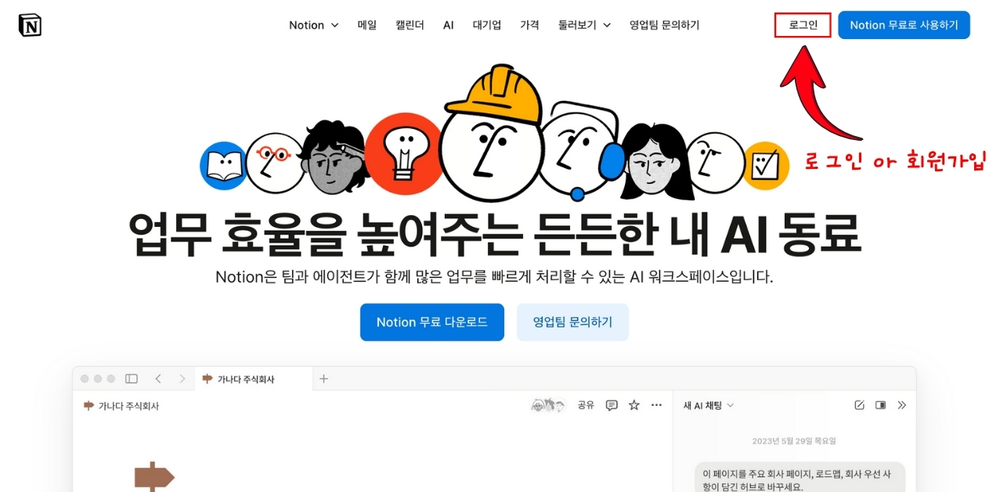

---

#### 2️⃣ Notion API Integration 생성

1. https://www.notion.so/profile/integrations 접속
2. `+ New integration` 버튼 클릭

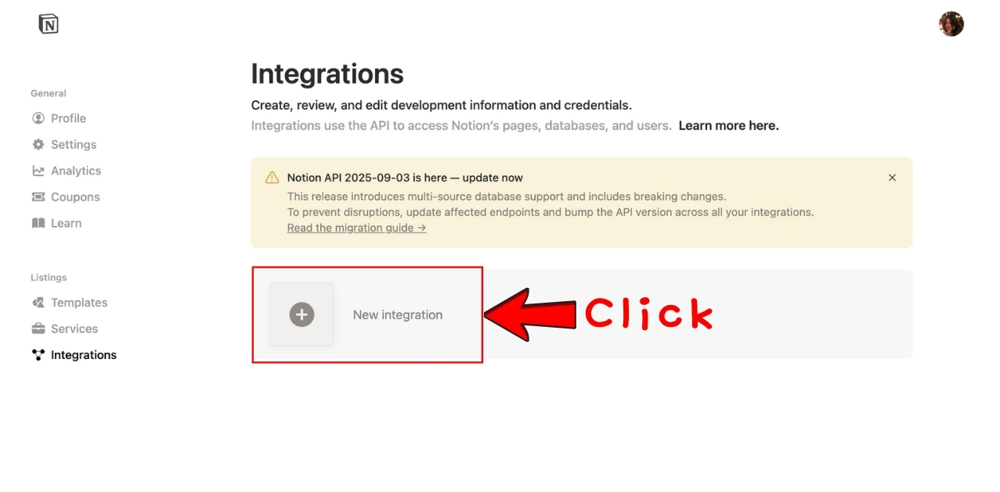

---

#### 3️⃣ Integration 정보 입력

1. **Name**: `nextjs-blog` (또는 원하는 이름)
2. **Type**: `Internal` 선택
3. `Submit` 버튼 클릭

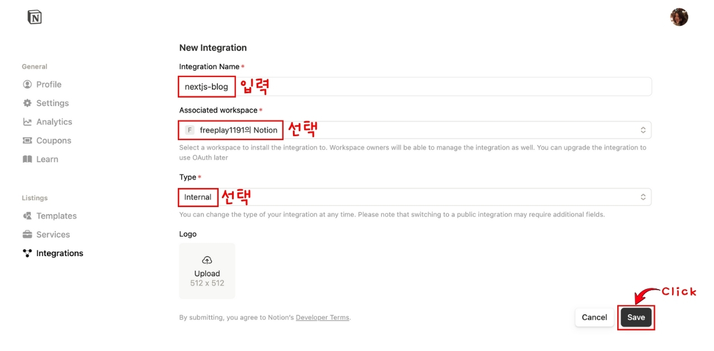

---

#### 4️⃣ API Key 복사

1. `Internal Integration Secret` 옆의 `Show` 버튼 클릭
2. 표시된 API Key를 복사 (메모장에 임시 저장)
3. 나중에 `NOTION_API_KEY`로 사용됩니다

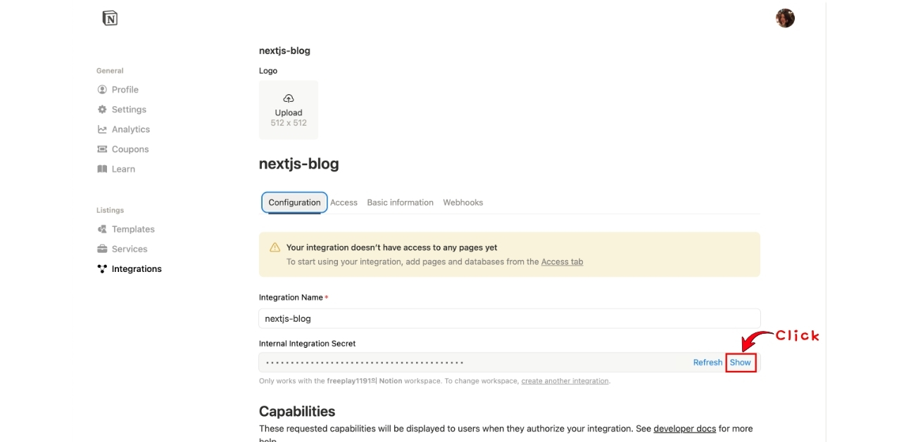

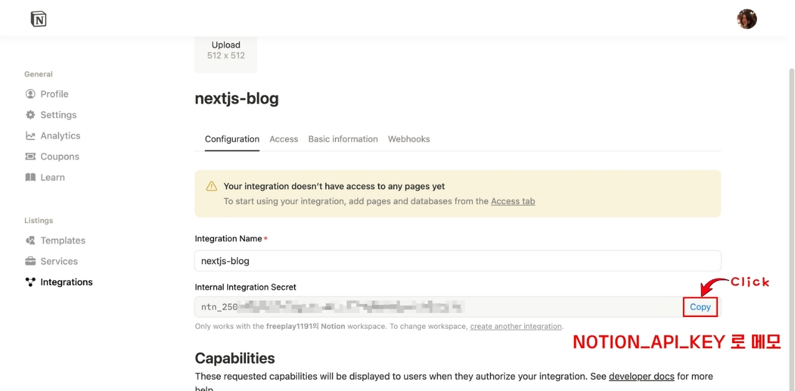

> **✅ 메모해두세요!**
> ```
> NOTION_API_KEY=ntn_1234xxxxxxxxxxxxxxxxxxxxxxxxxxxxx
> ```

**✅ 완료 확인:**
- [ ] API Key 복사 완료
- [ ] 메모장에 저장 완료

---

### 📄 1.2 블로그 템플릿 복사하기

> 💡 **추천:** [Sample 템플릿](https://www.notion.so/freelife/295573b3dc09809b9b4dc3c309399a97)을 복사하면 데이터베이스 구조를 쉽게 만들 수 있습니다.

**📌 필요한 것:**
- Notion 계정 로그인 상태
- 내 워크스페이스의 빈 페이지

---

#### 1️⃣ 템플릿 페이지 복사

1. [Sample 템플릿](https://www.notion.so/freelife/295573b3dc09809b9b4dc3c309399a97) 접속
2. 페이지에서 `Ctrl + A` 로 **전체 선택**
3. `Ctrl + C` 로 **복사**

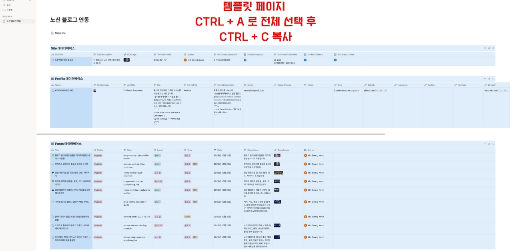

4. 내 워크스페이스에 **빈 페이지** 생성
5. `Ctrl + V` 로 **붙여넣기**

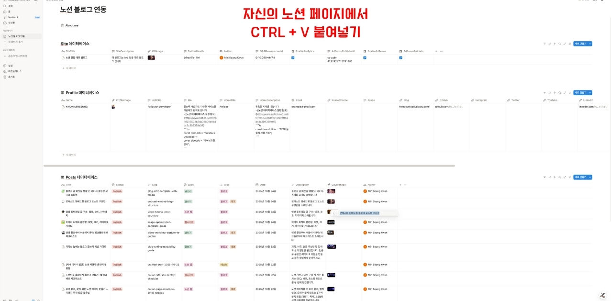

> ⚠️ **주의:** 붙여넣은 다음 Sample 템플릿 데이터는 지우고 자신의 정보로 변경하세요!

---

#### 2️⃣ Integration 연결

1. 복사한 페이지에서 우측 상단 `•••` 메뉴 클릭
2. `연결` → `nextjs-blog` 선택
3. 연결 완료 확인

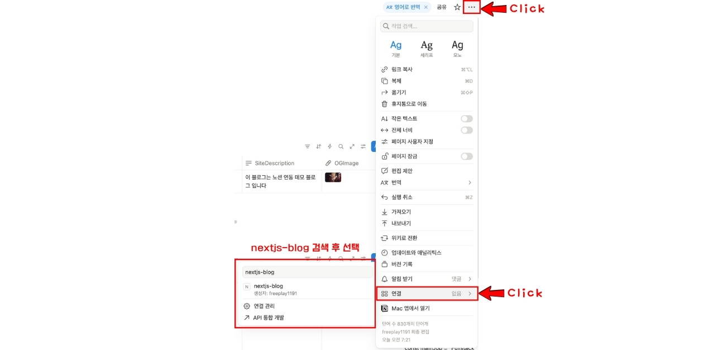

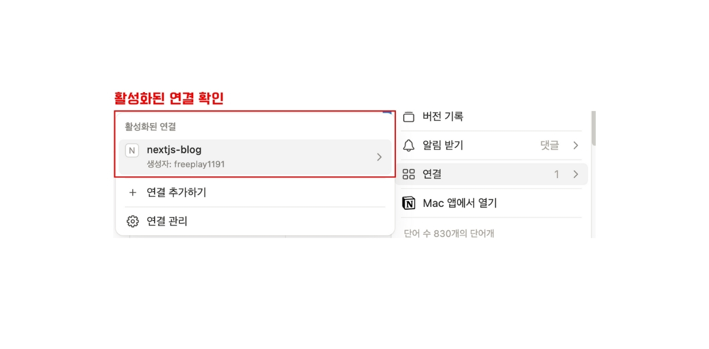

**✅ 완료 확인:**
- [ ] 템플릿 복사 완료
- [ ] Integration 연결 완료

---

### 🆔 1.3 데이터베이스 ID 추출하기

**📌 추출할 ID 목록:**

| 이름 | 타입 | 환경변수명 |
|------|------|-----------|
| 📄 About me | 페이지 | `NOTION_ABOUT_PAGE_ID` |
| ⚙️ Site | 데이터베이스 | `NOTION_SITE_DATABASE_ID` |
| 👤 Profile | 데이터베이스 | `NOTION_PROFILE_DATABASE_ID` |
| 📝 Posts | 데이터베이스 | `NOTION_DATABASE_ID` |

---

#### 1️⃣ About me 페이지 ID 추출

1. `About me` 페이지에서 `링크 복사` 클릭
2. 복사된 링크에서 ID 추출:

```
https://www.notion.so/About-me-a1b2c3d4e5f6789012345678abcdef12
                           ↑ 이 부분이 ID입니다
```

3. 메모장에 저장:

> **✅ 메모해두세요!**
> ```
> NOTION_ABOUT_PAGE_ID=a1b2c3d4e5f6789012345678abcdef12
> ```

---

#### 2️⃣ 데이터베이스 ID 추출 (Site, Profile, Posts)

**각 데이터베이스(Site, Profile, Posts)에서 동일한 방법으로 진행:**

1. 데이터베이스 제목 클릭
2. 우측 상단 `•••` → `보기 링크 복사` 클릭
3. 복사된 링크에서 ID 추출:

```
https://www.notion.so/12345678abcd12345678abcd12345678?v=xxxxx
                     ↑ 이 부분만 복사 (?v= 뒤는 제거)
```

> ⚠️ **주의:** `?v=` 뒤의 부분은 포함하지 마세요!

4. 메모장에 저장:

> **✅ 메모해두세요!**
> ```
> NOTION_SITE_DATABASE_ID=12345678abcd12345678abcd12345678
> NOTION_PROFILE_DATABASE_ID=87654321dcba87654321dcba87654321
> NOTION_DATABASE_ID=11223344aabb11223344aabb11223344
> ```

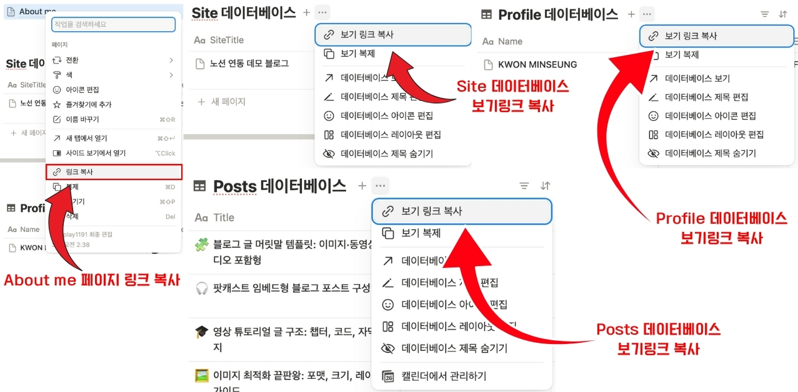

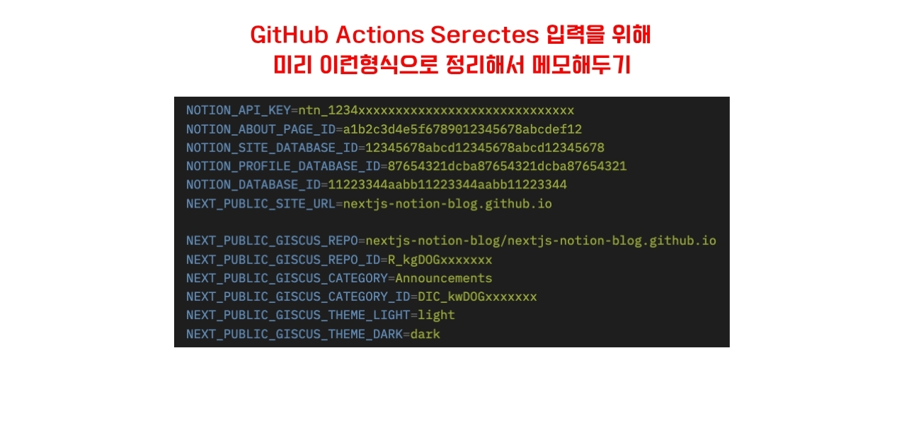

**✅ 완료 확인:**
- [ ] About me 페이지 ID 추출 완료
- [ ] Site 데이터베이스 ID 추출 완료
- [ ] Profile 데이터베이스 ID 추출 완료
- [ ] Posts 데이터베이스 ID 추출 완료
- [ ] 총 4개 ID 메모장에 저장 완료

---

## 🐙 2. GitHub 준비하기

> 📖 자세한 내용: [NON_DEVELOPER_GUIDE.md - 1~3, 5~6단계](NON_DEVELOPER_GUIDE.md#1단계-github-계정-만들기)

### 🚀 2.1 GitHub 가입 및 Fork

**📌 필요한 것:**
- 이메일 주소 또는 GitHub 계정

---

#### 1️⃣ GitHub 가입

1. https://github.com/ 접속
2. `Sign up` 클릭하여 가입
3. 계정 생성 완료

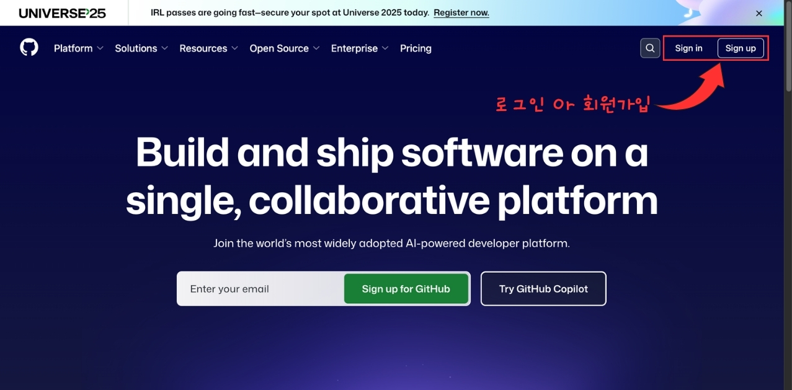

---

#### 2️⃣ 블로그 템플릿 Fork

1. https://github.com/freelife1191/nextjs-notion-blog 접속
2. 우측 상단 `Fork` 버튼 클릭

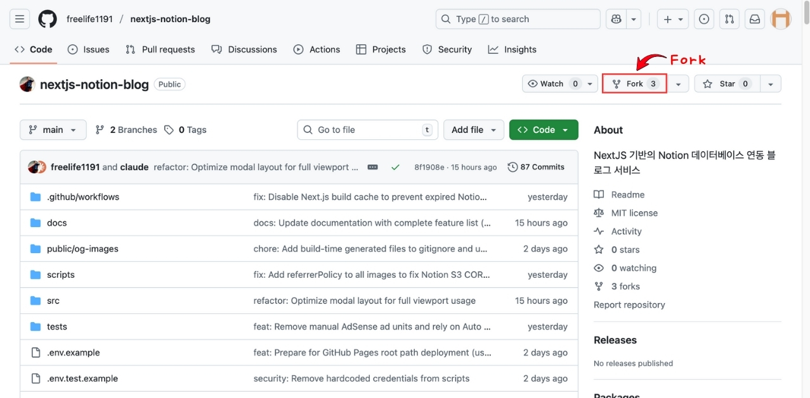

---

#### 3️⃣ Repository 이름 설정

1. **Repository name** 입력: `your-username.github.io`
   - 예: `john.github.io`
2. `Create fork` 버튼 클릭
3. Fork 완료 대기

> 💡 **팁:** `your-username`은 본인의 GitHub 사용자명으로 바꿔주세요.

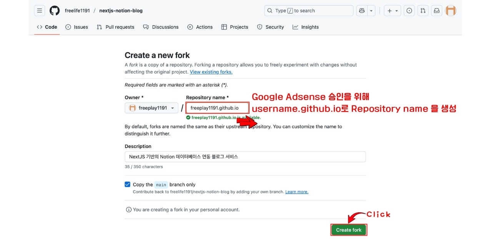

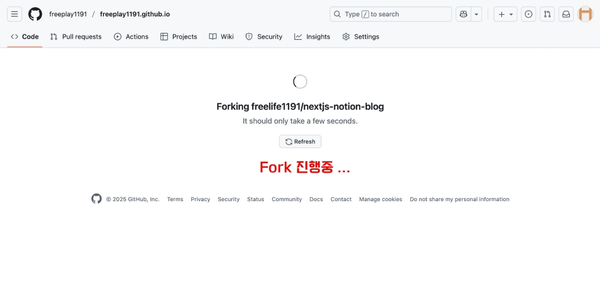

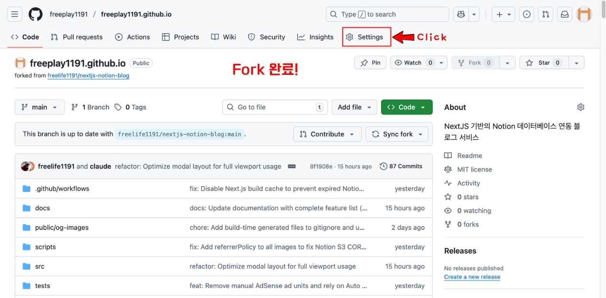

**✅ 완료 확인:**
- [ ] GitHub 계정 생성 완료
- [ ] 블로그 템플릿 Fork 완료
- [ ] Repository 이름이 `your-username.github.io` 형식인지 확인

---

### ⚡ 2.2 Actions 및 Pages 활성화

**📌 필요한 것:**
- Fork한 GitHub 저장소 접속

---

#### 1️⃣ Actions 활성화

1. Fork한 저장소에서 `Settings` 탭 클릭
2. 왼쪽 메뉴에서 `Actions` → `General` 클릭
3. `Allow all actions and reusable workflows` 선택
4. `Save` 버튼 클릭

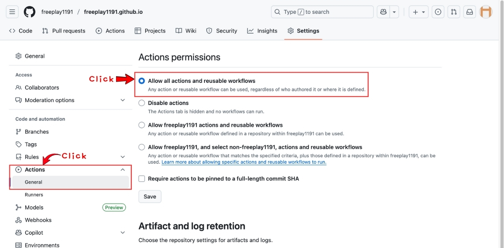

---

#### 2️⃣ GitHub Pages 설정

1. `Settings` → `Pages` 클릭
2. **Source** 섹션에서:
   - Source: `GitHub Actions` 선택
3. 설정 자동 저장됨

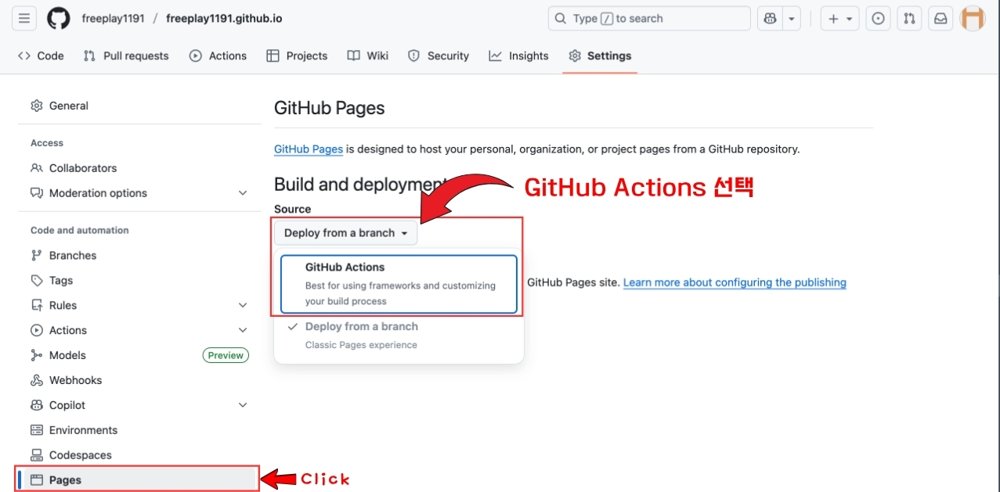

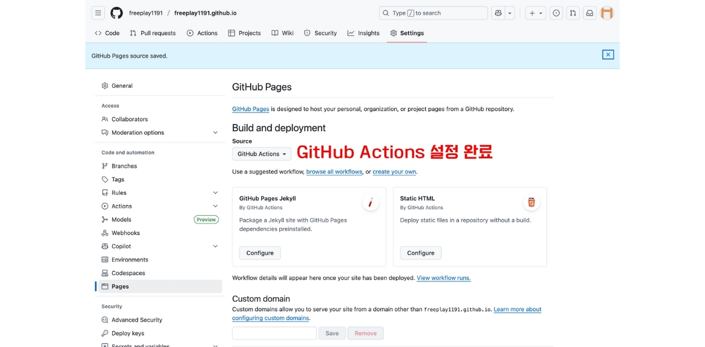

**✅ 완료 확인:**
- [ ] Actions 활성화 완료
- [ ] GitHub Pages Source가 "GitHub Actions"로 설정됨

---

### 🔐 2.3 Notion 정보 등록 (Secrets)

**📌 필요한 것:**
- 1.1에서 메모한 Notion API Key
- 1.3에서 메모한 4개의 ID

---

#### 1️⃣ Secrets 페이지 이동

1. `Settings` → `Secrets and variables` → `Actions` 클릭
2. `New repository secret` 버튼 클릭

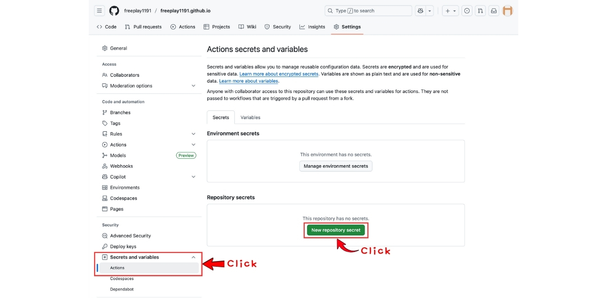

---

#### 2️⃣ 필수 Secrets 등록

**등록할 6개의 Secrets:**

| Name | Value 예시 | 설명 |
|------|-----------|------|
| `NOTION_API_KEY` | `ntn_1234...` | 1.1에서 복사한 API Key |
| `NOTION_DATABASE_ID` | `11223344aabb...` | Posts 데이터베이스 ID |
| `NOTION_PROFILE_DATABASE_ID` | `87654321dcba...` | Profile 데이터베이스 ID |
| `NOTION_SITE_DATABASE_ID` | `12345678abcd...` | Site 데이터베이스 ID |
| `NOTION_ABOUT_PAGE_ID` | `a1b2c3d4e5f6...` | About me 페이지 ID |
| `NEXT_PUBLIC_SITE_URL` | `https://your-username.github.io` | 블로그 주소 |

**각 Secret 등록 방법:**

1. `New repository secret` 클릭
2. **Name**: 위 표의 Name 정확히 입력
3. **Value**: 해당하는 값 입력
4. `Add secret` 클릭
5. **6개 모두 반복**

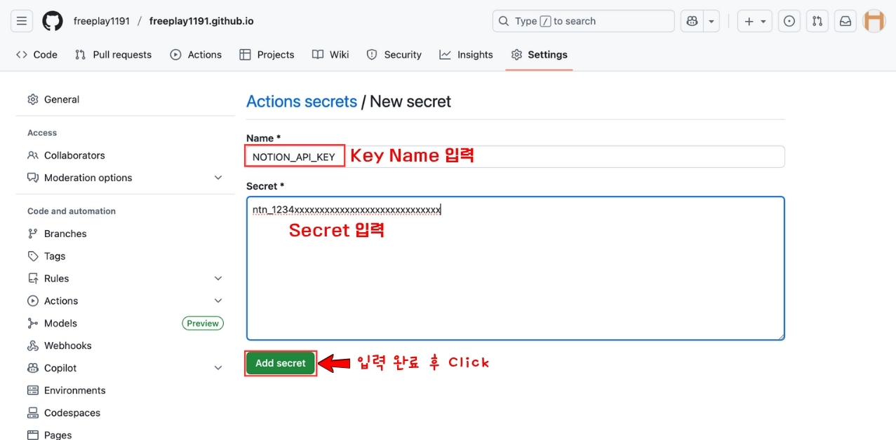

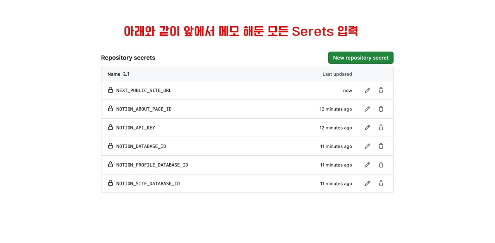

> ⚠️ **중요:** `NEXT_PUBLIC_SITE_URL`에서 `your-username`을 본인의 GitHub 사용자명으로 바꿔주세요!

**✅ 완료 확인:**
- [ ] `NOTION_API_KEY` 등록 완료
- [ ] `NOTION_DATABASE_ID` 등록 완료
- [ ] `NOTION_PROFILE_DATABASE_ID` 등록 완료
- [ ] `NOTION_SITE_DATABASE_ID` 등록 완료
- [ ] `NOTION_ABOUT_PAGE_ID` 등록 완료
- [ ] `NEXT_PUBLIC_SITE_URL` 등록 완료
- [ ] 총 6개 Secrets 등록 완료

---

## 💬 3. 댓글 시스템 설정 (선택)

> 📖 자세한 내용: [GISCUS_SETUP_GUIDE.md](GISCUS_SETUP_GUIDE.md)
>
> 💡 **선택사항**: 댓글 기능이 필요하지 않다면 이 단계를 건너뛰어도 됩니다.

### 🗣️ 3.1 GitHub Discussions 활성화

**📌 필요한 것:**
- Fork한 GitHub 저장소 접속

---

#### 1️⃣ Discussions 기능 활성화

1. 저장소의 `Settings` → `General` 이동
2. **Features** 섹션으로 스크롤
3. `Discussions` 체크박스 선택
4. `Set up discussions` 버튼 클릭
5. `Start discussion` 클릭

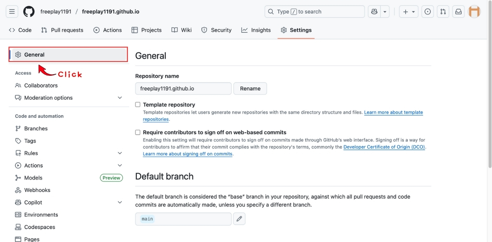

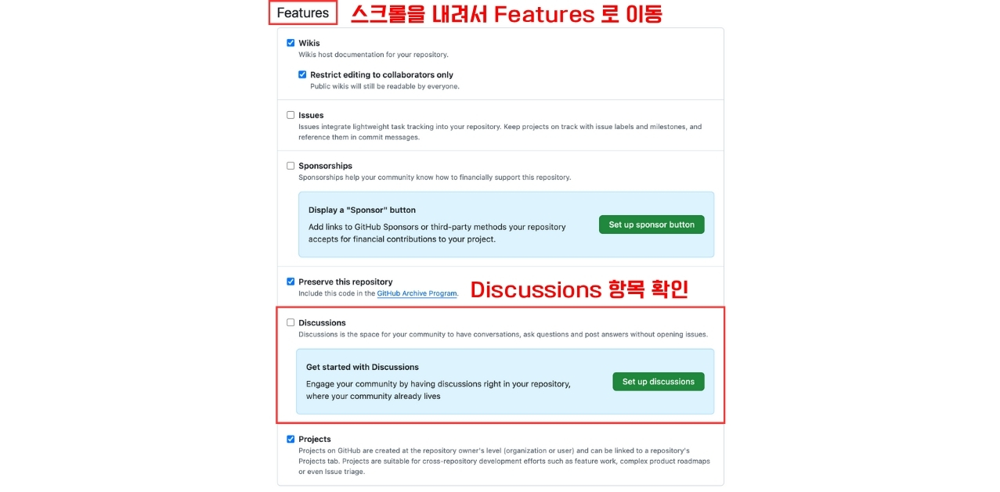

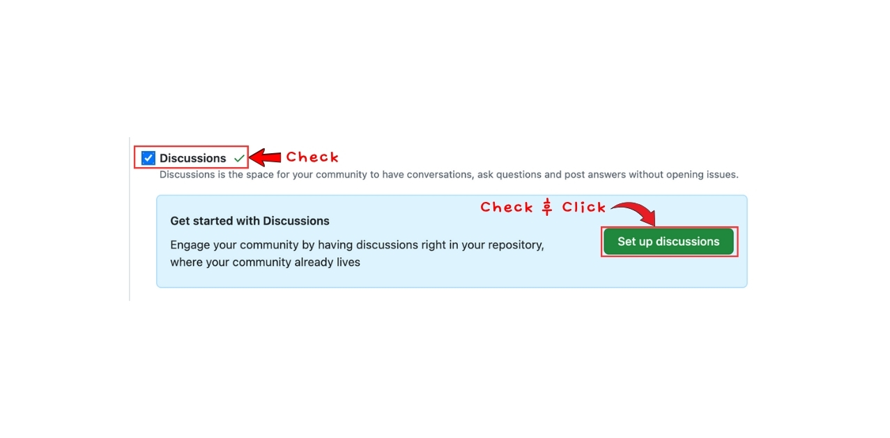

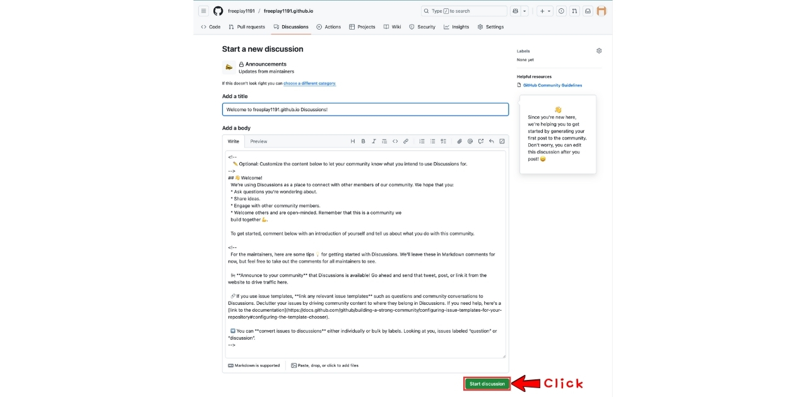

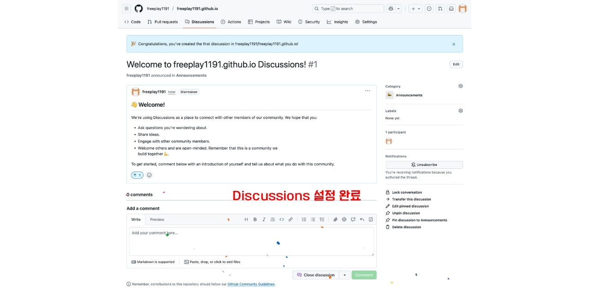

**✅ 완료 확인:**
- [ ] Discussions 기능 활성화 완료
- [ ] Discussions 탭이 저장소에 표시됨

---

### 📦 3.2 giscus 앱 설치

**📌 필요한 것:**
- GitHub 계정 로그인 상태
- Discussions 기능이 활성화된 저장소

---

#### 1️⃣ giscus 앱 설치

1. https://github.com/apps/giscus 접속
2. `Install` 버튼 클릭
3. 저장소 선택: `your-username/your-username.github.io`
4. `Install` 확인
5. 설치 완료 대기

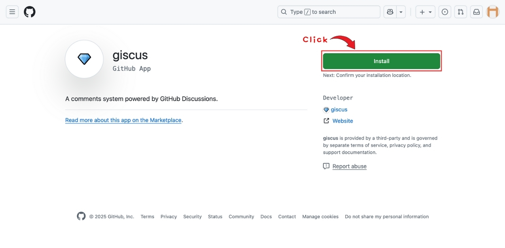

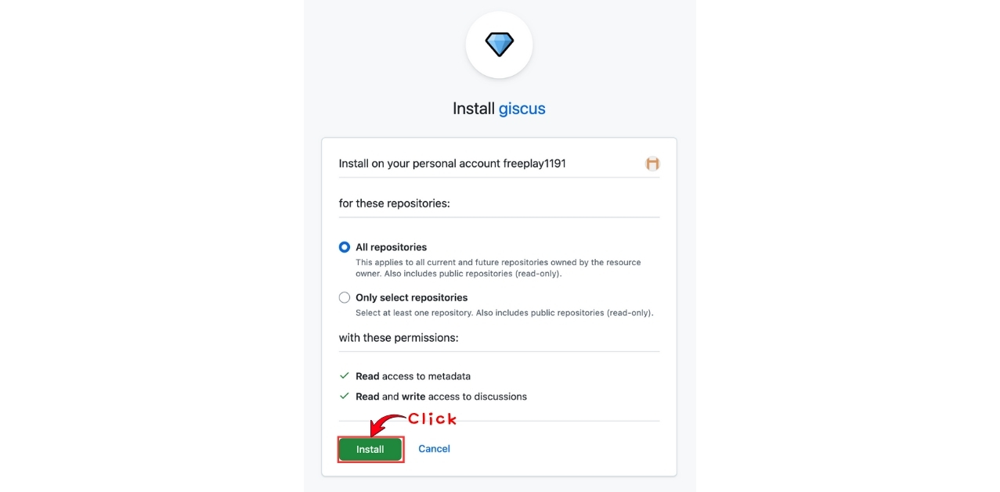

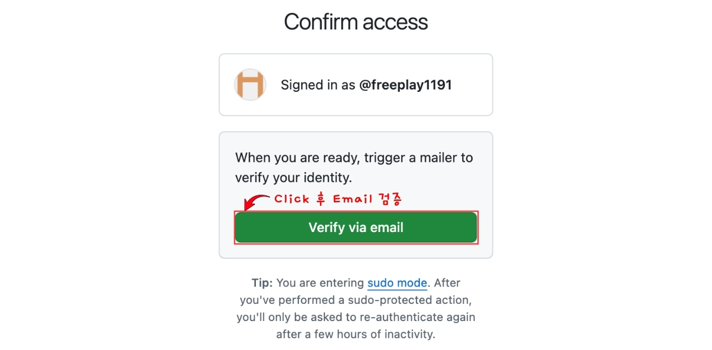

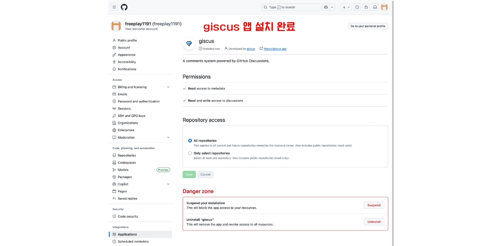

**✅ 완료 확인:**
- [ ] giscus 앱 설치 완료
- [ ] 저장소에 giscus 앱 권한 부여됨

---

### ⚙️ 3.3 giscus 설정값 생성

**📌 필요한 것:**
- giscus 앱이 설치된 저장소
- GitHub Secrets 접근 권한

---

#### 1️⃣ giscus 설정 페이지 접속

1. https://giscus.app/ko 접속

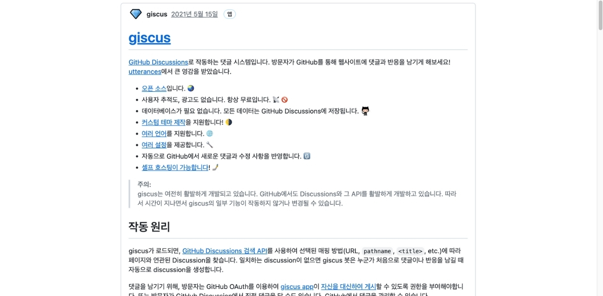

---

#### 2️⃣ 저장소 및 설정 입력

1. **저장소** 입력: `your-username/your-username.github.io`

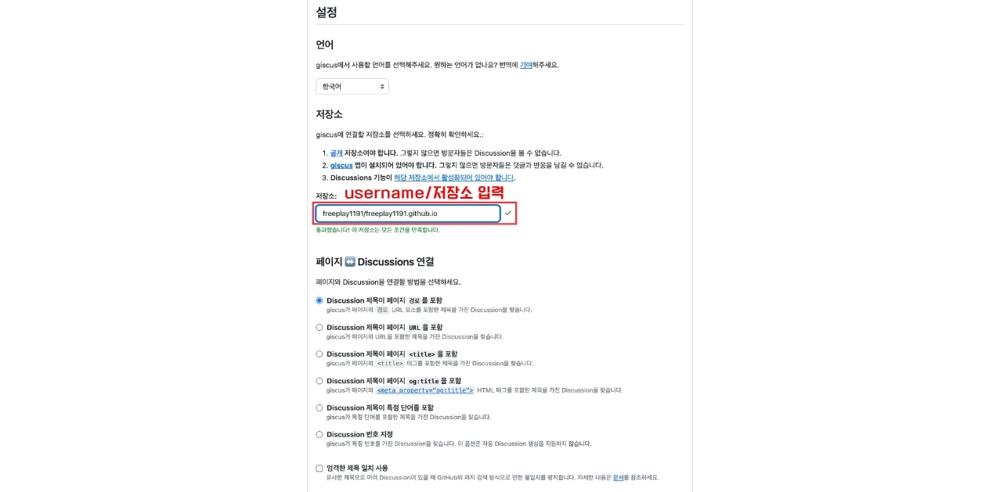

2. **Discussion 카테고리** 선택: `Announcements`
3. **기능** 선택:
   - ✅ 메인 포스트에 반응 남기기
   - ✅ 댓글 위에 댓글 상자 배치
   - ✅ 댓글 느리게 불러오기

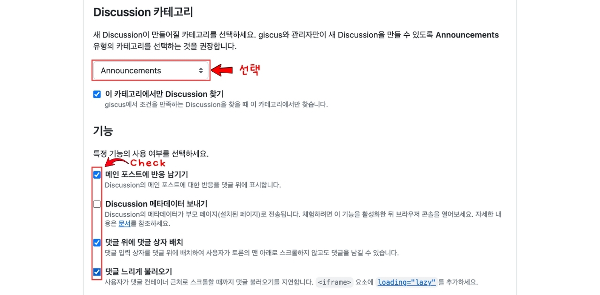

---

#### 3️⃣ 설정값 복사

페이지 하단 **giscus 사용** 섹션에서 값 확인:

```html
<script src="https://giscus.app/client.js"
        data-repo="your-username/your-username.github.io"
        data-repo-id="R_kgDOGxxxxxxx"
        data-category="Announcements"
        data-category-id="DIC_kwDOGxxxxxxx"
        ...
</script>
```

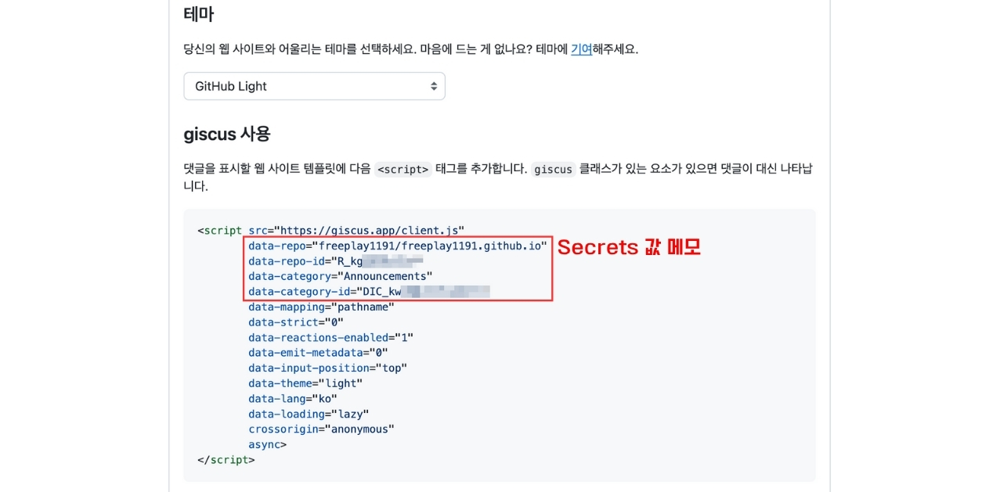

---

#### 4️⃣ GitHub Secrets에 값 등록

**등록할 6개의 Secrets:**

| Name | Value 예시 | 추출 위치 |
|------|-----------|----------|
| `NEXT_PUBLIC_GISCUS_REPO` | `your-username/your-username.github.io` | `data-repo` 값 |
| `NEXT_PUBLIC_GISCUS_REPO_ID` | `R_kgDOGxxxxxxx` | `data-repo-id` 값 |
| `NEXT_PUBLIC_GISCUS_CATEGORY` | `Announcements` | `data-category` 값 |
| `NEXT_PUBLIC_GISCUS_CATEGORY_ID` | `DIC_kwDOGxxxxxxx` | `data-category-id` 값 |
| `NEXT_PUBLIC_GISCUS_THEME_LIGHT` | `light` | 직접 입력 |
| `NEXT_PUBLIC_GISCUS_THEME_DARK` | `dark` | 직접 입력 |

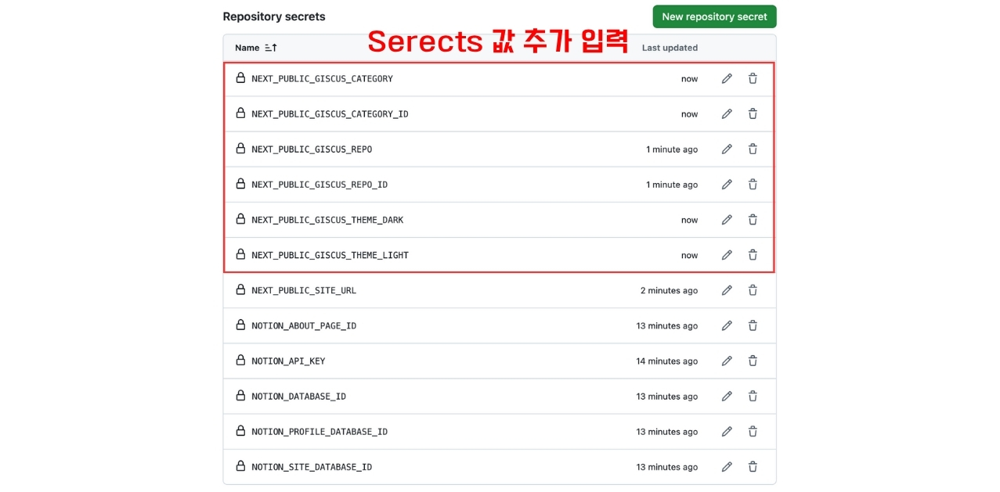

**등록 방법:** 2.3 섹션과 동일하게 `Settings` → `Secrets and variables` → `Actions`에서 등록

**✅ 완료 확인:**
- [ ] `NEXT_PUBLIC_GISCUS_REPO` 등록 완료
- [ ] `NEXT_PUBLIC_GISCUS_REPO_ID` 등록 완료
- [ ] `NEXT_PUBLIC_GISCUS_CATEGORY` 등록 완료
- [ ] `NEXT_PUBLIC_GISCUS_CATEGORY_ID` 등록 완료
- [ ] `NEXT_PUBLIC_GISCUS_THEME_LIGHT` 등록 완료
- [ ] `NEXT_PUBLIC_GISCUS_THEME_DARK` 등록 완료
- [ ] 총 6개 giscus Secrets 등록 완료

---

## 🚀 4. 배포 실행하기

> 📖 자세한 내용: [NON_DEVELOPER_GUIDE.md - 7단계](NON_DEVELOPER_GUIDE.md#7단계-첫-배포-실행하기)

### ▶️ 4.1 배포 Workflow 실행

**📌 필요한 것:**
- 모든 Secrets 등록 완료
- Notion 데이터베이스 설정 완료

---

#### 1️⃣ Actions 탭 이동

1. 저장소 상단의 `Actions` 탭 클릭
2. (최초) `I understand my workflows, go ahead and enable them` 버튼 클릭

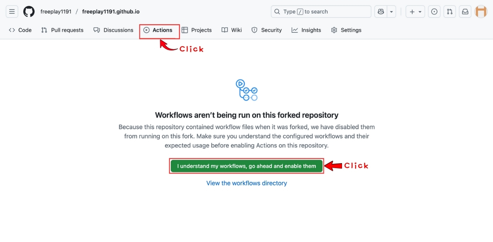

---

#### 2️⃣ 배포 실행

1. 왼쪽 메뉴에서 `Deploy to GitHub Pages` 클릭
2. 우측 상단 `Enable workflow` 클릭 (최초 1회)

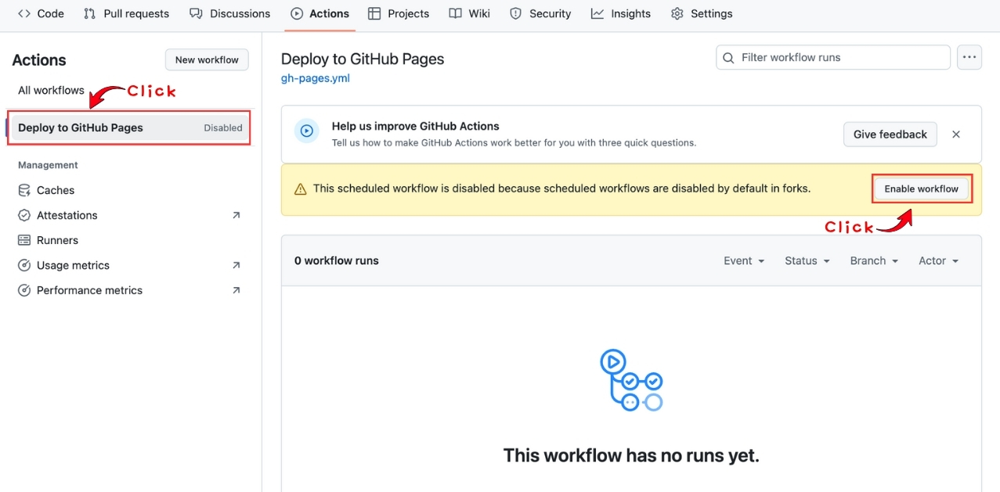

3. `Run workflow` 드롭다운 메뉴 클릭
4. `Run workflow` 버튼 클릭

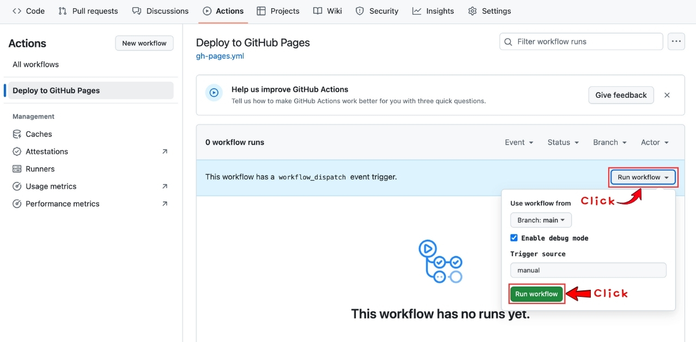

---

#### 3️⃣ 배포 진행 확인

**상태 표시:**
- 🟡 노란색 원: 진행 중
- ✅ 초록색 체크: 성공
- ❌ 빨간색 X: 실패

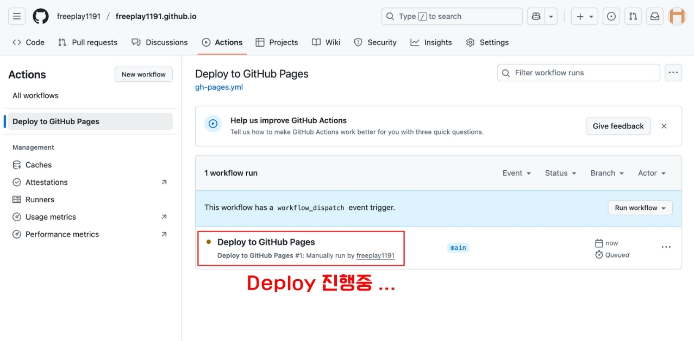

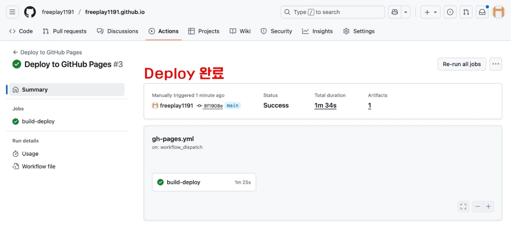

> ⚠️ **배포 실패 시:** Secrets에 입력한 Database ID를 확인하세요. 올바른 데이터베이스 ID를 입력해야 합니다.

**✅ 완료 확인:**
- [ ] Workflow 실행 완료
- [ ] 배포 성공 (초록색 체크) 확인

---

## ✨ 5. 블로그 확인하기

> 📖 자세한 내용: [NON_DEVELOPER_GUIDE.md - 8단계](NON_DEVELOPER_GUIDE.md#8단계-블로그-확인하기)

### 🌐 5.1 블로그 접속

**📌 접속 주소:**

```
https://your-username.github.io
```

> 💡 **팁:** `your-username`을 본인의 GitHub 사용자명으로 바꿔주세요.

배포가 완료되면 위 주소로 접속하여 블로그를 확인하세요!

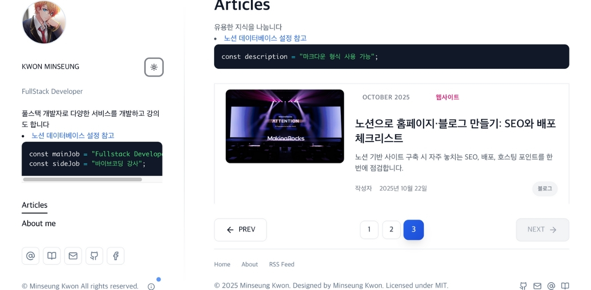

**✅ 완료 확인:**
- [ ] 블로그 주소 접속 성공
- [ ] 블로그 페이지가 정상적으로 표시됨

---

### 📝 5.2 블로그 운영

#### ✍️ 새 글 작성하기

1. Notion의 **Posts** 데이터베이스에서 새 항목 추가
2. 글 작성 완료
3. **Status**를 `Publish`로 설정
4. 10분 후 자동으로 블로그에 반영됨 (자동 배포)

---

#### ⚡ 즉시 반영하기

**자동 배포를 기다리지 않고 즉시 반영하려면:**

1. GitHub 저장소의 `Actions` 탭 클릭
2. `Deploy to GitHub Pages` 선택
3. `Run workflow` 수동 실행

> 📖 **자세한 운영 방법:** [NON_DEVELOPER_GUIDE.md - 일상적인 블로그 운영](NON_DEVELOPER_GUIDE.md#일상적인-블로그-운영)

---

## 🎉 설치 완료!

**축하합니다!** 이제 Notion으로 관리하는 나만의 블로그가 생겼습니다. 🎊

---

### 📋 다음 단계

블로그를 더욱 풍성하게 만들어보세요:

- [ ] 📄 **About me 페이지 작성** - Notion에서 자기소개 작성
- [ ] 👤 **Profile 정보 입력** - Profile 데이터베이스에 프로필 정보 입력
- [ ] ⚙️ **SEO 설정** - Site 데이터베이스에 SEO 메타데이터 입력
- [ ] ✍️ **첫 글 작성** - Posts 데이터베이스에서 첫 번째 블로그 글 작성

---

### 🎯 추가 기능 가이드

더 많은 기능을 원하신다면:

- 📚 [**고급 기능 가이드**](ADVANCED_FEATURES_GUIDE.md)
  - 블로그 커스터마이징
  - Google Analytics 연동
  - AdSense 광고 설정
  - 사용자 정의 도메인 연결

- 🔧 [**문제 해결 가이드**](TROUBLESHOOTING_GUIDE.md)
  - 자주 묻는 질문 (FAQ)
  - 배포 실패 해결 방법
  - Notion API 오류 해결

---

## 🔄 6. 블로그 업데이트하기 (Sync Fork)

> 💡 **언제 필요한가요?**
> 원본 저장소(freelife1191/nextjs-notion-blog)에 새로운 기능이나 버그 수정이 추가되었을 때, fork한 저장소를 최신 상태로 업데이트하기 위해 필요합니다.

### 🔁 6.1 Fork 저장소 동기화

**📌 필요한 것:**
- Fork한 GitHub 저장소 접속
- 원본 저장소에 새로운 업데이트가 있는 경우

---

#### 1️⃣ 업데이트 실행

1. fork한 저장소 메인 페이지 접속
   - 예: `https://github.com/your-username/your-username.github.io`
2. 저장소 이름 아래에 다음 메시지 확인:
   - `This branch is X commits behind freelife1191:main`
3. 우측의 `Sync fork` 버튼 확인

> ⚠️ **주의:** 업데이트가 없는 경우 "This branch is up to date" 메시지가 표시되며, Sync fork 버튼이 비활성화됩니다.

4. `Sync fork` 버튼 클릭
5. 드롭다운 메뉴에서 `Update branch` 버튼 클릭
6. 자동으로 원본 저장소의 최신 변경사항이 병합됩니다

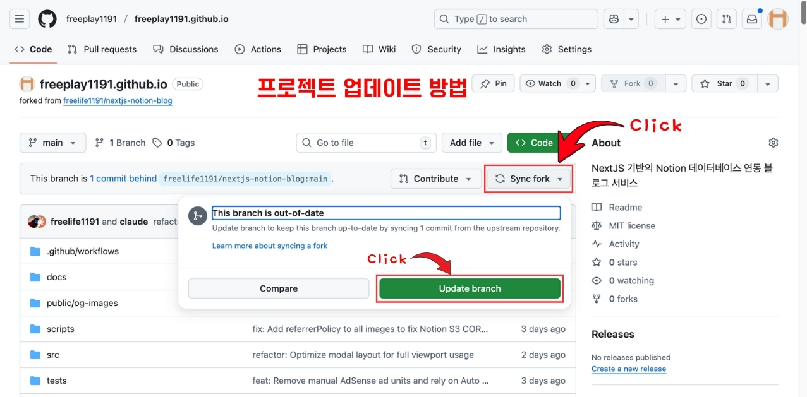

> 💡 **팁:** 충돌(conflict)이 발생하는 경우 `Discard changes` 또는 `Compare` 옵션을 선택할 수 있습니다.
> - `Discard changes`: 내 변경사항을 버리고 원본 저장소 내용으로 덮어씁니다
> - `Compare`: 충돌을 수동으로 해결합니다 (개발자용)

---

#### 3️⃣ 동기화 완료 확인

1. 페이지가 새로고침되며 "This branch is up to date" 메시지 표시
2. 자동으로 GitHub Actions가 트리거되어 새로운 배포가 시작됩니다
3. `Actions` 탭에서 배포 진행 상황 확인 가능

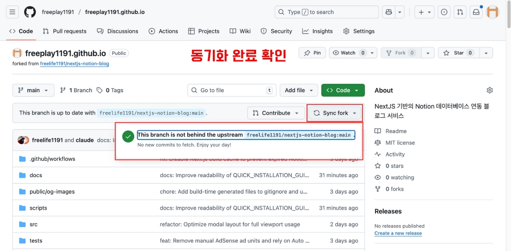

**✅ 완료 확인:**
- [ ] "This branch is up to date" 메시지 확인
- [ ] GitHub Actions 자동 실행 확인
- [ ] 배포 완료 후 블로그에서 업데이트 내용 확인

> 📖 **자동 배포:** Sync fork 완료 후 GitHub Actions가 자동으로 실행되어 블로그가 업데이트됩니다. 별도로 배포를 실행할 필요가 없습니다.

**🔔 업데이트 알림 받기:**

원본 저장소의 업데이트를 받으려면:
1. 원본 저장소([freelife1191/nextjs-notion-blog](https://github.com/freelife1191/nextjs-notion-blog)) 방문
2. 우측 상단 `Watch` → `Custom` → `Releases` 선택
3. 새로운 릴리즈가 발표되면 이메일로 알림을 받습니다

---

## 📚 참고 문서

더 자세한 정보가 필요하시다면:

| 가이드 | 설명 | 대상 |
|--------|------|------|
| 📖 [**비개발자 완전 가이드**](NON_DEVELOPER_GUIDE.md) | 클릭 단위 상세 설명 | 비개발자 |
| 🎨 [**Notion 설정 가이드**](NOTION_SETUP_GUIDE.md) | 데이터베이스 구조 및 활용법 | 모든 사용자 |
| 💬 [**Giscus 설정 가이드**](GISCUS_SETUP_GUIDE.md) | 댓글 시스템 상세 설정 | 댓글 기능 사용자 |
| 🚀 [**고급 기능 가이드**](ADVANCED_FEATURES_GUIDE.md) | 커스터마이징 및 확장 기능 | 고급 사용자 |
| 🔧 [**문제 해결 가이드**](TROUBLESHOOTING_GUIDE.md) | FAQ 및 트러블슈팅 | 모든 사용자 |

---

**💡 도움이 필요하신가요?**
- 💬 [GitHub Issues](https://github.com/freelife1191/nextjs-notion-blog/issues)에서 질문하기
- 📧 문의사항은 저장소 관리자에게 연락하기

