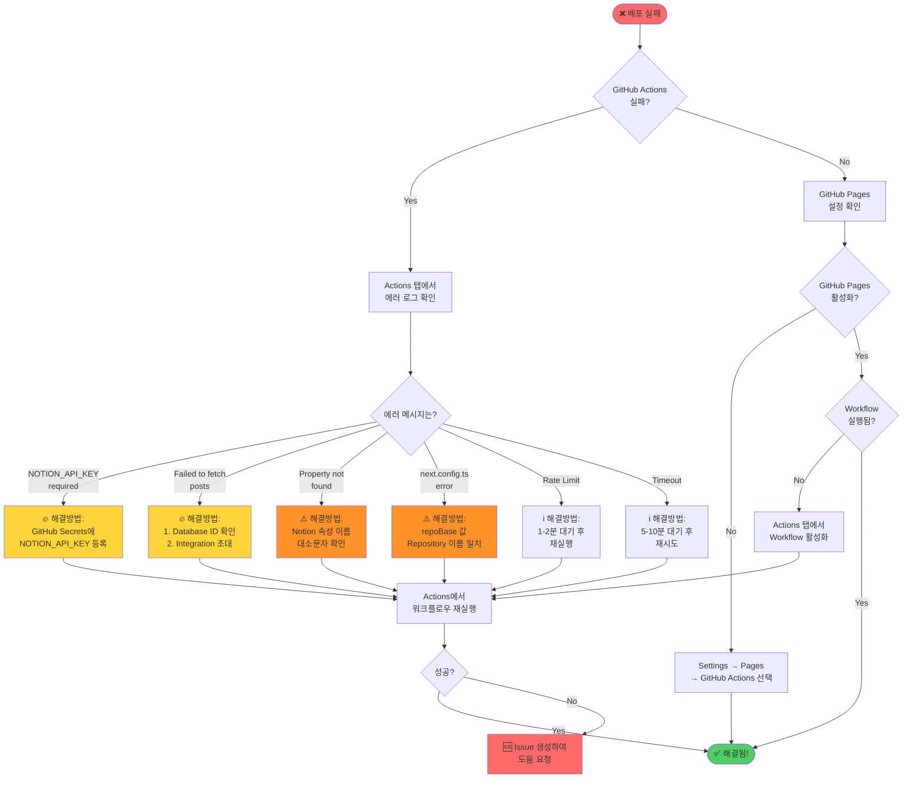
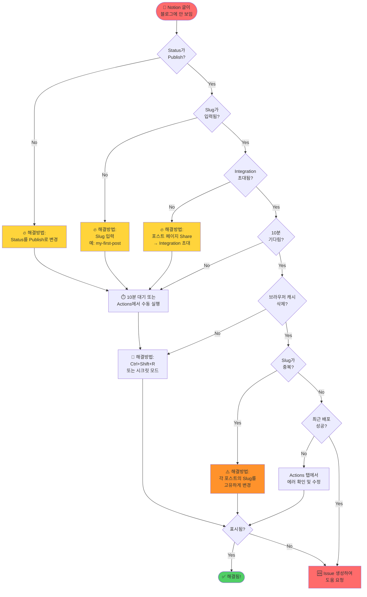
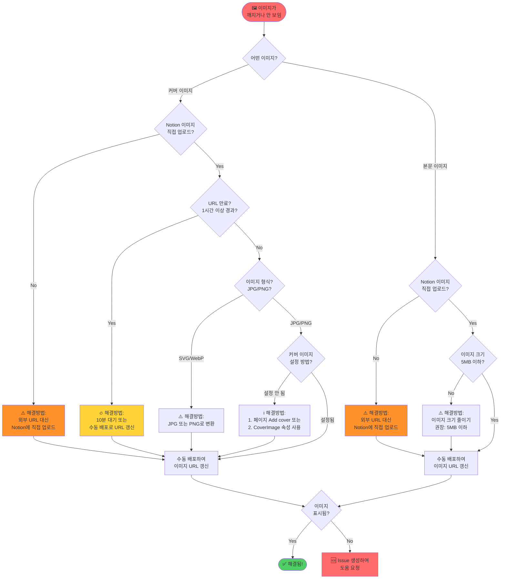
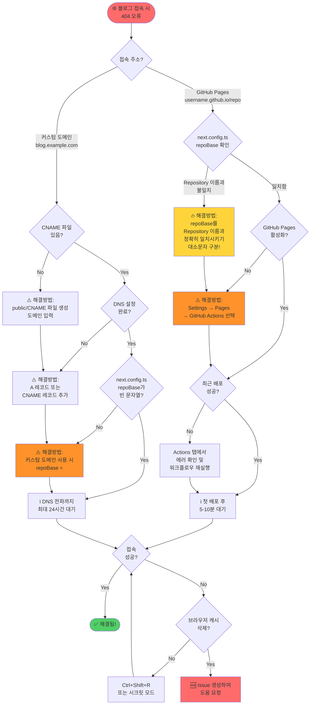

# 문제 해결 가이드 (Troubleshooting Guide)

> 블로그 운영 중 발생할 수 있는 문제들과 해결 방법을 정리한 가이드입니다.

---

## 🚨 빠른 진단 체크리스트

배포 실패 시 **가장 먼저** 확인해야 할 사항들입니다:

### ✅ 배포 실패 시 TOP 3 체크포인트

1. **🔥 NOTION_API_KEY 확인** (가장 흔한 문제!)
   - GitHub → Settings → Secrets → Actions
   - `NOTION_API_KEY`가 등록되어 있나요?
   - 값이 `secret_`로 시작하나요?

2. **🔥 Repository 이름 확인**
   - `next.config.ts` 3번째 줄
   - `repoBase` 값이 실제 Repository 이름과 일치하나요?
   - 대소문자까지 정확히 일치해야 합니다!

3. **🔥 Integration 초대 확인**
   - Notion Posts 데이터베이스 → Share 버튼
   - Integration이 초대되어 있나요?

### 💡 우선순위 표시 안내

문제의 빈도와 중요도에 따라 다음과 같이 표시됩니다:

- 🔥 **매우 흔함** - 대부분의 사용자가 한 번은 겪는 문제
- ⚠️ **자주 발생** - 설정 오류 시 자주 발생
- ℹ️ **가끔 발생** - 특정 상황에서만 발생

---

## 🔄 문제 해결 플로우차트

시각적 다이어그램으로 문제를 빠르게 진단하세요:

### 1️⃣ 배포 실패 진단 플로우



### 2️⃣ 콘텐츠 미표시 진단 플로우



### 3️⃣ 이미지 문제 진단 플로우



### 4️⃣ 404 오류 진단 플로우



---

## 📌 목차

0. [🔄 문제 해결 플로우차트](#-문제-해결-플로우차트)
   - [1️⃣ 배포 실패 진단 플로우](#1️⃣-배포-실패-진단-플로우)
   - [2️⃣ 콘텐츠 미표시 진단 플로우](#2️⃣-콘텐츠-미표시-진단-플로우)
   - [3️⃣ 이미지 문제 진단 플로우](#3️⃣-이미지-문제-진단-플로우)
   - [4️⃣ 404 오류 진단 플로우](#4️⃣-404-오류-진단-플로우)

1. [빌드 및 배포 문제](#빌드-및-배포-문제)
   - [❌ 배포가 실패했어요 (빨간색 X 표시)](#-배포가-실패했어요-빨간색-x-표시)
     - [🔥 에러 1: NOTION_API_KEY is required](#-에러-1-notion_api_key-is-required-매우-흔함)
     - [🔥 에러 2: Failed to fetch published posts](#-에러-2-failed-to-fetch-published-posts-매우-흔함)
     - [⚠️ 에러 3: Property 'Title' not found](#️-에러-3-property-title-not-found-자주-발생)
     - [⚠️ 에러 4: next.config.ts 오류](#️-에러-4-nextconfigts-오류-자주-발생)
     - [ℹ️ 에러 5: Notion API Rate Limit](#ℹ️-에러-5-notion-api-rate-limit-가끔-발생)
     - [ℹ️ 에러 6: Network Timeout](#ℹ️-에러-6-network-timeout-가끔-발생)
     - [ℹ️ 에러 7: Workflow가 실행되지 않아요](#ℹ️-에러-7-workflow가-실행되지-않아요-fork-후-첫-배포)
   - [⏱️ 배포가 너무 오래 걸려요 (정상 범위 확인)](#️-배포가-너무-오래-걸려요-정상-범위-확인)

2. [콘텐츠 표시 문제](#콘텐츠-표시-문제)
   - [🔥 Notion에서 글을 작성했는데 블로그에 표시되지 않아요](#-notion에서-글을-작성했는데-블로그에-표시되지-않아요-매우-흔함)
   - [⚠️ Slug가 중복되어 한 글만 표시돼요](#️-slug가-중복되어-한-글만-표시돼요-자주-발생)
   - [ℹ️ Notion 블록이 제대로 렌더링되지 않아요](#ℹ️-notion-블록이-제대로-렌더링되지-않아요-가끔-발생)
   - [🏷️ 태그가 표시되지 않아요](#️-태그가-표시되지-않아요)
   - [📅 날짜가 이상하게 표시돼요](#-날짜가-이상하게-표시돼요)
   - [ℹ️ About 페이지가 표시되지 않아요](#ℹ️-about-페이지가-표시되지-않아요-선택적-기능)

3. [이미지 문제](#이미지-문제)
   - [⚠️ 커버 이미지가 표시되지 않아요](#️-커버-이미지가-표시되지-않아요-자주-발생)
     - [원인 1: Notion 이미지 URL 만료](#원인-1-notion-이미지-url-만료-가장-흔함)
     - [원인 2: 외부 이미지 차단](#원인-2-외부-이미지-차단)
     - [원인 3: 이미지 형식 문제](#원인-3-이미지-형식-문제)
     - [원인 4: 커버 이미지 설정 방법](#원인-4-커버-이미지-설정-방법)
   - [📷 본문 이미지가 깨져요](#-본문-이미지가-깨져요)

4. [스타일 문제](#스타일-문제)
   - [🎨 CSS가 적용되지 않거나 레이아웃이 이상해요](#-css가-적용되지-않거나-레이아웃이-이상해요)
     - [원인 1: basePath 불일치](#원인-1-basepath-불일치)
     - [원인 2: 캐시 문제](#원인-2-캐시-문제)
     - [원인 3: 빌드 오류](#원인-3-빌드-오류)
   - [🌙 다크 모드가 작동하지 않아요](#-다크-모드가-작동하지-않아요)

5. [Notion 연동 문제](#notion-연동-문제)
   - [🔗 Integration이 작동하지 않아요](#-integration이-작동하지-않아요)
   - [🔄 Notion에서 수정했는데 반영이 안 돼요](#-notion에서-수정했는데-반영이-안-돼요)
   - [ℹ️ Profile 또는 Site 정보가 표시되지 않아요](#ℹ️-profile-또는-site-정보가-표시되지-않아요-선택적-기능)

6. [GitHub Pages 문제](#github-pages-문제)
   - [🌐 블로그 주소로 접속하면 404 오류가 나요](#-블로그-주소로-접속하면-404-오류가-나요)
     - [원인 1: basePath 불일치](#원인-1-basepath-불일치-1)
     - [원인 2: GitHub Pages 미활성화](#원인-2-github-pages-미활성화)
     - [원인 3: 배포 미완료](#원인-3-배포-미완료)
     - [원인 4: 대기 시간](#원인-4-대기-시간)
   - [🔒 HTTPS가 작동하지 않아요](#-https가-작동하지-않아요)

7. [Custom Domain 문제](#custom-domain-문제)
   - [🌐 커스텀 도메인 연결이 안 돼요](#-커스텀-도메인-연결이-안-돼요)
     - [⚠️ 문제 1: CNAME 파일 설정](#️-문제-1-cname-파일-설정-자주-발생)
     - [⚠️ 문제 2: DNS 설정 오류](#️-문제-2-dns-설정-오류-자주-발생)
     - [⚠️ 문제 3: basePath 충돌](#️-문제-3-basepath-충돌-자주-발생)
     - [ℹ️ 문제 4: HTTPS 인증서 오류](#ℹ️-문제-4-https-인증서-오류-가끔-발생)
     - [ℹ️ 문제 5: www 리디렉션 설정](#ℹ️-문제-5-www-리디렉션-설정)

8. [Analytics 및 AdSense 문제](#analytics-및-adsense-문제)
   - [📊 Google Analytics가 작동하지 않아요](#-google-analytics가-작동하지-않아요)
   - [💰 Google AdSense가 표시되지 않아요](#-google-adsense가-표시되지-않아요)

9. [로컬 개발 환경 문제](#로컬-개발-환경-문제)
   - [💻 npm install 오류](#-npm-install-오류)
     - [에러 1: ENOENT](#에러-1-enoent)
     - [에러 2: Node 버전 불일치](#에러-2-node-버전-불일치)
   - [🚀 npm run dev 오류](#-npm-run-dev-오류)
   - [🔥 포트가 이미 사용 중이에요](#-포트가-이미-사용-중이에요)
   - [⚠️ Dependencies 버전 충돌](#️-dependencies-버전-충돌-자주-발생)
   - [🔥 .env.local을 실수로 커밋했어요 (보안 위험!)](#-envlocal을-실수로-커밋했어요-보안-위험)

10. [성능 문제](#성능-문제)
    - [🐌 블로그 로딩이 느려요](#-블로그-로딩이-느려요)
    - [⏳ 빌드 시간이 너무 길어요](#-빌드-시간이-너무-길어요)

11. [기타 문제](#기타-문제)
    - [🔍 검색 엔진에 블로그가 노출되지 않아요](#-검색-엔진에-블로그가-노출되지-않아요)
    - [📧 이메일 링크가 작동하지 않아요](#-이메일-링크가-작동하지-않아요)
    - [🔄 RSS 피드가 업데이트되지 않아요](#-rss-피드가-업데이트되지-않아요)

12. [🆘 여전히 해결되지 않나요?](#-여전히-해결되지-않나요)
    - [1. 빠른 진단 체크리스트 재확인](#1-빠른-진단-체크리스트-재확인)
    - [2. 로그 확인](#2-로그-확인)
    - [3. 기존 Issues 검색](#3-기존-issues-검색)
    - [4. 새 Issue 생성](#4-새-issue-생성)
    - [5. Discussions 활용](#5-discussions-활용)
    - [6. 관련 문서 재확인](#6-관련-문서-재확인)
    - [7. 커뮤니티 도움 요청](#7-커뮤니티-도움-요청)

13. [💡 도움을 받을 때 팁](#-도움을-받을-때-팁)

---

## 📚 관련 문서

문제 해결에 도움이 되는 다른 가이드들:

- **[비개발자를 위한 완전 가이드 (NON_DEVELOPER_GUIDE.md)](./NON_DEVELOPER_GUIDE.md)** - 초기 설정 방법
- **[Notion 설정 가이드 (NOTION_SETUP_GUIDE.md)](./NOTION_SETUP_GUIDE.md)** - Notion 데이터베이스 설정
- **[개발자 가이드 (DEVELOPER_GUIDE.md)](./DEVELOPER_GUIDE.md)** - 개발자를 위한 상세 가이드
- **[README.md](../README.md)** - 프로젝트 전체 문서

---

## 빌드 및 배포 문제

### ❌ 배포가 실패했어요 (빨간색 X 표시)

**증상**: GitHub Actions 탭에서 워크플로우가 실패하고 빨간색 X가 표시됩니다.

**확인 방법**:
1. GitHub 저장소 → **Actions** 탭
2. 실패한 워크플로우 클릭
3. **build** 단계 클릭하여 로그 확인

---

#### 🔥 에러 1: NOTION_API_KEY is required (매우 흔함!)

```
Error: NOTION_API_KEY is required
```

**증상**: 배포 시 빌드가 실패하고 위 에러 메시지가 표시됩니다.

**원인**: Notion API Key가 GitHub Secrets에 등록되지 않았거나 잘못되었습니다.

**💡 중요**: 로컬(`.env.local`)에만 설정하고 GitHub Secrets에 추가하지 않으면 이 에러가 발생합니다!

**해결 방법**:
1. GitHub 저장소 → **Settings** → **Secrets and variables** → **Actions**
2. `NOTION_API_KEY`가 있는지 확인
3. 없다면:
   - **New repository secret** 클릭
   - Name: `NOTION_API_KEY`
   - Secret: Notion Integration Secret 붙여넣기 (`secret_`로 시작)
   - **Add secret** 클릭
4. 있는데 작동하지 않는다면:
   - Notion에서 Integration Token 재발급
   - GitHub Secret 업데이트 (오른쪽 **Update** 클릭)
5. Actions 탭에서 워크플로우 재실행

---

#### 🔥 에러 2: Failed to fetch published posts (매우 흔함!)

```
Error: Failed to fetch published posts
NotionClientError: Could not find database with ID: xxxxxxxx
NotionClientError: API request failed with status 401
```

**원인**:
- Database ID가 잘못되었거나
- Integration이 데이터베이스에 초대되지 않았습니다

**해결 방법**:
1. **Database ID 확인**:
   - Notion에서 Posts 데이터베이스 열기
   - 브라우저 주소창 URL 확인
   - 형식: `https://www.notion.so/workspace/<database-id>?v=...`
   - `<database-id>` 부분 복사 (32자리)

2. **GitHub Secret 업데이트**:
   - Settings → Secrets → `NOTION_DATABASE_ID` 업데이트

3. **Integration 초대 확인**:
   - Notion 데이터베이스 페이지
   - 우측 상단 **Share** 버튼 클릭
   - Integration 이름이 보이는지 확인
   - 없다면 **Invite** 클릭하여 Integration 초대

4. Actions 탭에서 워크플로우 재실행

---

#### ⚠️ 에러 3: Property 'Title' not found (자주 발생)

```
Error: Property 'Title' not found in database
Error: Property 'Slug' does not exist
Error: Required property 'Status' is missing
```

**원인**: Notion 데이터베이스의 속성 이름이 잘못되었습니다.

**해결 방법**:
1. Notion Posts 데이터베이스 열기
2. 테이블 상단의 속성(컬럼) 이름 확인
3. 다음 속성이 **정확히** 일치하는지 확인 (대소문자 구분!):
   - `Title` (타입: Title)
   - `Slug` (타입: Text)
   - `Status` (타입: Select)
   - `Date` (타입: Date)
   - `Tags` (타입: Multi-select, 선택사항)
   - `Label` (타입: Select, 선택사항)
   - `Description` (타입: Text, 선택사항)
   - `CoverImage` (타입: Files & media, 선택사항)
   - `Author` (타입: Text, 선택사항)
   - `Language` (타입: Select, 선택사항)

4. 잘못된 이름이 있다면:
   - 속성 이름 클릭
   - **Edit property** → 이름 수정
   - 정확히 위와 같이 입력 (예: `title` ❌, `Title` ✅)

5. Actions 탭에서 워크플로우 재실행

---

#### ⚠️ 에러 4: next.config.ts 오류 (자주 발생)

```
Error: Invalid next.config.ts
SyntaxError: Unexpected token
Error: Configuration must export a default object
```

**원인**: `next.config.ts` 파일 문법 오류

**해결 방법**:
1. 저장소에서 `next.config.ts` 파일 열기
2. 3번째 줄 확인:
   ```typescript
   const repoBase = "/your-repo-name";
   ```
3. 따옴표, 세미콜론 등이 올바른지 확인
4. Repository 이름이 정확한지 확인
5. 수정 후 커밋

---

#### ℹ️ 에러 5: Notion API Rate Limit (가끔 발생)

```
Error: Too Many Requests (429)
NotionClientError: Rate limited. Please retry after some time
```

**원인**: Notion API 요청 한도 초과 (분당 3회 제한)

**해결 방법**:
1. **자동 재시도**: 코드에 재시도 로직이 있어 자동으로 재시도됩니다
2. **수동 대기**: 1-2분 후 워크플로우 재실행
3. **포스트 개수**: 포스트가 매우 많다면 (100개 이상) 정상입니다
4. **빈도 조정**: 자동 배포 빈도를 10분에서 30분으로 변경 가능
   - `.github/workflows/gh-pages.yml` 파일의 cron 설정 수정

---

#### ℹ️ 에러 6: Network Timeout (가끔 발생)

```
Error: Request timeout
Error: ETIMEDOUT
Error: connect ETIMEDOUT
```

**원인**: Notion API 연결 타임아웃 (네트워크 문제 또는 Notion 서버 지연)

**해결 방법**:
1. **재시도**: Actions 탭에서 워크플로우 재실행
2. **Notion 상태 확인**: [Notion Status](https://status.notion.so/)에서 서비스 상태 확인
3. **대기 후 재시도**: 5-10분 대기 후 재시도
4. **자동 재시도**: 코드에 타임아웃 재시도 로직이 포함되어 있음

---

#### ℹ️ 에러 7: Workflow가 실행되지 않아요 (Fork 후 첫 배포)

```
Workflows aren't being run on this forked repository
```

**증상**: Fork 후 Actions 탭에서 노란색 배너가 표시되고 워크플로우가 실행되지 않습니다.

**원인**: Fork된 저장소는 보안상 워크플로우가 자동으로 비활성화됩니다.

**해결 방법**:
1. GitHub 저장소 → **Actions** 탭
2. 노란색 배너 확인:
   ```
   Workflows aren't being run on this forked repository
   ```
3. **I understand my workflows, go ahead and enable them** 버튼 클릭
4. 워크플로우가 활성화됩니다
5. 왼쪽에서 **Deploy to GitHub Pages** 선택 → **Run workflow** 클릭

---

### ⏱️ 배포가 너무 오래 걸려요 (정상 범위 확인)

**증상**: 워크플로우가 10분 이상 실행됩니다.

**원인**:
- Notion API가 느림
- 포스트 개수가 매우 많음 (100개 이상)

**해결 방법**:
1. **정상 범위 확인**:
   - 10-20개 포스트: 2-3분
   - 50개 포스트: 3-5분
   - 100개 이상: 5-10분

2. **캐시 확인**:
   - 코드에 캐싱 로직이 있어 두 번째 빌드부터는 빨라집니다

3. **너무 느리다면**:
   - GitHub Issues에 리포트
   - 포스트 개수와 빌드 시간 기록

---

## 콘텐츠 표시 문제

### 🔥 Notion에서 글을 작성했는데 블로그에 표시되지 않아요 (매우 흔함!)

**체크리스트**:

#### 1. Status가 Publish인가요?
- Notion Posts 데이터베이스에서 해당 글의 Status 확인
- `Draft`, `Hidden`, `Wait`는 블로그에 표시 안 됨
- **해결**: Status를 `Publish`로 변경

#### 2. Slug가 입력되었나요?
- Slug 필드가 비어있으면 표시 안 됨
- **해결**: Slug 입력 (예: `my-first-post`)
  - 영문 소문자, 숫자, 하이픈만 사용
  - 공백 대신 하이픈 사용

#### 3. Integration이 초대되었나요?
- 포스트 페이지 우측 상단 **Share** 클릭
- Integration 이름이 있는지 확인
- **해결**: 없다면 Integration 초대

#### 4. 10분 기다렸나요?
- 자동 동기화는 10분마다 실행
- **해결**:
  - 10분 대기하거나
  - GitHub Actions 탭에서 수동 실행

#### 5. 캐시를 삭제했나요?
- 브라우저 캐시 때문에 안 보일 수 있음
- **해결**:
  - Windows: `Ctrl + Shift + R`
  - Mac: `Cmd + Shift + R`
  - 또는 시크릿 모드에서 확인

---

### ⚠️ Slug가 중복되어 한 글만 표시돼요 (자주 발생)

```
Error: Duplicate slug detected: my-post
Warning: Multiple posts with same slug will overwrite each other
```

**증상**:
- 두 개 이상의 포스트에 같은 Slug를 사용하면 한 글만 표시됩니다
- 빌드 시 에러가 발생하거나 마지막 글로 덮어씌워집니다

**원인**: Slug는 고유해야 하는데 중복된 값이 있습니다

**해결**:
1. Notion Posts 데이터베이스 열기
2. Slug 컬럼을 정렬하여 중복 확인
3. 중복된 Slug를 찾아서 다른 이름으로 변경:
   - 예: `my-post` → `my-post-2024`
   - 예: `introduction` → `introduction-part-1`, `introduction-part-2`
4. 각 포스트의 Slug가 고유한지 확인
5. 워크플로우 재실행

**💡 팁**: Slug는 URL의 일부가 되므로 다음 규칙을 따르세요:
- 영문 소문자, 숫자, 하이픈만 사용
- 공백 대신 하이픈 사용
- 한글, 특수문자 사용 금지
- 각 포스트마다 고유한 값 사용

---

### ℹ️ Notion 블록이 제대로 렌더링되지 않아요 (가끔 발생)

**증상**:
- 특정 블록이 깨지거나 표시되지 않습니다
- 예상과 다르게 렌더링됩니다

**원인**: 일부 Notion 블록 타입은 지원하지 않거나 제한적으로 지원됩니다

**지원하는 블록 타입**:
- ✅ 텍스트, 헤딩 (H1, H2, H3)
- ✅ 목록 (순서 있음, 없음, 토글)
- ✅ 코드 블록 (Syntax Highlighting 지원)
- ✅ 인용구, 구분선
- ✅ 이미지, 파일
- ✅ 북마크, URL Embed
- ✅ 표 (Table)
- ✅ Callout

**제한적으로 지원하는 블록**:
- ⚠️ Database (임베드 불가, 링크로만 표시)
- ⚠️ Synced Block (원본 내용으로 렌더링)
- ⚠️ Column Layout (단일 컬럼으로 표시)

**지원하지 않는 블록**:
- ❌ Mention (일부 타입만 지원)
- ❌ Equation (LaTeX)
- ❌ 동영상 임베드 (일부 플랫폼만 지원)
- ❌ 템플릿, 링크된 데이터베이스

**해결**:
1. **지원하는 블록으로 대체**:
   - Database → 링크 또는 표로 변경
   - Equation → 이미지로 스크린샷 첨부
   - Column Layout → 단일 컬럼 레이아웃 사용

2. **GitHub Issues 확인**:
   - [Issues](https://github.com/freelife1191/nextjs-notion-blog/issues)에서 해당 블록 타입 지원 요청 검색
   - 없다면 새 Issue 생성하여 기능 요청

---

### 🏷️ 태그가 표시되지 않아요

**원인**: Tags 속성 타입이 잘못되었습니다.

**해결**:
1. Notion Posts 데이터베이스
2. Tags 속성 클릭
3. 타입이 **Multi-select**인지 확인
4. Select 타입이라면 Multi-select로 변경
5. 워크플로우 재실행

---

### 📅 날짜가 이상하게 표시돼요

**원인**: Date 속성 형식 문제

**해결**:
1. Notion에서 Date 속성 확인
2. 날짜가 제대로 입력되었는지 확인
3. 시간대 설정 확인 (Notion 설정 → Language & region)

---

### ℹ️ About 페이지가 표시되지 않아요 (선택적 기능)

**증상**: About 페이지가 404 오류를 표시하거나 빈 페이지입니다.

**원인**: About 페이지는 선택적 기능이며, 설정되지 않았을 수 있습니다.

**해결**:

#### 방법 1: About 페이지 사용하지 않기
- About 페이지는 선택사항입니다
- 사용하지 않으려면 설정 불필요
- Navigation에서 About 링크 제거 가능

#### 방법 2: About 페이지 설정하기
1. **About 페이지 생성**:
   - Notion에서 새 페이지 생성
   - 자기소개, 경력, 연락처 등 입력

2. **Page ID 복사**:
   - About 페이지 URL 확인
   - 형식: `https://www.notion.so/<page-id>`
   - `<page-id>` 부분 복사 (32자리)

3. **GitHub Secret 등록**:
   - Settings → Secrets → Actions
   - **New repository secret** 클릭
   - Name: `NOTION_ABOUT_PAGE_ID`
   - Secret: 복사한 Page ID 붙여넣기
   - **Add secret** 클릭

4. **Integration 초대**:
   - About 페이지 우측 상단 **Share** 클릭
   - Integration 초대

5. **워크플로우 재실행**

---

## 이미지 문제

### ⚠️ 커버 이미지가 표시되지 않아요 (자주 발생)

**증상**: 포스트 커버 이미지가 깨지거나 보이지 않습니다.

**원인 및 해결**:

#### 원인 1: Notion 이미지 URL 만료 (가장 흔함!)
- Notion 이미지 URL은 **1시간** 후 만료됨
- **해결**: 10분 대기 또는 수동 배포 (자동으로 최신 URL 가져옴)

#### 원인 2: 외부 이미지 차단
- 일부 사이트는 외부 링크를 차단
- **해결**: Notion에 이미지 직접 업로드 (권장)

#### 원인 3: 이미지 형식 문제
- 일부 형식(SVG, WebP 등)은 미지원 가능
- **해결**: JPG 또는 PNG 사용

#### 원인 4: 커버 이미지 설정 방법
1. **방법 1: 페이지 커버** (권장)
   - 포스트 페이지 상단 **Add cover** 클릭
   - 이미지 업로드 또는 URL 입력

2. **방법 2: CoverImage 속성**
   - Posts 데이터베이스의 CoverImage 필드에 이미지 업로드

**우선순위**: 페이지 커버 > CoverImage 속성

---

### 📷 본문 이미지가 깨져요

**해결**:
1. Notion에서 이미지 재업로드
2. 외부 이미지 URL 대신 Notion에 직접 업로드
3. 이미지 크기 확인 (권장: 5MB 이하)
4. 수동 배포하여 URL 갱신

---

## 스타일 문제

### 🎨 CSS가 적용되지 않거나 레이아웃이 이상해요

**증상**: 블로그 디자인이 깨지거나 스타일이 없습니다.

**원인 및 해결**:

#### 원인 1: basePath 불일치
**확인**:
1. `next.config.ts` 파일 열기
2. 3번째 줄 확인:
   ```typescript
   const repoBase = "/your-repo-name";
   ```
3. Repository 이름과 정확히 일치하는지 확인
   - 대소문자 구분 (`My-Blog` ≠ `my-blog`)

**해결**:
- Repository 이름과 일치하도록 수정
- 커밋 후 재배포

#### 원인 2: 캐시 문제
**해결**:
1. 브라우저 캐시 삭제 (`Ctrl + Shift + R` 또는 `Cmd + Shift + R`)
2. 시크릿 모드에서 확인

#### 원인 3: 빌드 오류
**해결**:
1. Actions 탭에서 마지막 워크플로우가 성공했는지 확인
2. 실패했다면 로그 확인하여 오류 수정

---

### 🌙 다크 모드가 작동하지 않아요

**원인**: 시스템 설정을 따름

**해결**:
- 다크 모드는 운영체제/브라우저 설정을 자동으로 따릅니다
- 수동 토글은 현재 미지원 (향후 추가 예정)
- 테스트 방법:
  - Windows: 설정 → 개인 설정 → 색
  - Mac: 시스템 환경설정 → 일반 → 화면 모드

---

## Notion 연동 문제

### 🔗 Integration이 작동하지 않아요

**증상**: Notion에서 데이터를 가져오지 못합니다.

**해결**:

#### 1. Integration Token 확인
1. [Notion Integrations](https://www.notion.so/my-integrations) 페이지
2. 본인의 Integration 클릭
3. **Capabilities** 확인:
   - ✅ Read content (필수)
   - ✅ Update content (선택)
4. **Internal Integration Secret** 복사
5. GitHub Secrets 업데이트

#### 2. Integration 초대 확인
다음 페이지에 모두 Integration이 초대되었는지 확인:
- Posts 데이터베이스
- Settings 데이터베이스 (사용하는 경우)
- About 페이지 (사용하는 경우)

초대 방법:
1. 페이지 우측 상단 **Share** 클릭
2. **Invite** 클릭
3. Integration 이름 검색하여 초대

---

### 🔄 Notion에서 수정했는데 반영이 안 돼요

**원인**:
- 자동 동기화는 10분마다 실행
- 또는 캐시 문제

**해결**:
1. **10분 대기**
2. **즉시 반영하려면**:
   - GitHub → Actions 탭
   - Deploy to GitHub Pages 선택
   - Run workflow 클릭
3. **브라우저 캐시 삭제**:
   - `Ctrl + Shift + R` (Windows)
   - `Cmd + Shift + R` (Mac)

---

### ℹ️ Profile 또는 Site 정보가 표시되지 않아요 (선택적 기능)

**증상**:
- 프로필 사진, 이름, 소셜 미디어 링크가 표시되지 않습니다
- 사이트 제목, 설명, Analytics ID 등이 작동하지 않습니다

**원인**: Profile/Site Database는 선택적 기능이며, 설정되지 않았을 수 있습니다.

**해결**:

#### 방법 1: 기본 설정 사용하기
- Profile/Site Database는 선택사항입니다
- 설정하지 않으면 기본값이 사용됩니다
- 기본값으로 충분하다면 설정 불필요

#### 방법 2: Profile Database 설정하기
1. **Profile Database 생성**:
   - Notion에서 새 데이터베이스 생성
   - [NOTION_SETUP_GUIDE.md](./NOTION_SETUP_GUIDE.md) 참고하여 속성 설정

2. **Database ID 복사**:
   - Profile Database URL 확인
   - Database ID 부분 복사 (32자리)

3. **GitHub Secret 등록**:
   - Settings → Secrets → Actions
   - Name: `NOTION_PROFILE_DATABASE_ID`
   - Secret: 복사한 Database ID 붙여넣기

4. **Integration 초대**:
   - Profile Database → Share → Integration 초대

5. **워크플로우 재실행**

#### 방법 3: Site Database 설정하기
1. **Site Database 생성** (Profile과 동일한 과정)
2. GitHub Secret 이름: `NOTION_SITE_DATABASE_ID`
3. Integration 초대 및 워크플로우 재실행

**💡 팁**:
- Profile/Site Database를 사용하면 Notion에서 바로 프로필과 사이트 설정을 관리할 수 있습니다
- Google Analytics ID, AdSense Publisher ID도 Site Database에서 관리 가능
- 자세한 설정 방법은 [NOTION_SETUP_GUIDE.md](./NOTION_SETUP_GUIDE.md) 참고

---

## GitHub Pages 문제

### 🌐 블로그 주소로 접속하면 404 오류가 나요

**증상**: `https://<username>.github.io/<repo>/` 접속 시 404

**원인 및 해결**:

#### 원인 1: basePath 불일치
- `next.config.ts`의 `repoBase` 값과 실제 Repository 이름이 다름
- **해결**: 위의 "스타일 문제" 섹션 참고

#### 원인 2: GitHub Pages 미활성화
**확인**:
1. Settings → Pages
2. Source가 **GitHub Actions**인지 확인
3. 아니라면 **GitHub Actions** 선택

#### 원인 3: 배포 미완료
**확인**:
1. Actions 탭
2. 최근 워크플로우가 성공 (✅)했는지 확인
3. 실패했다면 로그 확인

#### 원인 4: 대기 시간
- 첫 배포 후 5-10분 정도 대기 필요
- **해결**: 잠시 후 재시도

---

### 🔒 HTTPS가 작동하지 않아요

**원인**: GitHub Pages는 자동으로 HTTPS 제공하지만 활성화까지 시간 소요

**해결**:
1. Settings → Pages
2. **Enforce HTTPS** 체크박스 확인
3. 체크되어 있다면 최대 24시간 대기
4. Let's Encrypt 인증서가 자동으로 발급됩니다

---

## Custom Domain 문제

### 🌐 커스텀 도메인 연결이 안 돼요

**증상**: 본인 소유의 도메인(`blog.example.com`)으로 접속이 안 됩니다.

**필수 조건**:
- GitHub Pages가 정상 작동하는지 먼저 확인 (`https://<username>.github.io/<repo>/`)
- 도메인 소유 및 DNS 관리 권한 필요

---

#### ⚠️ 문제 1: CNAME 파일 설정 (자주 발생)

**해결**:
1. 프로젝트 루트에 `public/CNAME` 파일 생성
2. 파일 내용에 도메인 입력 (https:// 제외):
   ```
   blog.example.com
   ```
3. 커밋 및 배포
4. GitHub Settings → Pages에서 Custom domain 입력

**⚠️ 중요**:
- `CNAME` 파일은 `public/` 디렉토리에 생성해야 합니다
- 확장자 없이 파일명이 정확히 `CNAME`이어야 합니다
- 한 줄에 하나의 도메인만 입력

---

#### ⚠️ 문제 2: DNS 설정 오류 (자주 발생)

**해결**:

**Apex Domain (example.com) 사용 시**:
1. DNS 제공업체 관리 페이지 접속
2. A 레코드 추가 (GitHub Pages IP 주소):
   ```
   185.199.108.153
   185.199.109.153
   185.199.110.153
   185.199.111.153
   ```
3. 전파까지 최대 24시간 대기

**Subdomain (blog.example.com) 사용 시**:
1. DNS 제공업체 관리 페이지 접속
2. CNAME 레코드 추가:
   - Name: `blog` (또는 원하는 서브도메인)
   - Value: `<username>.github.io`
3. 전파까지 최대 24시간 대기

**💡 DNS 전파 확인**:
- [DNS Checker](https://dnschecker.org/)에서 도메인 입력하여 확인
- 전 세계에서 동일한 IP로 응답하는지 확인

---

#### ⚠️ 문제 3: basePath 충돌 (자주 발생)

**증상**: 커스텀 도메인 사용 시 CSS, 이미지가 깨집니다.

**원인**: `next.config.ts`의 `basePath` 설정이 커스텀 도메인과 충돌합니다.

**해결**:
1. `next.config.ts` 파일 열기
2. 커스텀 도메인 사용 시 `basePath`를 빈 문자열로 변경:
   ```typescript
   // GitHub Pages (username.github.io/repo) 사용 시
   const repoBase = "/nextjs-notion-blog";

   // 커스텀 도메인 (blog.example.com) 사용 시
   const repoBase = "";
   ```
3. 커밋 및 재배포

**⚠️ 주의**: 커스텀 도메인을 사용하지 않는다면 원래대로 복원해야 합니다!

---

#### ℹ️ 문제 4: HTTPS 인증서 오류 (가끔 발생)

**증상**:
```
NET::ERR_CERT_COMMON_NAME_INVALID
Your connection is not private
```

**원인**: GitHub Pages SSL 인증서가 아직 발급되지 않았습니다.

**해결**:
1. GitHub Settings → Pages
2. Custom domain 입력 후 **Save**
3. **Enforce HTTPS** 체크박스 활성화 대기 (최대 24시간)
4. 활성화되면 체크
5. 인증서 발급까지 최대 24시간 대기

**💡 참고**:
- GitHub Pages는 Let's Encrypt를 사용하여 자동으로 SSL 인증서 발급
- DNS 설정이 올바르지 않으면 인증서 발급 불가
- 인증서는 90일마다 자동 갱신됨

---

#### ℹ️ 문제 5: www 리디렉션 설정

**증상**: `www.example.com`과 `example.com` 중 하나만 작동합니다.

**해결**:

**방법 1: www → non-www 리디렉션 (권장)**
1. `CNAME` 파일에 `example.com` 입력 (www 제외)
2. DNS 설정:
   - A 레코드: `example.com` → GitHub Pages IP
   - CNAME 레코드: `www` → `example.com`
3. GitHub Settings → Pages → `example.com` 입력

**방법 2: non-www → www 리디렉션**
1. `CNAME` 파일에 `www.example.com` 입력
2. DNS 설정:
   - CNAME 레코드: `www` → `<username>.github.io`
   - URL 리디렉션: `example.com` → `www.example.com` (DNS 제공업체에서 설정)
3. GitHub Settings → Pages → `www.example.com` 입력

---

## Analytics 및 AdSense 문제

### 📊 Google Analytics가 작동하지 않아요

**체크리스트**:

#### 1. 측정 ID 확인
- Settings 데이터베이스의 `GA4MeasurementId` 확인
- 형식: `G-XXXXXXXXXX`
- X는 대문자 또는 숫자

#### 2. EnableAnalytics 체크
- Settings 데이터베이스의 `EnableAnalytics`가 체크되었는지 확인

#### 3. 프로덕션 환경 확인
- 개발 환경(`localhost`)에서는 Analytics 로드 안 됨
- **배포된 사이트**에서만 작동

#### 4. 브라우저 확인
- **광고 차단 플러그인** 비활성화
- 시크릿 모드에서 테스트
- 개발자 도구 (F12) → Network 탭에서 `gtag/js` 파일 로드 확인

#### 5. Google Analytics 대시보드 확인
- [Google Analytics](https://analytics.google.com/)
- 보고서 → 실시간 → 현재 활성 사용자 확인
- 최대 24시간 후 데이터 표시

---

### 💰 Google AdSense가 표시되지 않아요

**체크리스트**:

#### 1. 승인 대기
- AdSense는 승인까지 **1-2주** 소요
- [AdSense 대시보드](https://www.google.com/adsense/)에서 상태 확인

#### 2. Publisher ID 확인
- Settings의 `AdSensePublisherId` 확인
- 형식: `ca-pub-XXXXXXXXXXXXXXXX`

#### 3. EnableAdSense 체크
- Settings의 `EnableAdSense`가 체크되었는지 확인

#### 4. 승인 후에도 표시 안 될 때
- 광고 표시까지 최대 **48시간** 소요
- 광고 차단 플러그인 비활성화
- 시크릿 모드에서 테스트

---

## 로컬 개발 환경 문제

### 💻 npm install 오류

#### 에러 1: ENOENT
```
npm ERR! code ENOENT
```

**원인**: 잘못된 디렉토리

**해결**:
```bash
# 프로젝트 루트 디렉토리로 이동
cd /path/to/nextjs-notion-blog

# package.json 파일이 있는지 확인
ls package.json

# 있다면 재시도
npm install
```

#### 에러 2: Node 버전 불일치
```
Error: The engine "node" is incompatible
```

**해결**:
```bash
# Node.js 버전 확인
node --version

# 20 이상이어야 함
# 아니라면 Node.js 재설치
# https://nodejs.org/
```

---

### 🚀 npm run dev 오류

#### 에러: NOTION_API_KEY is required
```
Error: NOTION_API_KEY is required
```

**원인**: `.env.local` 파일 없음

**해결**:
1. 프로젝트 루트에 `.env.local` 파일 생성
2. 다음 내용 추가:
   ```env
   NOTION_API_KEY=secret_xxxxxxxxxxxx
   NOTION_DATABASE_ID=xxxxxxxxxxxxxxxxxxxxxxxxxxxxxxxx
   NEXT_PUBLIC_SITE_URL=https://your-username.github.io/your-repo-name
   ```
3. 실제 값으로 교체
4. 파일 이름이 정확히 `.env.local`인지 확인 (`.env` 아님)

---

### 🔥 포트가 이미 사용 중이에요
```
Error: listen EADDRINUSE: address already in use :::3000
```

**해결**:
```bash
# 실행 중인 개발 서버 종료
# Ctrl + C

# 또는 포트 변경
npm run dev -- -p 3001
```

---

### ⚠️ Dependencies 버전 충돌 (자주 발생)

```
npm ERR! code ERESOLVE
npm ERR! ERESOLVE unable to resolve dependency tree
npm ERR! Found: react@19.0.0
npm ERR! Could not resolve dependency
```

**원인**:
- `package-lock.json` 파일의 의존성 충돌
- Node.js 버전 불일치
- npm 캐시 문제

**해결**:

#### 방법 1: 깨끗한 재설치
```bash
# node_modules 및 lock 파일 삭제
rm -rf node_modules package-lock.json

# npm 캐시 삭제
npm cache clean --force

# 재설치
npm install
```

#### 방법 2: Node.js 버전 확인
```bash
# Node.js 버전 확인
node --version

# v20 이상이어야 함
# 아니라면 https://nodejs.org/ 에서 최신 LTS 버전 설치
```

#### 방법 3: 강제 설치 (비권장)
```bash
# 의존성 충돌 무시하고 강제 설치
npm install --legacy-peer-deps
```

**⚠️ 주의**: `--legacy-peer-deps`는 임시 해결책입니다. 가능하면 방법 1, 2를 사용하세요.

---

### 🔥 .env.local을 실수로 커밋했어요 (보안 위험!)

```
.env.local 파일이 Git 히스토리에 포함됨
NOTION_API_KEY 등 민감한 정보 노출 위험
```

**증상**: `.env.local` 파일을 실수로 Git에 커밋했습니다.

**위험**:
- ⚠️ **매우 위험**: NOTION_API_KEY 등 민감한 정보가 GitHub에 공개됩니다
- Public Repository라면 누구나 볼 수 있습니다
- Integration이 악용될 수 있습니다

**즉시 조치 사항**:

#### 1. Integration Token 재발급 (최우선!)
1. [Notion Integrations](https://www.notion.so/my-integrations) 접속
2. 본인의 Integration 클릭
3. **Secrets** 탭 → **Regenerate secret** 클릭
4. 새로운 Secret 복사
5. GitHub Secrets 업데이트:
   - Settings → Secrets → Actions
   - `NOTION_API_KEY` 업데이트

#### 2. Git 히스토리에서 파일 제거
```bash
# 현재 커밋에서만 제거 (히스토리에는 남음)
git rm --cached .env.local
git commit -m "Remove .env.local from tracking"
git push

# Git 히스토리에서 완전히 제거 (권장)
git filter-branch --force --index-filter \
  "git rm --cached --ignore-unmatch .env.local" \
  --prune-empty --tag-name-filter cat -- --all

# 강제 푸시 (히스토리 재작성)
git push origin --force --all
```

**⚠️ 경고**: `git filter-branch`는 Git 히스토리를 재작성합니다. 협업 중이라면 팀원에게 미리 알리세요!

#### 3. .gitignore 확인
```bash
# .gitignore 파일 확인
cat .gitignore

# .env.local이 포함되어 있는지 확인
# 없다면 추가:
echo ".env.local" >> .gitignore
git add .gitignore
git commit -m "Add .env.local to .gitignore"
git push
```

#### 4. BFG Repo-Cleaner 사용 (고급 방법)
```bash
# BFG 설치 (macOS)
brew install bfg

# .env.local 제거
bfg --delete-files .env.local

# 정리
git reflog expire --expire=now --all
git gc --prune=now --aggressive

# 강제 푸시
git push origin --force --all
```

**💡 예방책**:
- `.env.local`은 절대 커밋하지 않기
- `.env.example` 파일로 예제만 제공
- 커밋 전 `git status`로 파일 확인
- `.gitignore`에 민감한 파일 추가

**🆘 여전히 걱정된다면**:
- Private Repository로 변경 (Settings → Danger Zone → Change visibility)
- 새 Integration 생성 후 기존 Integration 삭제

---

## 성능 문제

### 🐌 블로그 로딩이 느려요

**원인 및 해결**:

#### 1. 이미지 최적화
- Notion에 업로드하는 이미지 크기 확인
- **권장 크기**:
  - 커버 이미지: 1200x630px, 1MB 이하
  - 본문 이미지: 최대 5MB

#### 2. GitHub Pages CDN
- GitHub Pages는 자동으로 CDN 사용
- 최초 로딩 후 캐싱되어 빨라짐

#### 3. 포스트 개수
- 홈페이지는 한 번에 10개씩 페이지네이션
- 성능 문제 없음

---

### ⏳ 빌드 시간이 너무 길어요

**원인**: 포스트 개수가 많음

**해결**:
- 정상 범위 (위의 "배포가 너무 오래 걸려요" 참고)
- 캐싱으로 두 번째 빌드부터 빨라짐
- 100개 이상일 경우 약간 느릴 수 있음 (정상)

---

## 기타 문제

### 🔍 검색 엔진에 블로그가 노출되지 않아요

**해결**:

#### 1. Sitemap 제출
- [Google Search Console](https://search.google.com/search-console)
- 속성 추가 → 블로그 URL 입력
- Sitemaps → `https://your-blog/sitemap.xml` 제출

#### 2. 시간 대기
- 검색 엔진 색인까지 **1-2주** 소요
- Google: 빠름 (며칠)
- Naver: 느림 (2-4주)

#### 3. robots.txt 확인
- `https://your-blog/robots.txt` 접속
- `Disallow:` 항목이 없는지 확인

---

### 📧 이메일 링크가 작동하지 않아요

**원인**: Settings의 Email 필드 형식 문제

**해결**:
1. Notion Settings 데이터베이스
2. Email 필드가 **Email 타입** 또는 **Text 타입**인지 확인
3. 값 형식:
   - Email 타입: `hello@example.com`
   - Text 타입: `mailto:hello@example.com`

---

### 🔄 RSS 피드가 업데이트되지 않아요

**원인**: 브라우저 또는 RSS 리더 캐시

**해결**:
1. RSS 리더에서 강제 새로고침
2. 브라우저 캐시 삭제
3. `https://your-blog/rss.xml` 직접 접속하여 확인
4. 10분 대기 또는 수동 배포

---

## 🆘 여전히 해결되지 않나요?

문제가 해결되지 않았다면 다음 단계를 따라주세요:

### 1. 빠른 진단 체크리스트 재확인

맨 위의 [빠른 진단 체크리스트](#빠른-진단-체크리스트)를 다시 한 번 확인하세요. 대부분의 문제는 TOP 3 체크포인트로 해결됩니다.

---

### 2. 로그 확인

**Actions 로그 확인**:
1. GitHub 저장소 → **Actions** 탭
2. 실패한 워크플로우 클릭
3. **build** 단계 클릭
4. 에러 메시지 **전체** 복사 (스크롤해서 앞뒤 맥락 포함)

**브라우저 콘솔 확인**:
1. F12 (개발자 도구 열기)
2. **Console** 탭 확인
3. 빨간색 에러 메시지 복사

---

### 3. 기존 Issues 검색

같은 문제를 겪은 다른 사용자가 있을 수 있습니다:

1. [GitHub Issues](https://github.com/freelife1191/nextjs-notion-blog/issues) 접속
2. 검색창에 에러 메시지 키워드 입력
   - 예: `NOTION_API_KEY`, `404`, `Property not found`
3. **Open** 및 **Closed** 모두 확인
4. 해결된 Issue를 찾으면 해결 방법 확인

---

### 4. 새 Issue 생성

검색해도 해결책을 찾지 못했다면 새 Issue를 생성해주세요:

1. [New Issue](https://github.com/freelife1191/nextjs-notion-blog/issues/new) 클릭
2. 다음 정보를 **가능한 자세히** 포함:

**필수 정보**:
- **문제 설명**: 무엇이 작동하지 않는지 (구체적으로)
- **예상 동작**: 어떻게 작동해야 하는지
- **실제 동작**: 실제로 어떻게 작동하는지
- **재현 방법**:
  1. 첫 번째 단계
  2. 두 번째 단계
  3. ...

**추가 정보**:
- **에러 메시지**: 전체 에러 로그 (코드 블록으로 감싸기)
  ```
  전체 에러 메시지 붙여넣기
  ```
- **스크린샷**: 화면 캡처 (특히 에러 화면)
- **환경 정보**:
  - OS: Windows 11 / macOS 14 / Ubuntu 22.04
  - 브라우저: Chrome 120 / Safari 17 / Firefox 121
  - Node.js 버전: `node --version` 결과
  - 포스트 개수: 약 XX개
- **시도한 해결 방법**: 어떤 해결 방법을 시도했는지

**좋은 Issue 예시**:
```markdown
## 문제 설명
배포는 성공하는데 커버 이미지가 모두 깨져서 표시됩니다.

## 재현 방법
1. Notion에 이미지 업로드
2. Status를 Publish로 변경
3. 10분 대기 후 블로그 확인
4. 이미지가 깨진 아이콘으로 표시됨

## 에러 메시지
브라우저 콘솔에 다음 에러가 표시됩니다:
\```
GET https://s3.us-west-2.amazonaws.com/... 403 Forbidden
\```

## 환경
- OS: macOS 14
- 브라우저: Chrome 120
- 포스트 개수: 15개
- Notion 이미지: 모두 직접 업로드 (외부 URL 아님)

## 시도한 해결 방법
- 워크플로우 재실행 (3회)
- 브라우저 캐시 삭제
- 이미지 재업로드
```

---

### 5. Discussions 활용

Issue가 아닌 질문이나 토론이라면:

1. [GitHub Discussions](https://github.com/freelife1191/nextjs-notion-blog/discussions) 접속
2. 카테고리 선택:
   - **Q&A**: 질문
   - **Ideas**: 기능 제안
   - **Show and tell**: 본인의 블로그 공유
   - **General**: 일반 토론

---

### 6. 관련 문서 재확인

놓친 부분이 있을 수 있습니다:

- **[비개발자를 위한 완전 가이드](./NON_DEVELOPER_GUIDE.md)** - 초기 설정 단계별 가이드
- **[Notion 설정 가이드](./NOTION_SETUP_GUIDE.md)** - Notion 데이터베이스 상세 설정
- **[개발자 가이드](./DEVELOPER_GUIDE.md)** - 고급 설정 및 커스터마이징
- **[README.md](../README.md)** - 프로젝트 개요 및 Quick Start

---

### 7. 커뮤니티 도움 요청

블로그 개발자 커뮤니티에서 도움을 받을 수도 있습니다:

- **Stack Overflow**: [Next.js 태그](https://stackoverflow.com/questions/tagged/next.js)
- **Reddit**: [r/nextjs](https://www.reddit.com/r/nextjs/)
- **Discord**: [Next.js Discord](https://discord.gg/nextjs)

---

## 💡 도움을 받을 때 팁

1. **구체적으로 질문하기**: "안 돼요" 대신 "XX를 하면 YY 에러가 발생합니다"
2. **재현 가능한 정보 제공**: 다른 사람이 같은 문제를 재현할 수 있도록
3. **에러 로그 전체 공유**: 일부만 복사하면 원인 파악이 어려움
4. **환경 정보 명시**: 버전, OS, 브라우저 등
5. **시도한 방법 공유**: 어떤 해결책을 시도했는지 (중복 답변 방지)
6. **스크린샷 활용**: 백문이 불여일견
7. **감사 표시**: 도움을 받았다면 감사 인사를 (커뮤니티 활성화)

---

**Happy Troubleshooting! 🔧**

문제가 해결되면 같은 문제를 겪는 다른 사람을 위해 Issue에 해결 방법을 공유해주세요!
